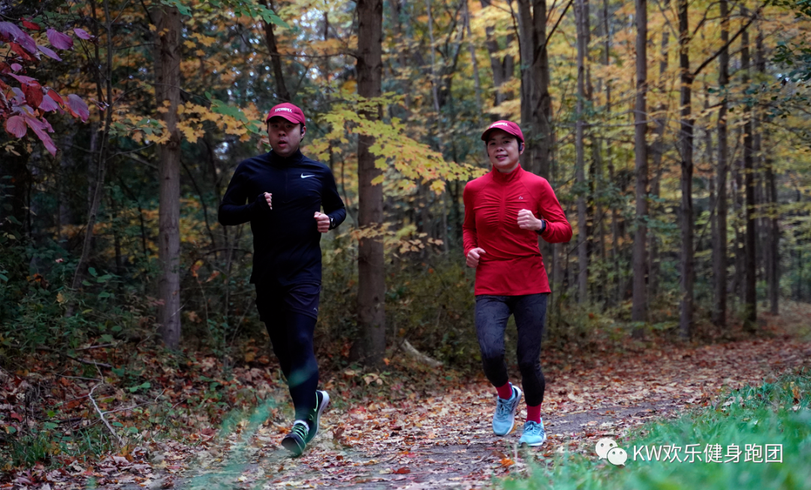
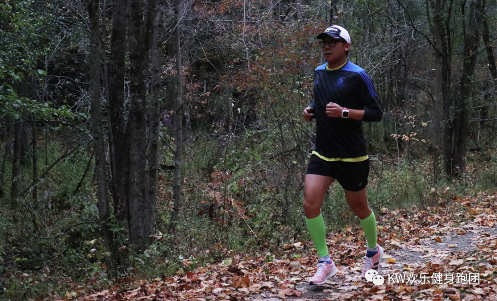

  
2020年10月18日，一个普通的周日，然而对于KW欢乐健身跑团来说注定是一个不平凡的日子

连续参加过多届多伦多秋季马拉松盛会的几位团员们自从去年顺利结束了多马比赛就一直在等待这天的到来，盼望着重聚首再举杯。一场突如其来的疫情打断了一切正常工作生活和社交活动，今年的多马也和全世界其他大多数赛事一样改成了线上跑。于是跑团组委会商议由几届多马元老挑头，组织一次小范围的马拉松测试跑，参赛人员由组委会成员推荐，以参加过多马赛事的跑团选手为主，地点定于 Cambridge to Paris rail trail。因为疫情有关法规对聚会人数有严格限定，所以并没有公开报名和大张旗鼓地宣传。  
  
  
此次测试跑分全程马拉松和半程马拉松两个项目，报名全马的除了去年参加多马全马的老吴、李明和高清之外，还有人称疯神的高峰；其余选手都参加半马或者放弃自己PB的机会却甘于奉献担任其他半马选手的私兔，目的就是创造条件帮助他人取得好成绩。全马时间会延续四个小时左右，因此于周日早7:30在商定的起点－Glen Morris也就是C2P Trail的中间点正式起跑。半马先遣队成员女神CoCo和私兔Andy哥也同时出发。全马F4路线为首先一路向北奔向十公里外的Cambridge折返点，折返后一路南下20公里到Trail终点Paris小镇，第二次折返重新北上，完成最后的十公里返回起点Glen Morris。半马也从同一地点出发，不过他们是上来就一路向南直奔南端的Paris小镇，在那里折返回到起点正好约21公里。因为这次全马跑并不是以PB为目标，所以大家开始阶段都比较放松有说有笑，很快就到了Trail的折返点，不做停留直接往回跑。

全马队员Cambridge折返后不久，8:30半马大部队选手们也出发了，他们跑过正式比赛的都打算刷新自己的比赛PB，首次参加比赛的也计划安全完赛创造PB或者超越自己的最佳训练成绩。
  
  
随着时间的流逝，半马先遣队的两员战将已经在9:15左右率先完成比赛，**由实力帅哥Andy领跑超实力美女Coco经过顽强拼搏终于取得半马优异成绩1小时36分钟（136）收获PB**  
－比2019年多马成绩快了3分钟！恭喜Coco飞小椰！  
  
  
  
感谢Andy实力引领，期待你下次比赛创造优异成绩！  
  
  
  
  
  
  
  
全马队伍返回到起点时差不多已经跑了18公里，稍事休息两分钟补充能量和水便继续出征，还有25公里左右的路程等着他们。  
一路南下途中陆陆续续遇上了半马最后冲刺阶段的队友们，大家互相鼓励，击掌加油，场面甚是感人！  
  
  
  
F4继续南下，到了Paris镇折返点时又看见了飞小椰和Andy在补给站向我们招手，非常感谢你们的支持！  
与此同时，半马的队友们都冲过终点线了，正如预料的一样，所有人都收获了PB，成绩单在此：  
  
  
  
  
**Linda：146**  恭喜 PB－进步超大，比2019年多马成绩快了5分钟！）  
  
  
私兔：实力哥感触－刚领跑完半马紧接着第二天就雨中PB半马－130，不是一般的牛！
  
  
  
  
  
  
  
  
**老汪：146**  （恭喜首马PB－就是一匹黑马！）
  
  
  
  
  
霍烽大神：半马体验跑－霍神乃本团元老级人物，参加过两场正式全马比赛，半马比赛两只手已经数不过来了。非常感谢全马最后几公里引领及补给。

Sam表哥：146（恭喜首马PB－又是一匹黑马！据说半马没跑够，又多造了三公里，为什么不报全马呢？）
  
  
  
  
  
  
**RuiRui：150**  实力派女将，恭喜首马PB并破二，不但完成了半马还多跑了近两公里！期待下次比赛一同出征！
  
  
  
  
  
**Carol飞小卡：154**  恭喜首马PB 并破二  －跑团原后勤部兼啦啦队长，大家和你一样，没人知道你有多能跑）  
  
**Mike麦总：156**  恭喜首马PB并破二－跑团励志之灵魂人物，大家可以坐等他的自传  
  
  
  
  
  
  
  
**私兔：大神追风曦－10月3日伦敦线上全马313完赛** 风都追不上你，少年！  
  
  
  
  
  
  
**飞小慧：208**  恭喜  首马PB－你的坚持一直都是我们的榜样，加油！）  
  
  
**Crystal飞小燕：154** 恭喜 首马PB  并破二 －感谢设立补给站，有幸在全马的队伍里看见你的加入，绝对又一位实力派女将！）  
  
  
**Yajing：215**  恭喜首马PB－太佩服你了，你能在这么短的时间里取得这么棒的成绩，我比你还激动！我别的能力没有，下次只要你还报名半马，我绝对申请私兔！）  
  
  
  
  
  
  
半马战队的队员们你们都好棒啊！
  
  
  
回到全马F4，过了35公里后高清同学率先体力不支严重掉速，进入传统的跑走结合环节，幸亏有御用摄影大师YoYo提供补给才得以坚持到终点，非常感谢！老吴李明从始至终配速极为稳健，超计划顺利完成全程马拉松，可喜可贺！全马成绩如下：  
  
  
  
  
**老吴：347；****李明：348；****高清：405**  
  
  
嗯还有一位，疯神高峰同学。由于他过了20多公里以后行踪诡秘，一度引起队友担心，后来才得知他老人家凌晨3:45就从Waterloo的家出发，历经30多公里一路跑到Glen Morris，然后才和我们一同起跑完成接下来的全程马拉松。**最终高峰总共累计完成了一个80公里超马，成绩7小时42分钟，配速5分46秒**！叹为观止！
  
  
  
  
  
  
  
  
  
比赛成功永远少不了后援队的鼎立协助，万分感谢摄影师兼流动人肉补给站YoYo和追风曦等同学抓拍的众多美好瞬间，还有全体半马参赛队友们为全马队友提供的补给和领跑等支持  
  
  
。飞小卡同学不仅跑的好，点心做的也是极为可口，谢谢分享！为了能再次吃上美味的点心及蛋糕，同时也鉴于很多选手都没有跑够，组委会决定每年都举办一次这类比赛，只设两个项目，**全马**和**超马**，基本上就是花跑全马和超马的时间聚在一起吃吃吃，  
  
希望大家踊跃报名，积极参与！我们跑团可能算不上跑得很多或者很快的跑团，但绝对是我们心中最温暖最棒的跑团！KW欢乐健身跑团，加油！  
  
  
  
  
  
  
  
  
  
  
  
  
  
  
  
  
  
  
  
  
  
**拥有信念、爱和希望，我们永远在路上！**  
  
****  
后记：由于公众号迁移手续繁杂，首篇纪实上的有点晚，敬请谅解！今后跑团活动都会在此展示，有时间也会补记之前的几场重要活动。希望朋友们多多关注，点赞，在看及转发。谢谢大家！
  
