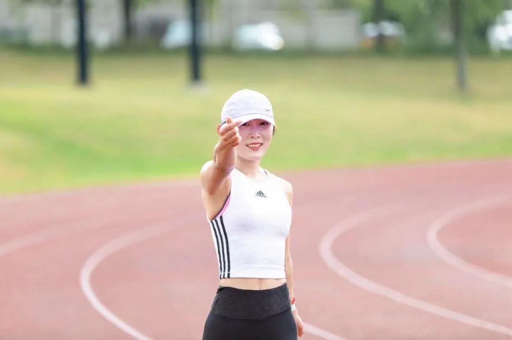
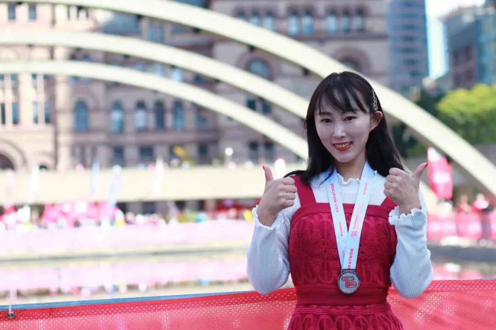
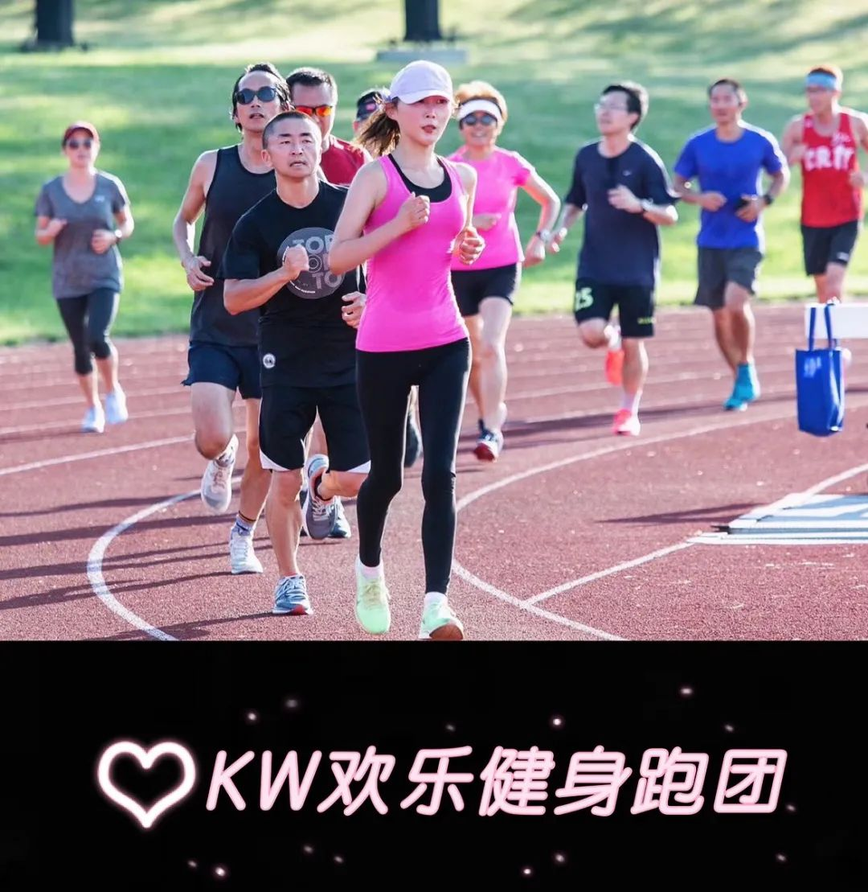
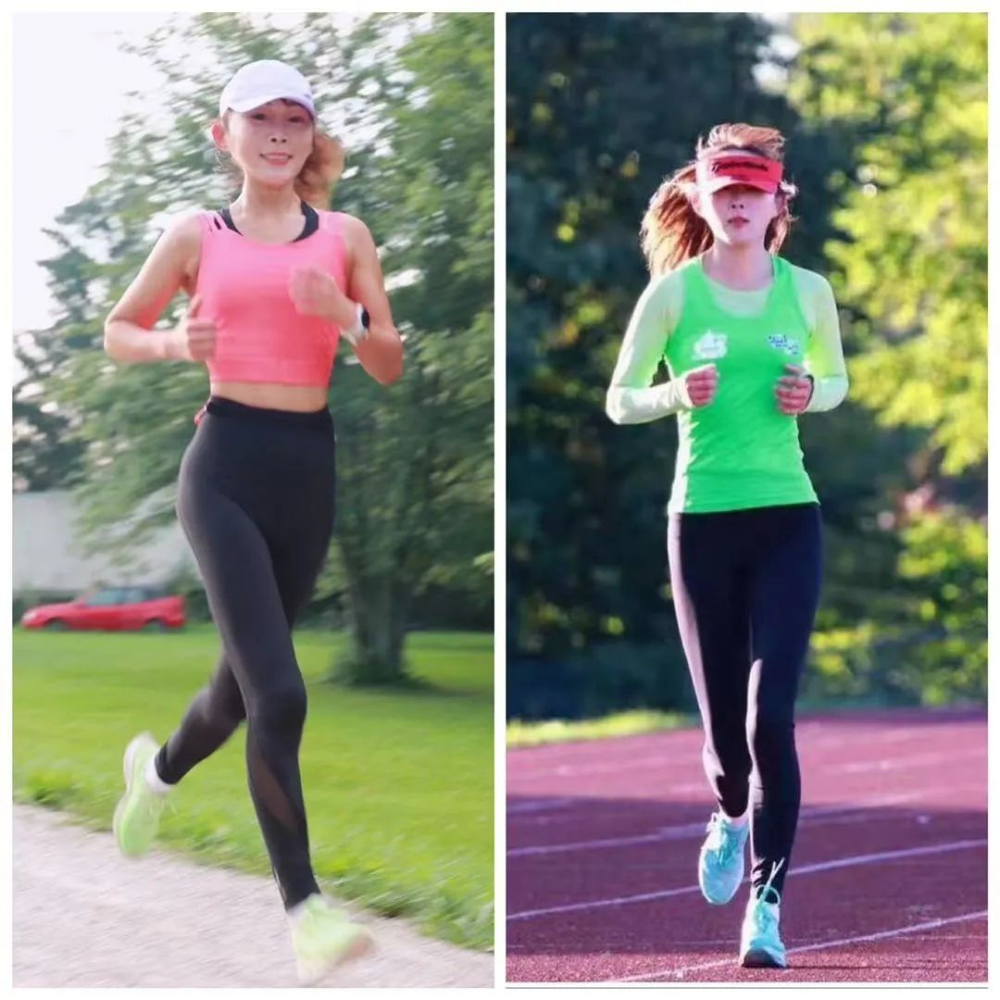
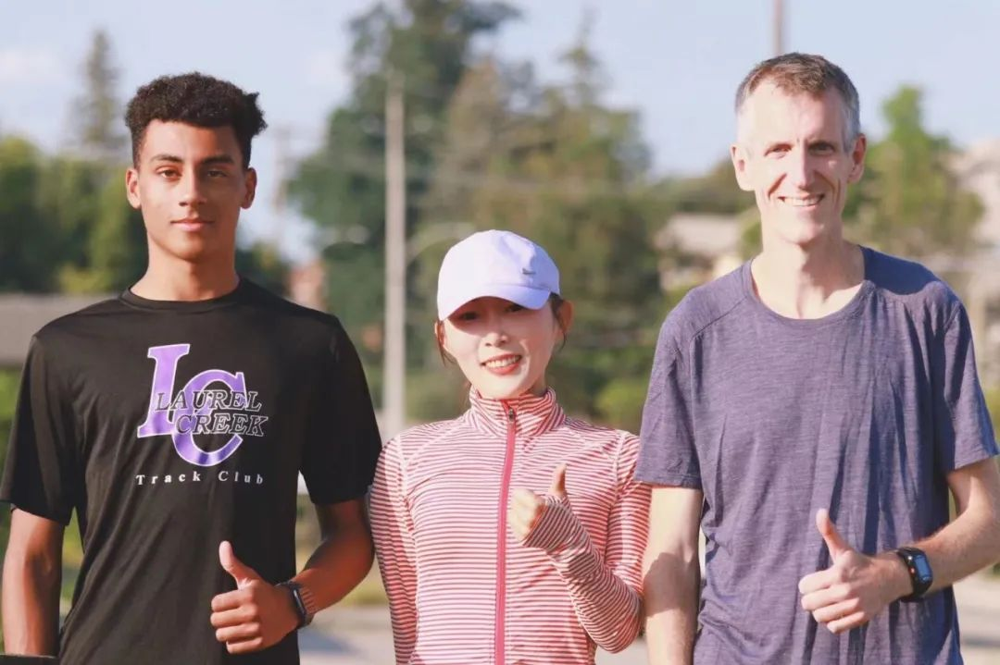
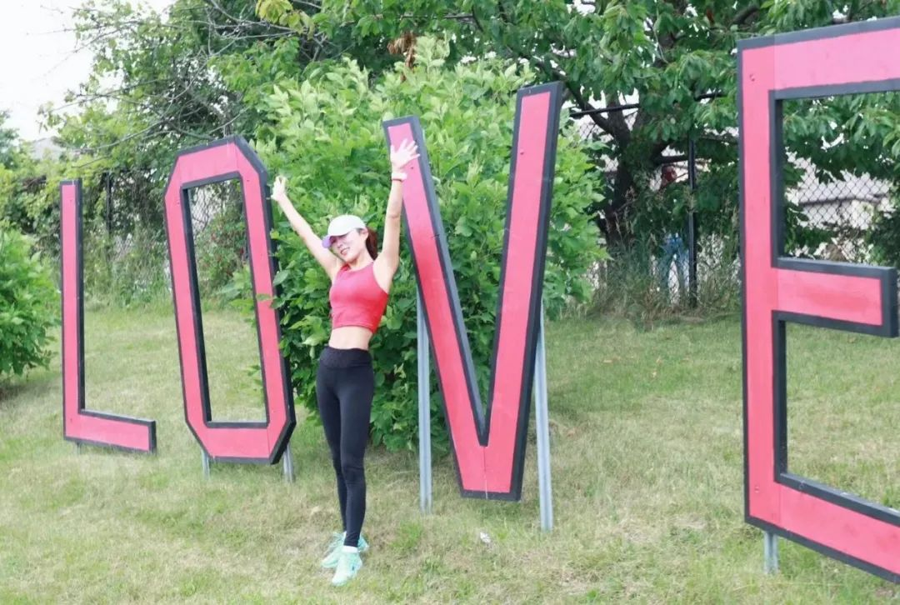
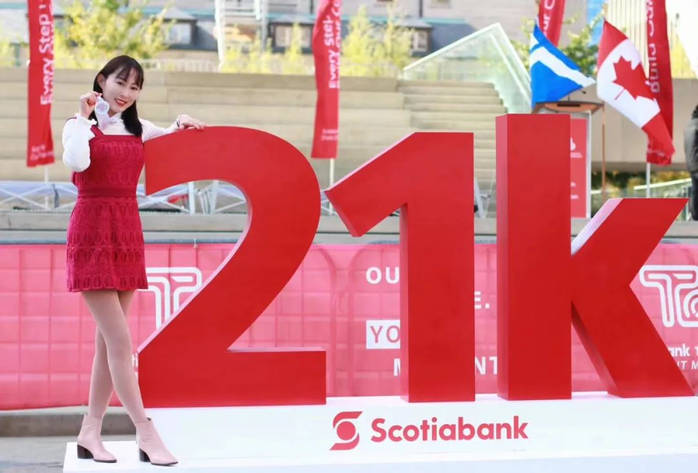
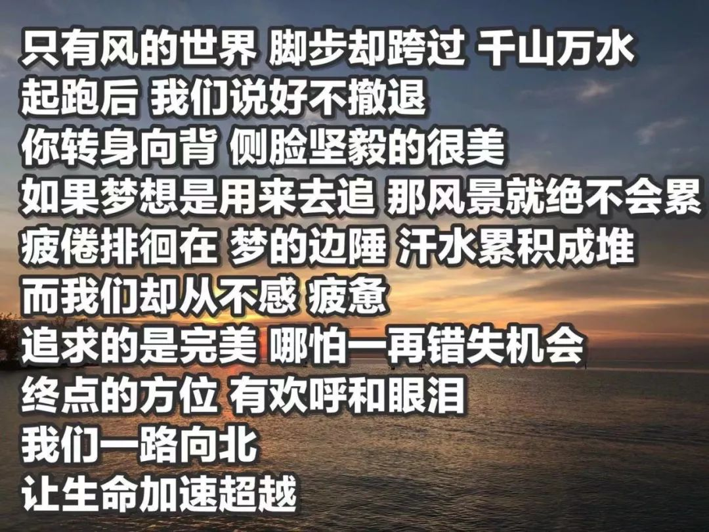
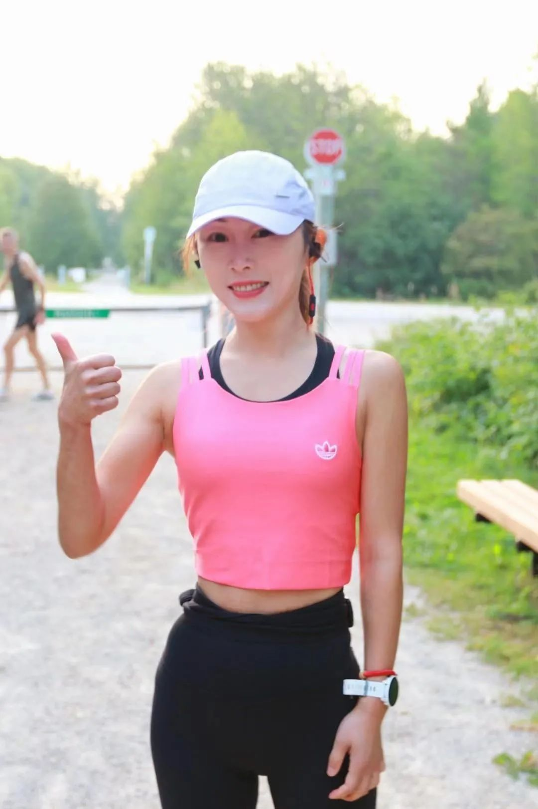

出国以前，我是一个典型的在父母关爱下长大的孩子，从小衣食无忧，开心快乐，最大的烦恼大概就是今天该穿哪一条裙子，该配上哪一双高跟鞋呢?

    
2009年的夏天，我拎着几个大箱子，踏上了加拿大滑铁卢的土地。新鲜感过去之后，我懵了。滑铁卢生活简单，民风淳朴，人们穿着简单休闲，我从国内带来的高跟鞋和花裙子在这边根本派不上用场，穿在大街上另类得让人感到奇怪。然而，更让我懵的是，在国内的老师的工作经验以及在美国的教育硕士学位在这边毫无用武之地，如果想找到一份教师类的全职工作，必须得有加拿大本地的教师资格证。文科出身的我，想找一份专业相关的教师工作，简直是难上加难。从小顺风顺水，没有遇到什么挫折的我，焦虑了。
  
  
我开始讨厌加拿大，我觉得也许我做出了一个错误的决定，尤其是加拿大漫长的冬天，让我这个从小在江南长大的人极其不适应，接连找工作的失利，也让我愈发的不自信。渐渐地，各种亚健康状态找上了我，浮肿，失眠，脸色暗沉，这些都让爱美的我无法忍受。  
  
  
  
  
  
于是我决定，如果在加拿大暂时没有一个成功的事业，至少我得有一个健康的身体，总是担心明天，又怎能把握好今天。我得开始锻炼了。我选择了对健身小白最友好最容易上手的运动——跑步。 
  
   
  
**随风奔跑自由是方向**  
  

每天六点闹钟响起，起床，洗漱，喝水，换衣服，出门，迎着晨曦，开始我的奔跑。加拿大的得天独厚的好空气呼吸起来沁人心脾，微微的汗水和身体里因为运动分泌的多巴胺让我的每次跑步都心情轻松愉悦。**我一路奔跑，一路享受清新宁静的感觉，享受自己和自己对话的美好。**  
  
  
  
  
  
  
早晨六七点，天还没有全亮，路上车来车往，有人为了生存已经开始奔波，有人像我一样在路上晨练。我忽然明白，没有人的生活是容易的，每个人都在为自己的目标付出努力，每个人都在奋斗，我的所有焦虑都来自对未来的不可知。既然未来不可知，我为什么不好好在此刻努力呢？生活不是一种刁难，而是一种雕刻，我应该沉下心来，好好地把握当下。**人生如弈，落子无悔，既然来到了加拿大，我就要好好的努力的去适应这个新的一片天。**过好每一个今天，明天才会更有价值。于是我决定重返校园，学习商科，重新选择职业方向。  
  
   
  
  
  

**跑一年，看到的是终点；跑十年，看到的是无限。**  
  

努力的意义，是在于努力本身。学习如此，跑步也一样。跑步和学习都是最美好的事情，上学的几年里，我也没有放下过跑步。在加拿大上过大学的人都知道，加拿大的大学有多累，写不完的作业，考不完的试，永无休止的presentation和project。我每天的时间被安排得满满的，坚持跑步成了一件非常挑战的事情。刚尝到跑步甜头的我，实在不愿意放弃，于是时间管理成了我学习的内容之一。我合理的安排好我的每一小时的时间，最大化的利用碎片时间，早睡早起，协调好每天的跑步和学习，想办法让生活和工作更高效。  
  
  
  
  
  
我发现，**做好时间管理之后，跑步和学习是一个良性的循环，每天早晨的跑步能让头脑更加清醒，思维更加敏锐，思路更加清晰，学习的效率反而更高了**.更重要的是，跑步让我觉得自己充满精力，充满力量，并且更有勇气面对学习中和生活中的一个个挑战。**跑步成为了我发泄压力和焦虑的窗口，也是我汲取力量的源泉。运动跟读书，一定是生活中成本最低的升值方式。**  
  
  
   
  
**最好看的腮红，是跑出来的**  
  

希腊古语说：**人类最好的医生就是空气，阳光和运动。**它治的不止是身体，还有心灵。跑步不仅仅给我带来更紧实的身材，运动后的出汗也帮助我排毒，皮肤更光滑，气色更好了，更重要的是，心理的变化。在跑步的过程中会遇到许多困难，时间紧张，天气不好，不想出门等等，每当这个时候，我都告诉自己，放弃不难，但坚持一定很酷。虽然有各种各样的困难在眼前，但是只要不放弃，我就一定能攻克它们。在这个过程中，我逐渐地变得心理强大，乐观自信。  
  
  
  
  
  
爱上跑步之后，我感觉自己身体和心理都越来越柔韧了，也更包容和豁达了，心态也越来越好。每当我面对困难的时候，越来越从容和淡定。我告诉自己，生活不可能永远是顺风顺水的，遇到当时过不去的坎，再努力一下下，再坚持一点点，不要放弃，在实现目标的路上可能受挫，但绝不能后退，走好当下的每一步，一定能越过任何生活中的山丘。跑步带给我的不仅仅是外貌和身材的变化，更重要的是自律，坚韧以及精神的富足。我变得越来越美越来越自信，这种美，是最昂贵的化妆品都无法达到的妆效。  
  
   
  
**Faith Love Hope**  
  
****  
这世上，比美好更美好的事，是努力等待着美好事物的发生。这就是努力的方向，也是我坚持跑步的信仰。毕业以后，我如愿找到了工作，有了加拿大本地的工作经验，将来的路，我会更加无惧地走下去。**跑步教会我，不忘初心，忠于信仰。**因为有所努力，所以能更明白生活不易；因为有所努力，才会满怀希望；因为有所努力，才会对生活充满热爱；因为有所努力，才会活出想要的自己。跑步大概是我这辈子做过最好的事情，坚持跑步也让我有更多的追求，距离再长一公里，时间再久一些，速度更快一点，不断为自己设立新的目标，**如果说有什么必须战胜的对手，那一定是过去的自己。**  
  
  
  
  
  
**跑步还教会我，总有那么一些人是他们让你成为更好的人。**  
感恩跑步，让我认识了**KW欢乐健身跑团**  
的小伙伴们。我们一起激励，一起奋进，一起定期活动，比赛，一起坚持不懈，一起互帮互助，一起分享更多跑步知识。有句话说，一个人跑的更快，一群人跑的更远，和他们在一起，是我感到最正能量的事情。跑团里的朋友们在平日的生活里都是精英，他们有医生，银行家，教师，机械师，IT  
才子，物流专家，房产业界大牛等等等等。和他们在一起，我才知道，没有最优秀，只有更努力，永远有比你牛的人比你更自律更努力更拼搏。从他们身上学到的最多的就是：**“对未来真正的慷慨，就是把一切都献给现在”**。有这些榜样的力量，我还有什么借口可以偷懒呢？我还有什么理由不去努力呢？越努力，越自由。**快乐的秘诀是自由，而自由的秘诀是勇气和坚持。我认为，真正的“自由”，就是在我们的视野内，容纳和让渡不自由的能力。**  
  
  
  
  
  
  
2019年5月，我在跑团小伙伴的鼓励下，完成了我的首个半程马拉松。2020年5月，我被多伦多马拉松选中成为配速员，带领参赛者完成半程马拉松。很可惜因为疫情，赛事取消了，我的配速员首秀没能上演。但是，疫情一定会过去，一切都会好起来，到时候有机会我希望能够继续当马拉松配速员，带领更多有梦想的人跑完他们的半程马拉松。另外今年，我还给自己定下了一个目标，完成我的首个全程马拉松，42.2公里，我相信我一定能完成我的目标！
  
   
  
**脚步不丈量走过的路，而是寻找更美的人生地图。**  
  
Google、Alphabet 首席执行官 SundarPichai在演讲中提到：“每代人都会低估下一代的潜力。但真正重要的是，年轻人应该相信自己改变世界的能力，要花时间去寻找最能激发你热情的事——它不该是父母让你去做的事，或是身边的人都在做的事，更不是社会期望你去做的事。新冠疫情对全世界都产生了巨大的影响，这时候更要保持开放，拥抱焦虑，怀抱希望（be open-minded, be impatient, be hopeful），我们终将战胜一切困难！”
”   
  
  
  
  
  
无论是逆境还是顺境，强大自己永远是最有用的武器。跑步可以强大自己的身体健康，更能磨炼自己的精神意志。要往前走，就得先忘掉过去，不念过往，不惧未来，这就是跑步的用意。   
  
  
  
  
人生当如跑者，不负韶华，奋力向前，始终坚持拥抱梦想，且热爱生活。这就是无与伦比的美丽。将来的你，一定会感谢，现在拼命努力的自己。  
  
   
  
**2021年4月6日**  
  
**加拿大 滑铁卢  摄影：YoYo**  
  

