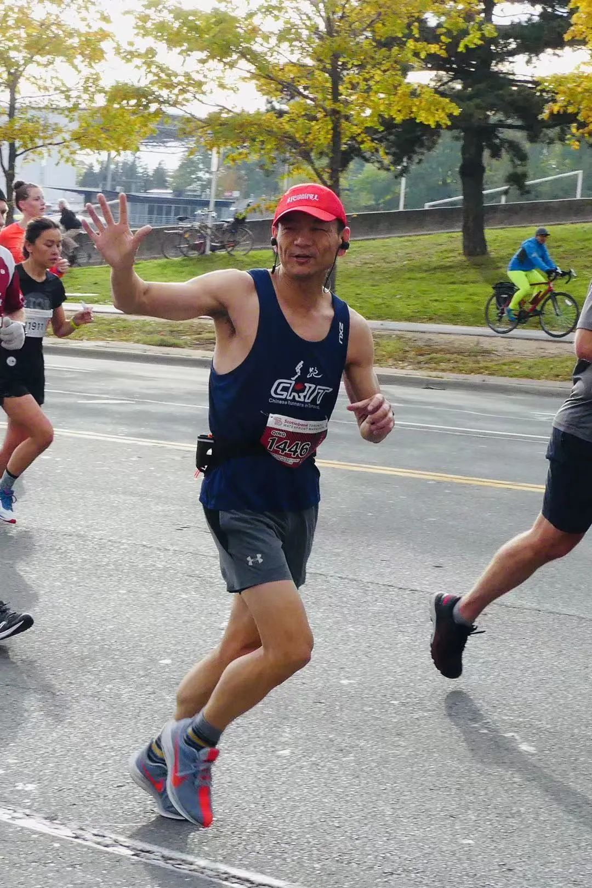

人生就是一场马拉松，迈出的每一个脚步都是对自己生命的挑战。几年来，长跑成为我生活的一部分，跑着跑着，看世界的角度变了；跑着跑着，重新认识了世界，改变了自己；跑着跑着，收获了健康、快乐和朋友

  
**三十功名尘与土　八千里路云和月**  
  
   
  
如果三十年算人生一章节的话，我的第一章妥妥的是在中国温室里成长的。从小学中学到大学，再从分配工作，到放弃身份跳槽，虽多有不如意，但现在看来也算顺风顺水。期间最大的问题是工作不久健康状况出了一些问题，让我不得不放弃了中意的体育活动，戒掉了烟然后就公司家两点一线的生活。从第二章开始，我们家庭决定准备移民加拿大，经过了和绝大多数技术移民相同的程序和等待之后，我们夫妻俩带着六岁的女儿终于在上个世纪末来到了这个美丽国度准备安新家。感慨到，前三十年虽然没挣着什么功名，但确实落了一身的尘和土，现在倒要从头来过了。按现在年轻人的说法就是，人生的游戏新建了一个档而且难度从休闲陡然调到了困难模式。  
  
  
来了首要任务当然是找工作，国内的工作经验说是偏重技术方面但也有很大成分靠PPT和忽悠，到了这里语言优势丧失殆尽，期间在多伦多和周边城镇简历遍发，面试寥寥，找工作这项所谓的“全职工作”让我倍感沮丧，也充分体会到作为个体在一个陌生的环境中如何载浮载沉艰难生存的同时还要睁大双眼不放过每一个可能的机会。一段时间白天上网找工作发简历及准备面试，下午去工厂打工到深夜，也上过好几个编程语言培训班，自己在家也有时间就自学。我的太太更是从下飞机那一刻就开始遍寻工厂的普通工作以支持我可以安心找到技术相关的工作，在这里我要衷心地对她说一声谢谢！  
  
  
  
  
  
终于，机会降临在一直有所准备的我。原来一起住在多伦多的邻居好朋友需要从滑铁卢搬回多伦多工作，我被推荐去填补那个空缺职位。经过面试，我的能力得到了公司的认可，我们全家最终来到了滑铁卢小镇安家落户了。工作稳定后，新的挑战也接踵而来，第一次互联网技术泡沫在几个月之后破裂，无数中小公司难逃厄运。我所在的公司是小得不能再小的公司了，管理层和员工一起努力最终度过了危机。２００３年我们迎来了第二个女儿的降生，她给家庭带来了无数的欢乐，也有很多让我们心力憔悴的时刻。那种感觉对我来说就像一道七彩的光线，从彼时照到今日然后穿透时光奔向无尽的未来，我就一直在这道光线上前行。
  
  
  
  
我承认我不是什么坚强的人，我普通的不能再普通了。别人眼睛里的不是事儿，在我这里可能会是一座山。很多问题都是出自我自身，也是我人性弱点的大暴露。随着孩子的成长，之后这几年的工作和生活的压力把我变成了一个亚健康的中年人。有时候我会在梦里回到中学和大学的操场，那是我的时光，我属于那里。  
  
  
  
2019年五月多伦多马拉松  
  
  
**想当年　金戈铁马　气吞万里如虎**  
  
****  
回想起当年初一刚入中学校门不久，校运会班级征集男生一千五百米，我所在的班没有一个同学听说过这么长距离的跑步，更别说跑下来了。但是又不能报名空缺啊，这不是公然认怂吗。于是小童同学和小李同学自告奋勇报名参赛，我们大家一起给他俩出谋划策，中心思想就是前半程绝不和他们拼速度，我们跑我们自己的。这里的他们其实就是指其他班几个有一些中长跑经验的同学。枪响以后大家都冲出去了，小童和小李同学慢悠悠地在最后晃悠。在北京四中那个正方形的四百米距离标准但是形状不标准的跑道上，小运动员要跑漫长的三又四分之三圈。印象中先头部队第二圈都跑完了，他俩还落后了大半圈。直到冲刺阶段了小童同学才渐渐发力加速，超过了不少后劲儿不足的选手，最终取得了第三名的好成绩。  
  
  
  
️2018年F4密西沙加半马  
  
这次比赛让我们受到了极大的刺激，以小童同学为首的以雪耻为目的的班级长跑队就此宣告成立！我荣幸地成为其中的一员。那会儿不跑步都吃不太饱，别说练长跑的了。我的印象是一天要七餐，也就是三餐之间和前后都要不停的吃吃吃。训练就是每天早晨课前绕操场四圈一千六百米，下午每周有一两次长跑，外加其他球类运动等，体能上得很快。好像我们长跑队在初二阶段就全年级基本无对手了，最辉煌的时刻是初三的一次一千五百米年级专项赛，每个班出五名男生，最终结果我们班包揽了第一到四名和第六名，我第一还是第二记不清了反正很牛的样子哈哈哈……校运会上四百八百一千五都有本班各路跑神镇守第一名。上了高中以后我已经成为校运会八百米一千五百米中长跑双料冠军了，那时候真的拽，很拽，非常拽。就是到了大学，我也一直延续这个不停奔跑的劲头，在一届校运动会上以普通学生的身份从特招的校田径队员云集的一千五百米比赛中杀将出来夺得第二名。  
  
  
**雄关漫道真如铁，而今迈步从头越**  
  
  
自从大学毕业后我就基本不跑步了，然后某个健康警灯的闪亮让我彻底断了跑步的念想。大夫说了，我这问题越跑风险越大，保不齐还得再动刀子。这一停就是二十年，期间偶尔踢踢佛系足球，还曾因为运动量严重不足很快受伤被抬下场。直到十年前自我感觉已经很不爽了，体重飙升，干点啥都喘。我经过一番思考，决定冒一些风险捡起老本行，看看中长跑能否改善一下身体状况。因为太长时间不运动了，开始的时候每周在家门口跑两三次，每次最多两公里，速度就没法看了，反正累成狗就停了。就这样断断续续跑了两三年，还是夏天跑冬天歇的节奏。直到2014年我注意到了我们KW地区一年一度的金秋Oktoberfest感恩节活动中有5公里欢乐跑比赛，想着不妨挑战一下自己，看看能不能跑下来这个“超长“距离。第一次在小区里尝试5K的情景至今记忆犹新，跑到最后几近虚脱，但总算开历史先河了。有了这次经验，我便大胆报名参赛，加上接下来几个月的自我训练，速度和耐力还是有了一些提高，最终在十月份的赛事中5公里跑进了25分钟安全完赛。  
接下来的几年我一直围绕着5-10公里自娱自乐，并在2016年创造了当时认为之后很难突破的5公里个人最佳成绩22分钟多一点。  
  
  
  
2019年5月多马选手后勤大部队  
  
  
2017年算是我人生中比较重要的一个年份，在这一年中，我给自己发出了新的挑战，准备尝试一下半程马拉松这个我之前做梦都没有梦见过的长距离项目。  
在紧锣密鼓备战期间，我有幸结识了KW地区不少华人健身跑步爱好者。  
虽然当年10月的多伦多湖滨半程马拉松首战因为训练时间短，跑量也远远不够，经验更无从谈起，成绩没有达到预期，但是经历比赛的那个过程至今都让我激动不已，新老朋友们隔着手机屏幕给我的鼓励和支持也让我非常感动。  
也许就是因为兴奋过了头结果最终跑崩了吧。  
然而有一点是我当时没有想到的，这次比赛是我的首次马拉松，大概也是我之后参加的所有比赛中唯一一次一个人的孤独之旅。  
  
  
  
  
**如果想跑得远　我们就一起跑**  
  
  
有了这次首马的经验和教训，我意识到如果想要科学训练提高成绩，还是要找有经验的跑者交流，大家有机会一起训练效果会好很多。从2017年底开始，在本地最大的健身群里，那些爱好健身跑步的和愿意参加马拉松运动的华人朋友们，以及已经参加过若干马拉松甚至铁人三项比赛的各路大神，真正聚集起来了。这就是我们心心念念的KW欢乐健身跑团。  
  
  
  
在那个挂着Faith Love Hope的再熟悉不过的中文学校田径场，我们跑起来不知疲倦，休息的时候有聊不完的话题。我们的脚步丈量过KW几乎每一条主要街道，我们也熟悉路面的每一个起伏。我们亲眼见证了跑团集体的成长和壮大，更感受到了每一个成员个体的进步和升华。从2018年4月感触同学参加滑铁卢一个人的半马，我和霍烽大神陪跑，一众摄影师驱车跟随，到接下来5月份密西沙加市半马，烽神感触李明和我号称F4报名参赛（注：他们是3Fast 而我是1Fake哈哈），啦啦队一同前往并贴心服务，大家互相鼓励，创造优异成绩。待到10月份多伦多湖滨马拉松参赛队员达到新高，共有10名队员报名参赛并且都顺利完赛，其中多数是青年组的少男少女，勇气可嘉！  
  
  
  
时间来到了2019年，这是KW欢乐健身跑团值得浓重书写的年份，也是我奔跑生涯中最重要的一年。在朋友们的不断鼓励和家人的支持下，我把自己的跑步目标定在了金秋十月的多伦多全程马拉松比赛上，那个对我来说从来都是遥不可及的42公里195米长跑项目。近年来国内外马拉松赛事越来越多，大多数以全程马拉松为主。每次看著名比赛直播，那些浩浩荡荡的队伍成千上万的人群，有种错觉好像全马它也不是那么难以完成。然而即便是参加了三次半程马拉松比赛的我，想按照差不多的节奏跑到二十五公里都是一件很难完成的任务。我在跑团成员们的帮助下，经过了5月份多伦多半马以赛代练并PB，外加有争议的减重过程，整个夏季都保持每周接近一百公里的跑量。如今回想起来确实很疯狂，但当时唯一的想法就是，要跑下来。  
  
  
  
回过头说一下5月的多马，亮点闪耀，跑团帅哥兼铁人三项大神陈曦同学全马3小时25分历经险阻勇夺PB，感触同学半马1小时35分奋力争先如愿PB，女神coco同学首半马1小时48分惊艳PB，女神Linda同学首半马2小时06分喜获PB，跑团一同前往的人数也达到几十人了，可谓声势浩大。  
  
  
  
  
经过艰难的夏训和初秋的调整，期间收获了无数的惊喜，包括5-10-21公里各项不间断的训练成绩提高，10月初传统的oktoberfest 5公里比赛我居然以20分29秒完赛，简直不可思议。一个星期后就是比赛日了，虽然这一周我都有感冒症状，到了开赛那天还比较严重，但是在10月20日我54岁生日这天黎明，我终于还是站在了多伦多湖滨马拉松比赛的起跑线上。跑团大神李明老吴加上我将在接下来的三个多小时里和数千跑者一起挑战这个超长距离跑步的皇冠。  
  
  
  
好像有这么一句话，人生就像一场马拉松。其实没有跑过全程马拉松的朋友并不一定能体会到，这句话到底有多么正确。我们欢快而信心满满地上路，尽可能按既定计划一步步实现自己的阶段目标，面对各种意外和挫折，排除各种困难和干扰，虽然准备无比充分，但依然有太多未知在前方。太阳毒一些我们就会无端多耗一些体力，水站比期望远一些我们也会心生恐惧，如果不巧有风雨助兴，那更是从灵魂到肉体的全方位折磨。平时训练把信心刻在灵魂深处的同时，也会捎带刻上那些疲惫无助想要随时放弃的感觉和记忆。两者永远处于搏斗状态。我们要做的就是不断给信心喂食，让信心在战斗中成长。单从马拉松跑步这件事来说，我认为跑不下来不丢人，没有勇气去尝试才遗憾。

我们做到了。但是前方路依然漫长。 
  
  
  
这次多伦多湖滨马拉松赛事KW欢乐健身跑团全方位收获PB，除了几位全马选手首战告捷外，其余所有半马选手全部大幅提高成绩，我们真心为自己的跑团而骄傲和自豪。  
如今跑步已经成为我们很多人生活的一部分了，就是在疫情肆虐的时期，我们都会在严格遵守防疫条例的情况下尽可能开展一些线上和线下跑步活动，目的就是保持所有人的活力，更好地面对生活。  
  
  
**有信心　有爱　就有希望**  
  
  
今年已经是来加拿大安家第23个年头了，大女儿已工作数年，小女儿也即将高中毕业。我们都在慢慢老去。在平凡的工作和生活之余，我最大的幸运就是结识了一群热爱跑步热爱生活的好朋友。作为跑团不合格的团长，我非常感谢大家一直以来的鼓励和支持。我最大的愿望就是能够有更多的朋友加入我们，和大家一起奔跑，永不停歇。
  
  
  
2019多伦多湖滨全马  
  
我还是从前那个少年  
  
没有一丝丝改变  
  
时间只不过是考验  
  
种在心中信念丝毫未减  
  
眼前这个少年  
  
还是最初那张脸  
  
面前再多艰险不退却  
  
Say never never giveup  
  
Like a fire  
  
   
  
愿我们带着信心和爱，向着希望前行。  
  
  
**2021年5月11日**  
  
**加拿大 滑铁卢**  
**摄影：YoYo**  
  

  
