出国对每一个第一代移民来说都是人生中最重大的决定之一。每个人出国的原因不同， 境遇不同，  但相同的是都是为了追求更美好的生活。移民的生活充满酸甜苦辣， 只有经历过的人才能体会。有人说，新移民一般要经过至少三到五年的时间， 才能找到和原来国内相当的专业工作， 才能真正的安顿下来， 融入枫叶国的生活， 我觉得大多数人都是这样。当然有人适应的很快， 也有人几十年也不能真正的适应异乡客的生活。每当回国的时候， 看到国内朋友的消息的时候，都不免要和国内的朋友们比一比， 想一想如果我当初不出国呢？现在会过的怎样？2021年6月9日是我来加拿大十五年的纪念日，现在的我没有后悔， 也没有沾沾自喜， 我很感谢十五年前的自己勇敢的做出了选择， 给了自己很难忘的一段经历。我也想对所有的异乡客说， 我们都是热爱生活的勇者， 应该为自己异乡客的经历感到骄傲。
  
  
**出国梦**  
  
  
我是一个幸运的女孩， 出生在北京一个普通的家庭。父母都是国营大厂的职工， 虽不富有， 却给了我最好的言传身教， 教会我如何做一个善良的人，一个爱学习的人， 一个做事认真努力的人。小学的班主任老师可以说是我遇到的第一位贵人， 在我四年级的时候， 她推荐我去参加奥数的学习。在八零年代， 我便成为了为数不多的奥数娃。那时还是周一到周六上课， 只有周日一天休息， 我会风雨无阻的在每周日下午参加奥数班的学习。奥数的学习令我的求学之路一帆风顺，凭借参加奥数竞赛的成绩我被选入了北京五中的数学实验班。升高中的时候又因为初中获得的北京市数学竞赛一等奖考入了北京四中的理科实验班。高考的时候我决定学医， 因为学医可以治病救人， 可以帮助他人。我幸运的考入了中国最棒的医学院 —— 中国协和医学院。  
  
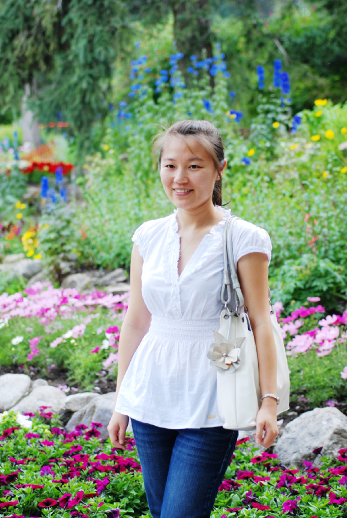  
  
协和医学院是美国洛克菲勒基金会创建的， 他的教学体系和美国一致， 从高中毕业开始学制八年， 其中包括了五年的医学基础本科， 一年见习， 一年临床实习，和一年科研训练。最后成绩合格授予医学博士学位， 基本上就是本硕博连读八年。以至于我的奶奶逢人便说：我家囡囡要上两个大学。很多人听了都说，这学制也太长了， 八年抗战都结束了。但十八岁的我觉得八年不是问题啊，多些时间在学校里学习不是一件很愉快的事吗？  
  
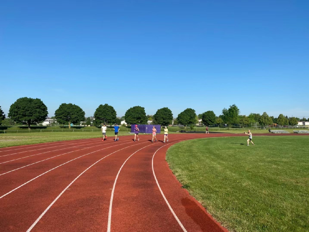  
  
那时的协和是和北大联合办学的， 我们在北大生物系学习两年半的基础课。之后再转回东单三条的协和总部学习解剖学，生理病理学等医学基础课， 之后再进入临床见习实习。2001年，我终于开始临床见习， 我还清楚的记得见习的第一天， 我们八个同学一组跟着一位护士姐姐进了住院部，分配给我们的工作是把所有的病床从上到下清洁一遍， 再把病历柜上的病历纸整理好。而此时我的初中高中同学们已经大学毕业一年有余，许多人已经开始工作赚钱，亦或读研，准备出国， 我还是个什么都不会的医学生，这时才体会到八年制的苦。当时很多人都想出国学习， 但出国需要考托福考雅思考GRE， 还要经过申请学校， 面试，签证等许多道关。对于我们医学生来讲面临着两难的抉择，选择出国，并不能直接做医生，需要先申请到国外做生物化学等基础学科的研究生，再通过一系列医学专业的考试，面试才能有机会申请住院医师的机会。而选择留在国内做临床，就意味着要从住院医做起，26 岁医学博士毕业，再经过五至七年的住院医训练才能成为一名主治医生。路漫漫其修远兮。经过几年挣扎，和多次被托福，GRE的折磨碾压，我终于在临毕业前决定留在国内做临床。

2004年的夏天， 我顺利进入了协和医院妇产科， 成了一名大医院的小小住院医。住院医的工作是繁琐忙碌的，虽然顶着医学博士的头衔， 我们其实是医院里经验值最低的， 根本不会给病人看病， 临床经验还不及资深的护士。我们每天7点前到病房开始了解病人夜间的情况， 准备8点查房的时候向上级医生做汇报。8 点查房，要准确的背出每个所管病人的病史，查体情况和化验结果， 还要回答上级医生的各种提问。之后上手术，或去门诊看病人。下午再晚查房，收新病人。常常忙到晚上7，8点才能回家。协和的老师们更是以严格要求著称，查房的时候背不出病人的情况， 回答不出老师的提问，都会被骂的很惨，连男住院医师都会被骂哭。但这样高强度的训练确实使我们的经验增长很快， 记得我第一个轮转的产科，三个月就接生了100 多个新生儿。作为协和的毕业生，我们也备受老师们的宠爱，骂归骂，那真是手把手的教手术， 一个字一个字的改病历啊。虽然年轻医生的训练周期很长， 但在协和医院这样顶尖的医院里，我们这些小住院医会逐渐成长为各个专业的专家大牛。 
  
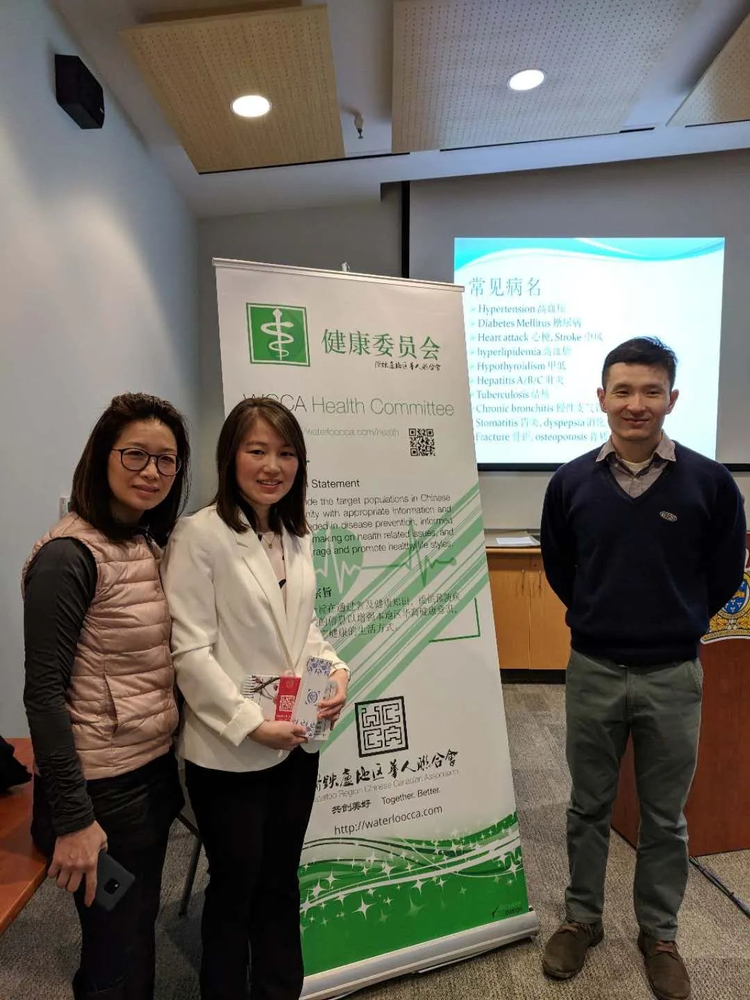  
  
在我结束第一年住院医生涯的时候， 老公获得了去加拿大读研的机会。他很喜欢加拿大的慢节奏生活，我们决定一起去加拿大生活。这对我来说意味着要辞掉协和的工作，去到一个陌生的国度，开始新的生活。很多人劝我好好想清楚，毕竟协和医院是全国最好的医院，能在这里做医生是许多人的梦想。这样轻易放弃，实在太可惜。最反对我出国的是我的舅舅， 舅舅从小很疼爱我，他对我寄以厚望，希望我成为医学大家。在知道我决定要去加拿大以后，舅舅找我谈了好几次，还写了很长的信给我，劝我不要出国，因为他身边很多认识的人的经历证明医生这个职业出国要想做回医生真的好难。但那时的我对外面的世界充满了好奇，我知道如果我留在协和，再过十年二十年，会成为一名很好的主治医师，教授，妇科专家， 但我更想出去看看外面的世界是什么样子。

2006 年5月我从协和医院辞职了。记得我当初开始工作的时候只签了一张三页纸的合同， 而辞职的时候，我跑遍医院各个部门，盖了二十几个章，交还了我的工牌和白大衣。妇产科的老师们对我特别好，他们听说我要出国了，请我吃饭，为我送行，每个人都说：你去哪里都是好样的，我们相信你！听他们这么说， 我的眼泪都要掉下来了。我 至今还记得那个6月初的下午，我抱着一个牛皮纸袋走在什刹海湖畔，纸袋里面存封着我从小学到工作的档案。当我把档案送到卫生部的档案局后，从小到大，第一次不再是学生，也不再有工作，脱离了组织，完全成了一个自由人。那一刻的心情有兴奋，有期待，有紧张，有不安， 有激动；很复杂也很难忘。
  
  
**初到枫叶国**  
  
  
2006年6月9日， 飞机抵达多伦多， 我以探亲者的身份来和刚刚硕士毕业，开始工作的老公相聚。朋友和老公开车来接我，加拿大给我的第一印象是地广人稀，环境优美。除了很少数的高层建筑之外， 所有的建筑都是只有一层。初到加国的一个月，朋友带我走遍了小区周围的小路，处处绿树成荫， 小松鼠，加拿大鹅随处可见。这让在大北京生活了二十多年的我兴奋不已。乘公共汽车去小城里的滑铁卢大学参观，这校园很像是个大工业区，连个校门都没有。这里的公共汽车每隔很久才有一趟，错过了一辆，有时就要等一个小时。  
  
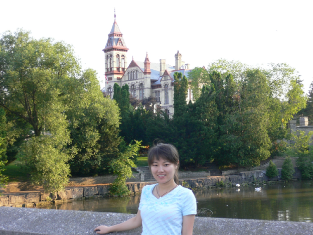  
  
然而当最初的兴奋退去，我必须开始思考如何返回职场。临走的时候协和的老师给我了一个多伦多师姐的电话号码，让我向她咨询一下。我忐忑了一个月，终于拨通了师姐的电话。师姐告诉我加拿大是承认我们在中国的医学文凭的， 但难的是所有非加拿大医学院毕业的医学生都要重新申请做住院医， 不管你已经做到主治医师还是教授，都是要通过许多考试，统一申请。每年有几千人申请几十个住院医名额，有的专业，比如我的妇产科，全省一年只有一个名额， 因此成功的几率小于百分之一。考虑到我的妇产科经历，师姐建议我考多伦多的一个专科学校的超声专业，学一年半毕业以后可以做一名超声技师，也可以有份稳定的工作和收入。而这个超声专业也是非常难申请，首先要通过托福或雅思考试，然后还要准备三封推荐信。放下电话我的心情很低落，看来在加拿大重做医生真的好难，比我来之前想想的还难。
  
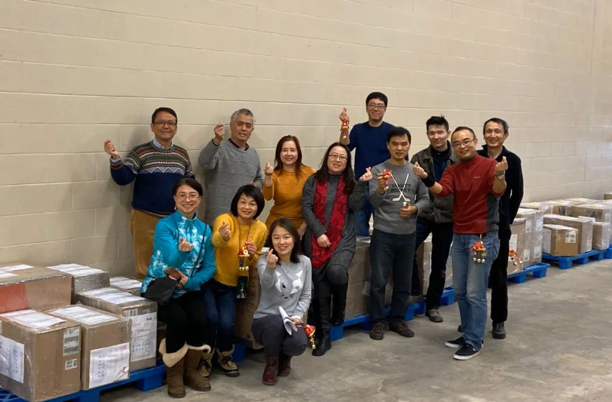  
  
要想重返职场，首先要过的是语言关。朋友推荐我去参加教会办的免费英语班，还有YMCA的英语班，因为不是移民，我需要交每小时5加元的学费。虽然英语评级我是中高级，但我的英语绝对是中国的应试英语，阅读和听力还不错，写作和口语就差好多。还记得刚来不久去照像，工作人员是个老先生，他大概没怎么听过我这种新移民的蹩脚英文，听我说完我要照相， 转身对我老公说：“这位女士的英文我听不懂，她在说什么？”听他这样说，我真的好难过，以我这样的英文水平， 别说当医生了， 连入学申请的托福考试都无法通过。于是，我开始寻找一切机会来提高我的英语水平，各种免费的英语课， 图书馆的英语角，教会的查经课。
  
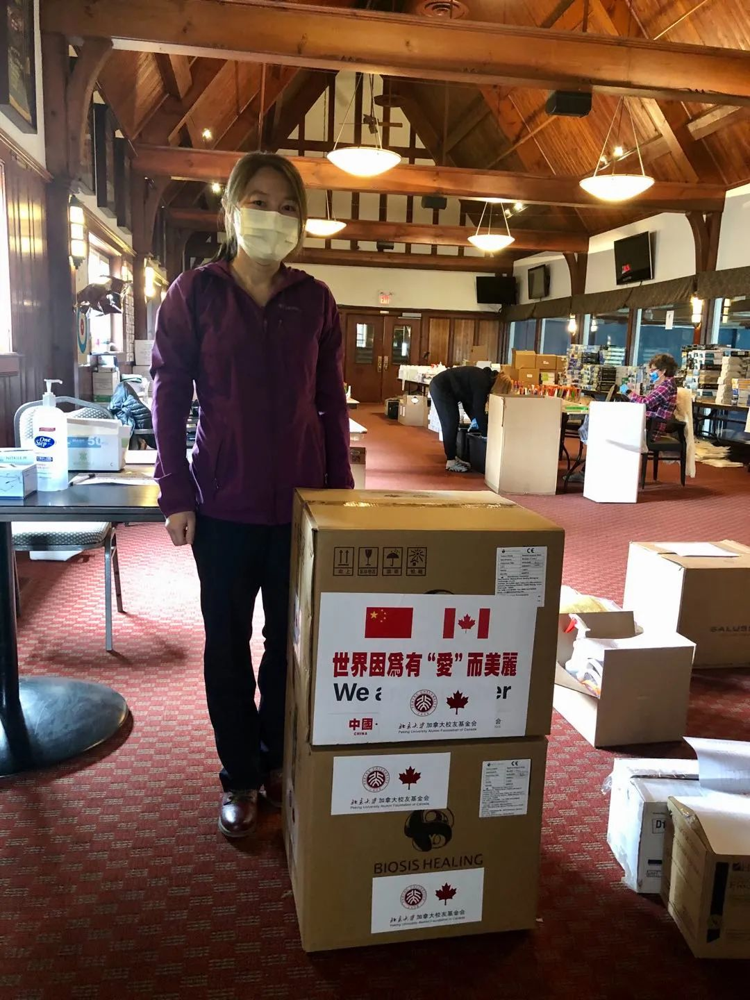  
  
离家不远有个小餐馆卖炸鱼和薯条，我看到门上贴着招人启示，也想去试试，想着既能赚钱补贴家用，还可以练练英文。拿着改了好几天的简历，我推开了小店的门，怯生生的问：“老板您这里招人吗？我想来这里工作。”老板是个高大的波兰大叔，上下打量了一下我，又看看我的简历，问：“你在餐馆干过吗？”我说：“没有，但我很勤劳的，不怕吃苦，学东西也快。”老板说：“我这里活很简单，就是帮着切切菜，打打杂，一小时8块钱，你明天开始行不？”我兴奋的说：“当然可以。”就这样，我找到了在加拿大的第一份工作，每天晚上6点到9点三个小时，正如老板所说，因为我的英文口语听力都不够好，我也确实不太会做什么，我的活就是简单的做做沙拉，切切土豆条，收盘子，洗盘子。老板一家是波兰移民，他们对我很好，他们知道新移民的不容易， 店里不忙的时候就和我聊天，也从不让我做重的活。几个月之后，我的英文有了些进步，也能和客人聊聊天了。  
  
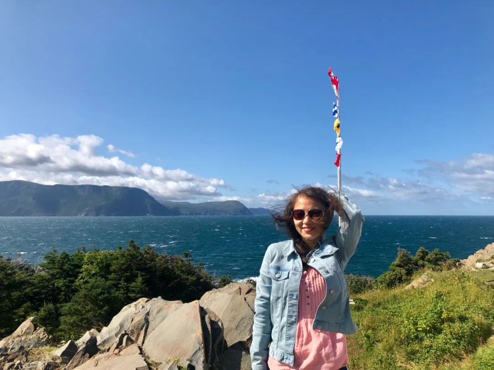  
  
离家不远的地方还有个老人院， 有了去炸鱼店面试的经历， 我也鼓足勇气抱着简历去老人院申请做志愿者。经理看着我的简历问：“我们这里有不少高中生来做志愿者，他们有的是来给老人们弹钢琴，有的是来陪他们聊天，做游戏，你这简历上写着你喜欢做瑜伽，那你能带老人们做瑜伽吗？”“可以啊！” 我立马答应下来。我的瑜伽经历其实只限于健身房里的几节操课，知道几个体式而已。我冲到图书馆，借来瑜伽的书和光盘临阵磨枪学习瑜伽，死记硬背下来光盘里老师说的每一句英文。第一次课，有十几个白发苍苍的老人跟着我做瑜伽。其中一个叫贝蒂的老奶奶已经98 岁了， 但她精神矍铄，乐观向上， 体前屈式，下犬式， 一点也不含糊。每周一次的瑜伽课，她从不缺席。后来我们成了忘年交， 经常一起聊天，一起玩拼词游戏。贝蒂年轻的时候在军队里工作，60岁退休后考上了我们城里劳里埃大学的艺术系，完成了大学本科的学习。从贝蒂身上我学到了对待生活的热情， 学到了活到老学到老的精神。

有了在老人院做志愿者的经历， 我又陆续申请到了在医院里和阿尔兹海默症中心做志愿者的机会，但做的工作和当年做见习医生一样， 就是整理一下病历， 带病人去做检查之类的事。加拿大人都特别热情友好， 每当他们听说我以前在中国是医生， 就会很敬佩， 鼓励我一定可以做回医生。只有我自己知道， 我和这个目标还相差甚远。 
  
  
  
加拿大是个多元化的国家， 我住的滑铁卢小城里有个多元文化中心，那里有一个外国医生学习小组， 都是像我一样的国外来的医生，在一起学习， 准备考试， 申请住院医。我刚刚加入的时候，小组里有十几个人，来自世界各地：伊朗，伊拉克， 埃及，尼日利亚，韩国， 印度，斯里兰卡， 叙利亚。大家一起学习一本叫TorontoNotes 的大厚书。这本宝典是多伦多大学的医学生总结的各科知识要点， 一共有50 章， 每章50 页左右， 被医学生们誉为考试圣经。大家也会分享一些如何申请住院医的信息。
  
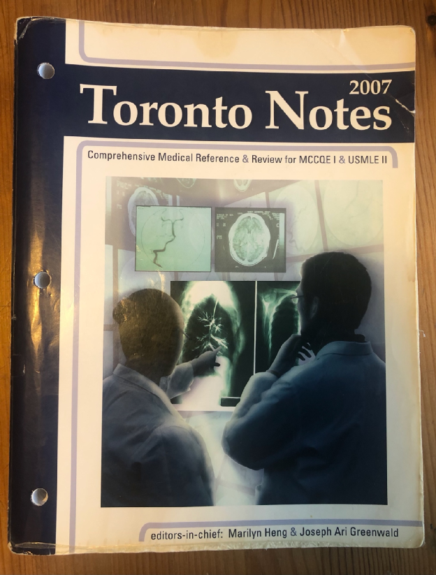  
  
初到加国的第一年，就在学英文， 打工， 做志愿者，学习中度过了。一年后我终于啃完了这本 2500 页的TorontoNotes， 通过了申请住院医的第一个考试- 医学知识评估考试。可惜成绩平平， 刚刚过线。这个评估考试其实非常重要， 很多人说医学院会用这个分数来决定是否录取住院医，而一但通过，便不能再考。一年的努力换来了一个刚刚及格的成绩， 让我觉得我离住院医更远了。 
  

  
被考试成绩打击了的我有些丧气了， 开始考虑如果不能重新做回医生，我还能做什么工作。于是我开始四处投简历找工作， 然而除了医学知识以外，我真的没有其他的技能和特长。面试了几个医生诊所前台的工作未果，我最终被奥特莱斯里的Levi’s 服装店录用了，成为了一名销售。来这个店里打工的多是十几岁的高中生， 大学生，和他们聊天让我觉得自己也变年轻了许多， 不仅学了不少时髦的英文单词， 还知道了雷鬼音乐， 鲍勃马利。店里的奖励机制是每卖出一单150 加元以上，就可以得到1 元钱的回扣，在店里工作了几个月以后， 我成长为了店里的金牌销售。  
  
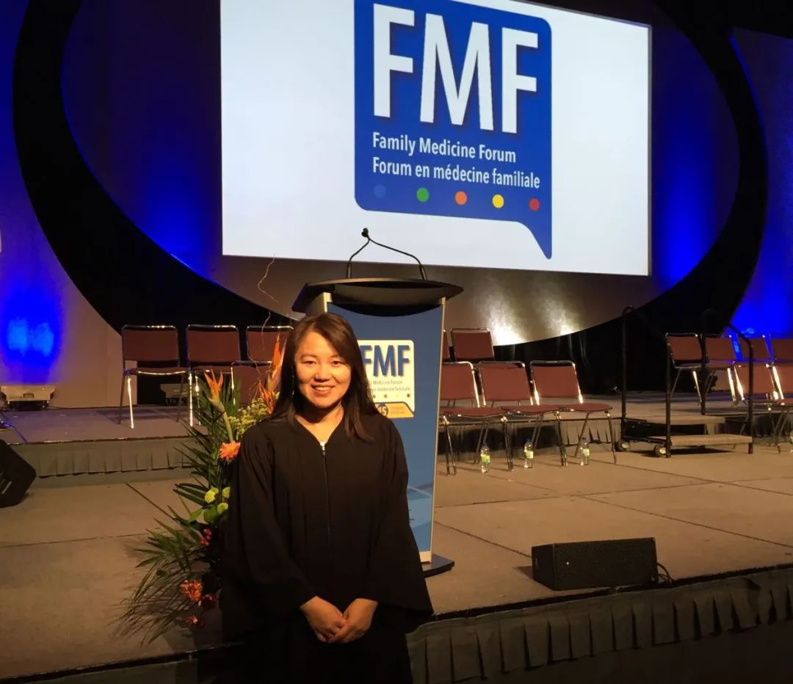  
  
工作之余我在准备我的第二个医学考试， 这次是多站考试， 一共12 站， 每一站都有一名假扮的病人， 我们来进行问病史和查体，老师在一旁观看打分，最后提问。这段时间， 我最怕的就是接到爸爸妈妈和舅舅的电话，每当他们问到考试准备的怎么样了，我就会很焦虑， 因为我知道， 即便考试都通过了，能申请到住院医的机会也是非常的小。有位多伦多的记者拍了一个记录片， 专门记录从其他国家移民到加拿大的医生的生活， 百分之九十都改了行，印象很深的是一名来自非洲的外科医生，送披萨， 开出租， 连续申请了九年， 最终申请到了住院医的职位。我们小城的电视台联系到医生学习小组，对我们进行了一次采访，在热点话题栏目里播出。节目播出后， 我们得到了许多关注， 我也才知道我是可以申请在老人院里做护士的工作的，只是因为没有护士执照， 工资只有12块钱一小时。在卖了一年牛仔裤以后， 我辞掉了这份销售的工作，开始在老人院里做护理的工作。虽然工作很简单，就是负责给老人们按时发药，打胰岛素， 但至少离我的医学梦更近了一步。

在老人院工作的空余， 我继续练习我的英语， 刷托福成绩， 准备第二个医学资格考试。那时大家还是通过微博联系， 我看到我的几个大学同学都在美国通过了考试， 准备申请住院医，还有的读了公共卫生专业的硕士。在美国， 很多临床医生都有公共卫生硕士的学历，我了解到我们小城里的滑铁卢大学也恰巧刚刚开办这个专业， 就兴奋的着手申请了。因为学了这个专业， 即便当不上医生， 也可以找到一些医疗卫生相关的专业工作。我很认真的准备了自荐信和简历，把自己好好夸了一番，却没想到接到了拒绝信。那一阵子情绪真的是跌到谷底， 来加拿大两年多，英语长进缓慢， 托福考了五六遍还没有达标， 医学专业考试通过了两个， 但成绩平平， 想上学又被拒。而国内的大学同学们这时都已经荣升主治医师， 美国的同学们也都当上了住院医。因为看不到希望，我真的有些抑郁了，动不动就会发脾气， 有时还会不自觉的落泪。
  
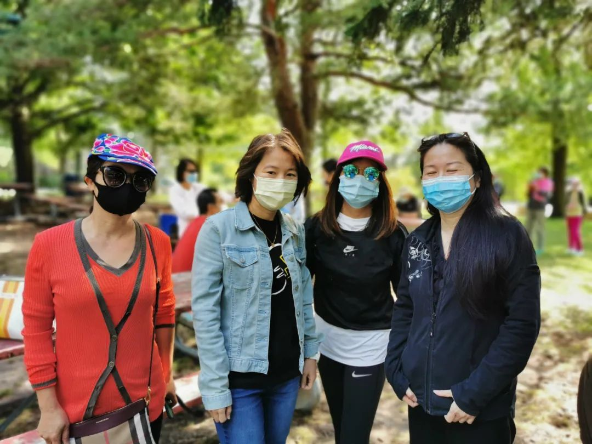  
  
一个消息惊醒了消沉的我， 我刚到加拿大时在医生小组和我一起学习的一个伊朗女孩成功申请到了精神科的住院医。在我打工的这两年里， 她不停的努力，通过了所有医学考试， 成功了。我对自己说：别人能做到的事， 我为什么做不到？原因是我还不够努力， 还不够优秀。我要加油！于是我又开始啃那本2500 页的大厚书，每周坐灰狗车去多伦多学习，抓住一切机会提高我的英语口语。功夫不负有心人，在我来加的第三个年头，我被滑铁卢大学的公共卫生硕士专业录取了， 并开始在一个家庭医生的诊所里做助手。经过大大小小十多次考试， 我终于有资格申请住院医了。我根据自己的经历申请了家庭医生， 公共卫生与预防医学， 和妇产科。
  
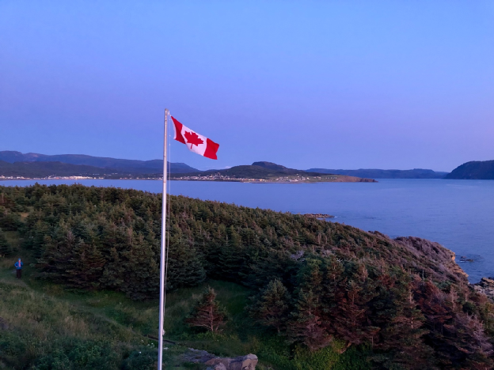  
  
我幸运的收到了北安大略医学院公共卫生与预防医学的面试邀请。这个学校是安省最新的一所医学院， 位于多伦多以北三百多公里的萨德伯里市。接到面试的通知，我既兴奋又紧张。面试包括面试前晚上的晚餐， 正式的一小时面试， 和面试后医学院和公共卫生局的参观活动。我和老公开了五个多小时的车来到萨德伯里市， 第一天晚上见到了住院医导师， 住院总医师， 和其他的五六个候选人。大家通过晚餐的机会互相了解， 第二天的面试都是些常规的问题，最后还让我们每人以当地卫生官员的名义写一篇文章来鼓励大家多做运动。幸运的是我之前刚好在滑铁卢大学选修了专业写作课， 这下可真是学有所用啦。之后便是漫长的等待结果。还记得发榜的那天，是中午12 点发榜， 我激动的不行， 想早点知道结果， 又不太敢看结果。12 点不到我就坐到电脑前开始刷结果， 没想到因为访问的人太多， 系统瘫痪了。过了一个多小时， 网站终于恢复了正常， 我看到大大的一行字映入眼帘：恭喜你， 成功的被选入住院医。我简直不敢相信自己的眼睛， 看了很多遍， 掐掐自己， 是真的，我成功了！经过五年的努力， 我重新做回了住院医。一年后， 我和导师一起面试新的住院医候选人的时候， 导师告诉我，在我面试的那年有两百多人申请， 最后的面试邀请的候选人都非常优秀， 他们有的英语比我好， 有的比我有经验，但我最后被选中， 是因为他们从我的文章里和我做志愿者的经历中看到了我对这个专业的热爱。
  
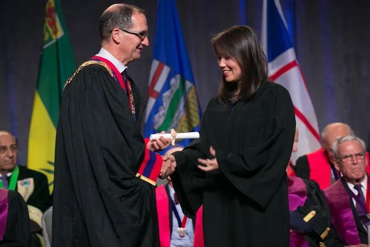  
  
  
**重做住院医**  
  
  
接到录取通知是在三月份， 而正是开始临床实习是在七月， 这之后的几个月都没有接到任何学校的通知， 这令我很怀疑是不是真的被录取了。直到六月份我才收到消息通知我去参加多伦多为期三周的实习前培训。这个培训是针对我们这些非美国加拿大的医学毕业生的， 三周的时间并不是要考察我们的医学知识， 而是要给我们补习一下这里的文化。医学可以算是科学， 但它其实更是一门艺术。医生与病人的交流很多时候比正确的诊断和治疗更重要。这三周的西方文化补习令我印象深刻的是：老师说这边的上级医师在给学生评语的时候， 通常采用三明治法则， 也就说先把你天花乱坠的夸奖一通， 然后再说出你的问题所在， 最后再夸奖一番，让你继续加油努力。而我们这些国外毕业的医学生往往没有注意听三明治中间的那一层。这一点我觉得不仅在学生和老师的交流中很重要， 也可以运用到和同事， 病人， 家人，朋友的交往中。

实习的前三个月算是试用期， 只有通过了考核才能正式成为住院医。我就读的医学院位于安省的北方，第一个轮转被安排在著名的白求恩出生的小镇。小镇只有5000 人口， 一家医院和两家诊所， 我在其中的一家家庭医生诊所实习。我的带教老师是个印度裔的帅哥，和他在一起行医的是一名有德国血统的医生。他们俩是当年住院医时候的同学，两人风格迥异，非常互补。德裔医生极为严谨， 印度裔医生则非常大胆豪放。我虽然顶着协和医学博士的光环， 并且通过了所有加拿大的医学考试， 但我的临床经验近乎为零， 我甚至不知道怎么看普通的感冒。而要通过这三个月的试用期， 每天老师都要给我填反馈表为我的表现打分。多亏这两位医生的理解，也幸好知道了三明治法则，我在这三个月里， 尽力多看病人， 不耻下问，终于从一名小白成长成一名可以独立看病的合格住院医， 通过了试用期。  
  
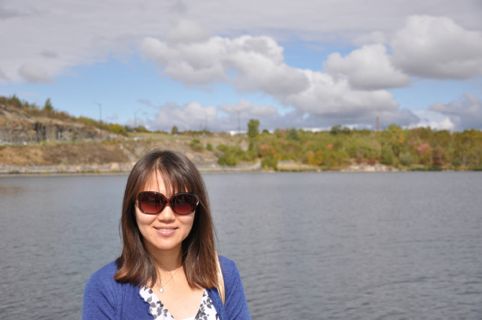  
  
紧接着的第二个实习是急诊室。萨德伯里是安省北方最大的城市，以镍矿和众多的湖泊闻名。这里的医院也是北方最大的医疗中心，负责方圆几百公里人们的医疗。医院的顶层是停机坪， 危重病人会被直升机送来救治， 需要特殊治疗的病人也会被直升机送往多伦多或渥太华的大医院。因为很多人住在很偏僻的地方， 所以这里见到的病例也都和城市里有很大不同。有很多严重的车祸，外伤， 和急重症的病人。与国内不同的是， 这里的急症室医生需要能够处理各种疾病， 从抢救病人到内科，外科， 妇产科，骨科， 如果有处理不了的或者复杂的病例才会联系专科医生来会诊， 因此也就对急诊医生有更高的要求。进入急诊室的病人按照病情的轻重被分为5级， 1级是需要抢救的，2级3级是需要严密监护生命体征， 紧急处理的， 4级5级是比较轻的患者。每个班大概7-12小时不等， 一般是前一半时间处理重症的患者， 后一半时间处理轻症的。我们住院医跟着带教老师， 可以自行选择病人， 但要保证病人的生命体征是平稳的。每个班下来，一个人大概可以看十几个病人， 结束前老师会给我们反馈意见。最难忘的一次经历是救护车送来一个车祸的病人， 危在旦夕， 我的老师让我和他一起去抢救室去进行抢救。分配给我的任务是给病人做气管插管。虽然我之前在模型上练习过， 但我从来没有给真的病人做过这个操作，而这是最关键的一个操作。我紧张到有些发抖， 但还是强撑着完成了我的第一个气管插管。可惜病人伤的太重，最终还是没有抢救成功。下班前和老师一起回顾病例的时候我哭了，我很内疚，觉得如果我的技术再熟练一些也许就能挽回那个病人。我的老师安慰我，说我做得很好，不必自责。但这一次的经历还是深深的印在我的脑海里， 时刻提醒我作为一名医务工作者的使命和责任--健康所系， 生命相托。

我的专业全名是公共卫生与预防医学专业。在新冠之前，我总需要向别人介绍一番， 这个专业是做什么的。这个专业的住院医生轮转一共五年，其中包括两年的家庭医生各科轮转， 一年的公共卫生硕士学习， 和两年的公共卫生专业轮转。毕业之后， 经过公共卫生专业考试， 我们就可以有资格做地区的卫生官。经过两年的家庭医生轮转之后，如果通过家庭医生的执业考试，我们也可以做家庭医生。然而无论是家庭医生还是专科医生的专科考试都只有两次机会， 也就是说如果两次考试不过，则一切归零， 就要重新从申请住院医开始。这压力可想而知，我的两个住院医同学， 因为第一次考试没有通过，害怕第二次考试再次失利，干脆搬到了其他的省去考试行医。我的第一次家庭医生专科考试也有一半没有通过， 失败在了面试的部分。这个考试是由家庭医生假扮成病人， 需要考生通过15 分钟的时间找出病人的问题， 并提出治疗方案。比如说， 病人是一位中年女性， 主诉是头痛， 但头痛的原因是她的母亲生病了，她需要照顾母亲，经济上还有压力等等。考官不会主动向您提供信息， 所以需要很仔细的聆听病人的叙述， 并提出适当的问题。这对本地的考生来说非常简单， 而对于我们这些英语非母语的考生就很难了。我有一站考试就遇到了一个有印度口音的考官，我想我是彻底没有搞清楚他的问题是什么， 因此考试失败。第一次考试的失败令我压力倍增， 那段时间感觉自己真的抑郁了焦虑了，每天都觉得很累，早上起不来床，不想去上班。明明知道自己应该更努力的去学习， 但就是不能安心下来学习。在这个时候，又幸运的遇到了一位好老师， 一位热心的家庭医生， 无偿的帮我们几个考试失利的住院医准备考试。我们每周都和她进行几次模拟考试练习。经过大半年的练习， 我终于通过了家庭医生的执业考试，可以独立行医了。
  
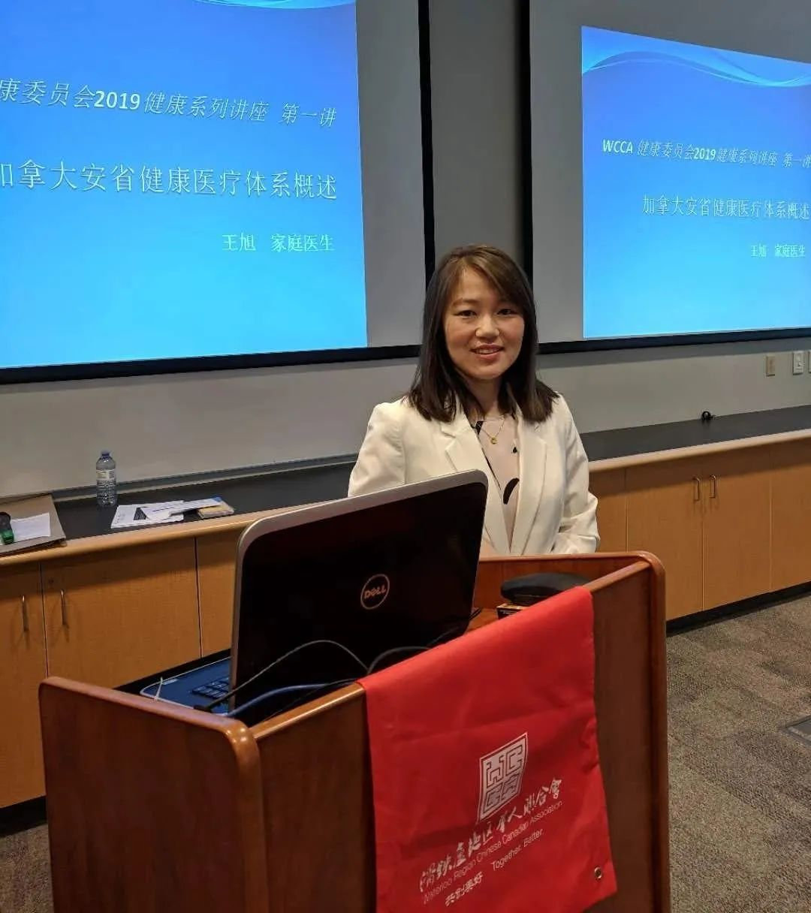  
  
公共卫生专业在新冠之后大家都有所了解了。这个专业的医生多在卫生部门主管传染病的防控， 疾病的预防， 促进健康的生活方式， 提高人群的整体健康水平。环境健康， 各种传染病防治追踪， 母婴健康， 宣传戒烟，母乳喂养， 提倡健康饮食， 控制肥胖， 都是公共卫生的重要组成部分。同时作为管理者， 还需要学习管理学， 人力资源，机构运营， 对外交流等等。对于我这样一个内向而不善言谈的人来说， 这又是一个不小的挑战。为了练习自己的英语和公共演讲能力， 我参加了toastmaster – 国际演讲俱乐部。反复的练习，让我不再害怕当众演讲， 主持会议， 也可以较为轻松的接受电台和电视台的访问。2016 年6月， 在我来到加拿大10年之后， 我通过了公共卫生与预防医学专业的执业考试， 并获得了地区卫生官的职位。
  
  
**做一名家庭医生**  
  
五年住院医毕业，我又一次面临职业的选择-- 做一名地区的卫生官员还是一名家庭医生。经过反复的思考， 我决定做我喜欢的工作， 能做好的工作——一名家庭医生。因为卫生官的工作以管理为主，需要很好的语言沟通能力， 而这些都不是我所擅长的。我所在的小城有很多的华人，大家都特别需要能说中文的家庭医生， 如果我能用我所学的知识面对面地为大家服务，那该多好啊。我开始招收病人的消息一经传开， 不到一个月就有六百多人登记报名。大家给了我无比的信任和关爱， 让我越来越热爱我的工作。

我们小城里汇聚了全国各地来的精英，华人组织也越来越强大。我常常收到各个组织的邀请， 为大家进行一些医学知识的科普， 看到我的病人和身边的朋友都能保持健康的状态，是我最开心的事情。下医医病， 中医医人， 上医医心。我也在不断的提高自己，不仅是要不断更新自己的知识，积累更多的经验， 更要向病人学习， 学会倾听，学习如何更好的和病人沟通。
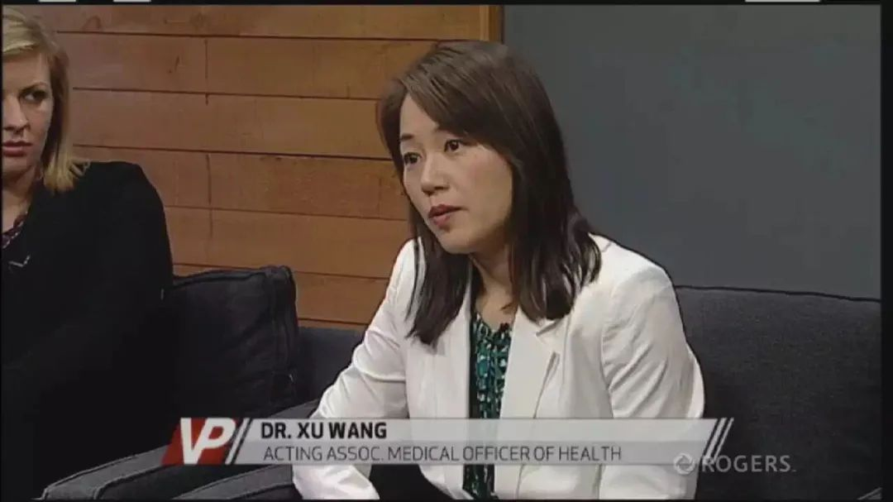  
  
来加十五载， 我没有能像舅舅期望的那样成为一名医学大家， 但我并没有为我当初做出的出国的决定而后悔。这十五年的移民生活让我经历很多， 成长很多， 收获很多。我很享受现在的工作和生活状态， 在这里做一名家庭医生，不必为收不收病人的红包而苦恼， 也不必强迫自己去搞科研或者做管理工作， 我只需要全身心投入的为我的病人服务好。每逢佳节，我总能收到很多感谢的卡片和病人亲手做的各种美食。工作之余，可以和小城里有才华的朋友们一起唱歌、画画、 跑步， 和家人一起种菜、养花、 做美食、远足、 露营。今年我的协和小师妹也成功的当上了住院医， 真为她高兴。生活不止眼前的苟且，只要我们心中充满希望，对自己充满信心，对身边的人充满爱，努力的活好每一天， 生活便会给我们带来无尽地喜悦和幸福。
  
**2021年6月9日**  
  
**加拿大  滑铁卢**  
  
  
  

  
