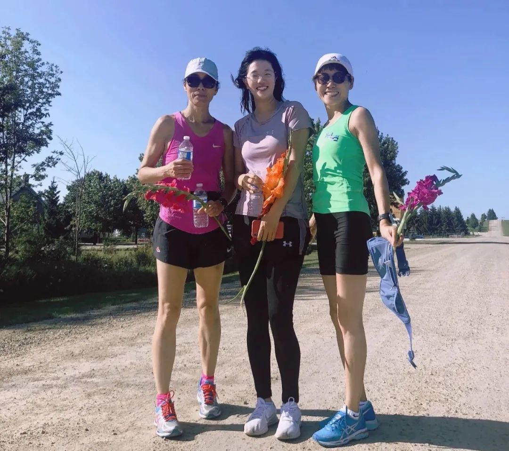
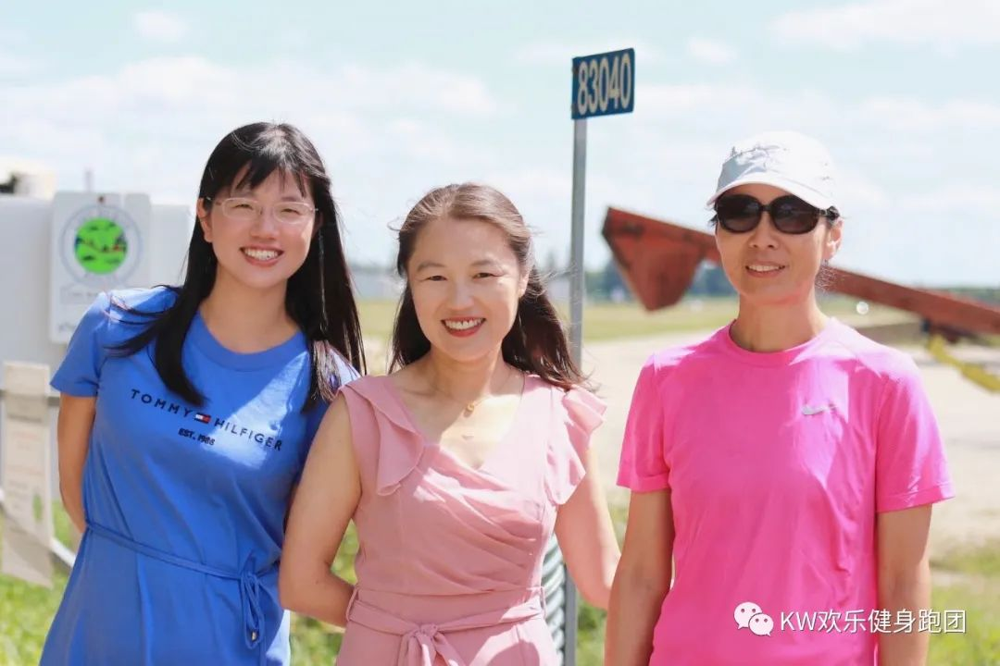
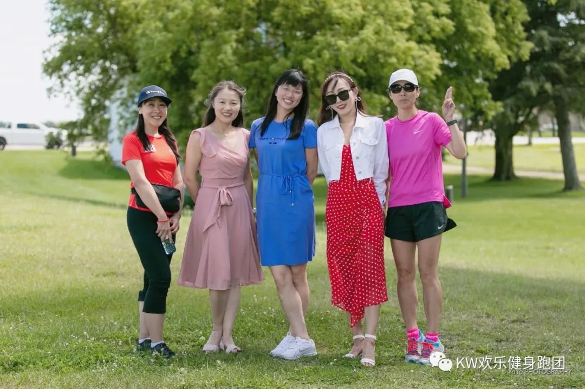
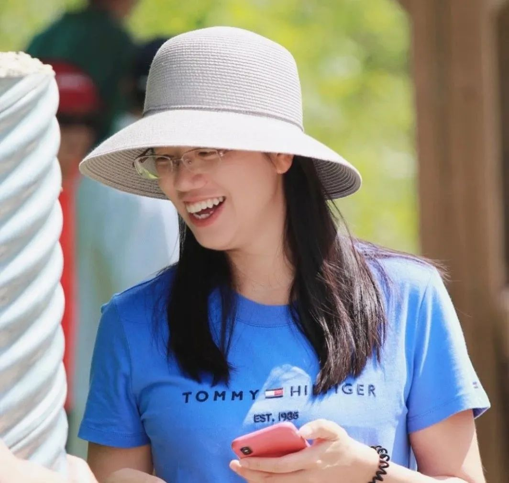
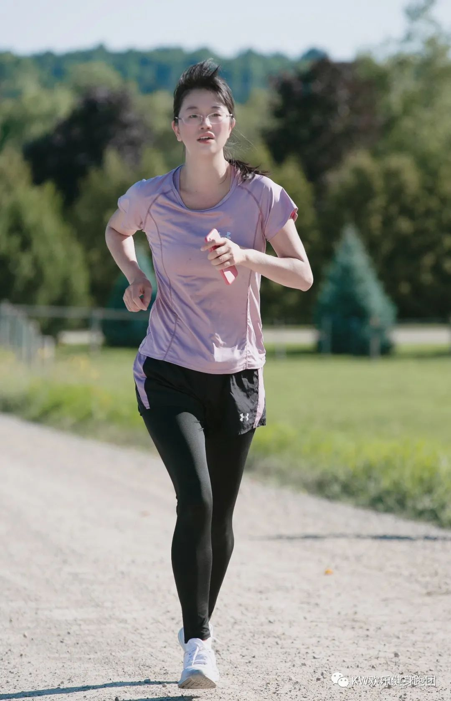

有太多的感动、震撼、 感谢埋在心里，有太多的话想跟各位哥哥姐姐们说

当知道我要参加Happy队时，我就开始了漫长的期待和向往。期待的是看队友们飞一样的奔跑，期待感受他们冲刺的速度。而心里想着自己只要开心跑就好。可是当到了上周一，心里却忽然有了另外一个声音：万一我那天腿不听话，罢工了咋办？于是我开启了长达一个星期的自我安慰和放纵。给自己做各种好吃的，减少跑步的次数，感觉这样自己会非常开心和舒服。凭着我对自己的肤浅了解，觉得肯定能在比赛的那天爆发自己的潜力，说不定跑的飞起来呢。可惜到了周五晚上，我就开始后悔自己这一周的散漫。心里念叨着早点睡，因为第二天要５点多起床。结果到了12点还在靠写作业转移自己的紧张。  
  
  
早上起床真心的很开心，忽然间忘了前一天的紧张和不安。可是却又好似要去参加高考一样的期待。来到第一棒的起点，看着朝气蓬勃的队友们，他们矫健的身姿，以及他们脸上散发的自信和期待，我顿然觉得自己肯定跑不下来了。看完第一棒Coco 和九儿姐的比赛，我发现他们真的身上有着我没有的品质：沉着和稳重。关键时刻依然发挥的比平时还好。趁着第二棒进行的时候，我开始给自己做各种心理准备。好像在说服心里躺着的那个懒虫，振奋起来以积极的心态迎接这场比赛。可是我心里的那只懒虫并不是太接受这些理由，心里还是充斥着各种怀疑和忐忑不安。  
  
  
在我就要开始跑的前几分钟，Linda 姐给了我一个振奋的消息：她要全程陪我跑。我当时激动地跳了起来。心里顿然感觉到一股热流。这股热流瞬间激发起身体里那条沉睡懒虫的斗志。  
  
  
终于开始跑啦。本来想着起跑会有运动会一般的刺激，可惜并没有。感觉好像很平常一样。可是心脏却像装了加速器一样，急速跳动。好像害怕什么。又好像在紧张什么。我的双腿还好很听话，真的可以跟上队友们的步伐。放眼望去，我竟然可以看到RuiRui的矫健身姿。心里一阵窃喜，说不定我真的可以跑飞起来呢。可惜几分钟以后我的美好愿望就已经落空啦。我发现自己竟然开始要使劲用最喘气的方式来呼吸并配合心脏工作。我的大脑好像很看不起这落后的呼吸和心脏系统。开始质疑他们：你们有必要这么费劲吗？速度并不是很快呀。正常呼吸就好。当我开始调节呼吸的时候，大脑开始自我质疑了：也许你的心肺就是不想工作呢？也许你就适合慢慢跑呢？放慢点步伐吧，Alice。开心最重要。你这个时候一点不开心，感觉你在挣扎。  
  
  
当我的大脑发出指示要寻找开心的时候，Linda 转头给我信号：跑了２公里啦。看着她那满脸的笑容和信任，我身体里忽然冲出了一股劲。这股劲在发出一个声音：你其实可以战胜这种疲惫感，你可以协调好自己的心肺功能。于是腿就像装了马达一样，自动的加速。接下来的５公里我都在Linda的鼓励和自我鼓励下顺利完成啦。虽然呼吸不像平时那么顺畅，但腿算是尽了最大的努力。当我听说还有一公里后就可以完赛时，腿就开始准备加速，为最后的冲刺做最后的努力。２分钟过后， Linda姐说：“还有500米，你可以冲出你的最佳成绩啦”。内心的表现欲望，和自我的高期待，使得我对最后500米的进行了完全错误地判断。我抬起头，感觉看不到尽头。于是开始怀疑这是否是真的终点还是Linda姐鼓励我的良药。但当我看到头上飞行的无人机，和前方做拍照状的团长，才明白这就快要到终点啦。可是我真的不想冲了，我想立即躺下睡觉。有几秒钟的时间，我在怀疑自己为什么要来参加这个比赛，为什么在跑不动的时候还要坚持。我内心的声音在很大声地喊停我的步伐。终于在我要觉得要停下来的一刻，我看到Linda姐矫健的加速身姿，  
仿佛她就是我  
。于是乎，自己的步子也就不自然地加快了。我真的跑到了终点！瞬间眼泪湿润了眼睛。而那眼泪不是因为自己的努力而感动的，而是因为在我快要放弃的时候，Linda姐一路的陪伴，以及最后我把她当作了自己的精神支柱而感动的。  
  
  
  
这也许就是比赛和运动的魅力。你会在挑战、迷茫、放弃中徘徊很久。但是想要获得成功的喜悦、朋友的认可、自我的肯定，你需要太多的努力、汗水、坚持、再坚持、以及非常坚定的意志。  
  
  
很多时候仅仅是自我的意志和坚定还是不足以克服我们内心的恐惧、放弃和妥协。  
  
  
榜样、陪伴以及亲眼目睹和发现身边朋友的坚强、友善以及以身作则的坚持和无声的感动能激发起我们自己内心的小宇宙。我们那个变的更好、更坚强、更友善、更乐于助人的超我就能更好的引领我们前行！  
  
  
  
回家休息了2个小时后，我重回了赛场。此时的我就特别特别地想帮助他人做点事。因为我发现当跑完了步，喝着Baohua姐递来的一碗银耳汤是多么幸福的一件事！看到队友们最后都来迎接我，关心我的时候，我感觉自己真的无比幸运。真的要感谢后勤各位哥哥姐姐们给予我的这种幸福感。很幸运的是这种奉献精神真的让我感受了家人般的温暖以及人在异国他乡莫名的亲切感。我下定决心，要把这种精神传承下去，传递给和我接触和认识的朋友们。  
  
  
下午Yunping 大哥和汪师傅的比赛，我决定要去服务和鼓励他们。我看到他们跑步的喜悦感竟然远远超过自己跑步时带来的成就感。终于到了郭大哥和高峰上场。我看到了所有的人都在经历着我上午的复杂心理，都在紧张和不安地准备着。当被封为峰神的高峰在跑前和我诉说自己的恐惧，我真的想给他个拥抱。虽然是跑神，但是他内心其实是特别最害怕跑坡段。因为他曾经受过伤。我很为他那种敢于挑战内心的恐惧而自豪。当得知郭大哥要全程跑坡路，我真恨不得跟他说，你慢慢跑，尽力就行。因为我知道，他一定会经历比我更复杂的心理活动，他一定要付出比我更多的努力和毅力才能战胜一个又一个的陡坡以及自己内心的焦虑。我是多么希望郭大哥也能像我一样幸运，有Linda姐这样的女神来做他的导航灯鼓舞和照亮他前行的方向。可惜我自己真的跑不下来。一分钟后，我看到了RuiRui那矫健的身姿。她是那么的美丽，那么的自信，那么的光芒四射，这才是我的明星啊。真想跑上去拥抱一下她。因为她做了很多人想做而没有能力做的事。我脑海里一遍又一遍出现RuiRui穿着粉色上衣，健步跑过的画面，一遍一遍地出现郭大哥气喘不息却满脸坚定的情景。  
  
除了这些，我也为Yun、Andy、Xiaohui、团长的精神所感动和鼓舞着。他们带着不适的身体依然坚持完成比赛。他们的坚持和笃定是我一生追求的品质。  
  
  
晚上吹着风，我们品尝着各位大厨们准备的美食。谈笑着，一切都是那么的美好。一切的艰辛、担心和恐惧都随着风吹的无影无踪。剩下的就是陪着我们一路跑来的坚定、陪伴、笃定、感谢和感动。  
  
  
  
感谢各位跑团的哥哥姐姐们，你们个个身着闪耀和美好的品德。你们的坚定、坚持、陪伴以及对我和对他人的鼓励，让我成为了你们的一个忠实的追随者。我也希望我能用这些美好的品质感染和帮助自己身边的人。  
  
  
生命的意义有很多。我们在完美的诠释其中最为美好的一部分：追逐和超越自我、认知和克服自我恐惧、用美德引导和感化他人。正因为这些，让本是很枯燥寂寞的跑步，变成很有很有爱和激情的运动。少年们，让我们继续带上这份对自由和远方的追求，对朋友的无私鼓舞与支持，对恐惧的藐视以及对美好远方和终点的不懈努力。  
  
  
  
  
最后再次感谢Linda姐的一路鼓励与支持。  
感谢Ruirui姐和Linda姐，你们很好的诠释了什么是最好的鼓舞和陪伴。  
  
  
感谢团长、感触、九儿、Coco的各种支持，让我能在这个异国他乡感受到家人般的温暖。  
  
  
感谢Mike, Baohua 姐， Arene, Yun你们的美食使得我们跑步更有动力。为了美食而跑，谁又不是呢？  
  
  
感谢 汪师傅，Yunping大哥, 吴大哥，你们给我传授的跑步秘笈我还要慢慢体会和吸收，但是你们传递的跑步精神和团队精神，我深刻的感受到了并且也会传递给他人。  
  
  
  
  
  
我们都还是那个少年，满怀着爱和热情奔跑着的少年！  
  
  
  
Alice Liu  
  
2021.8.16 书于  
滑铁卢  
  
