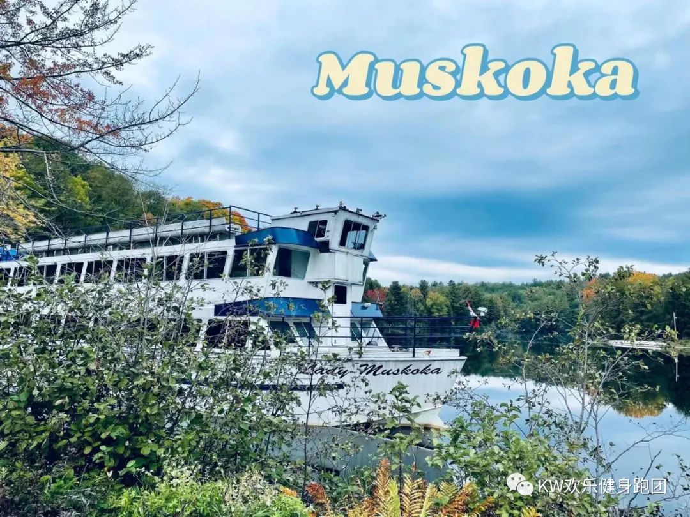
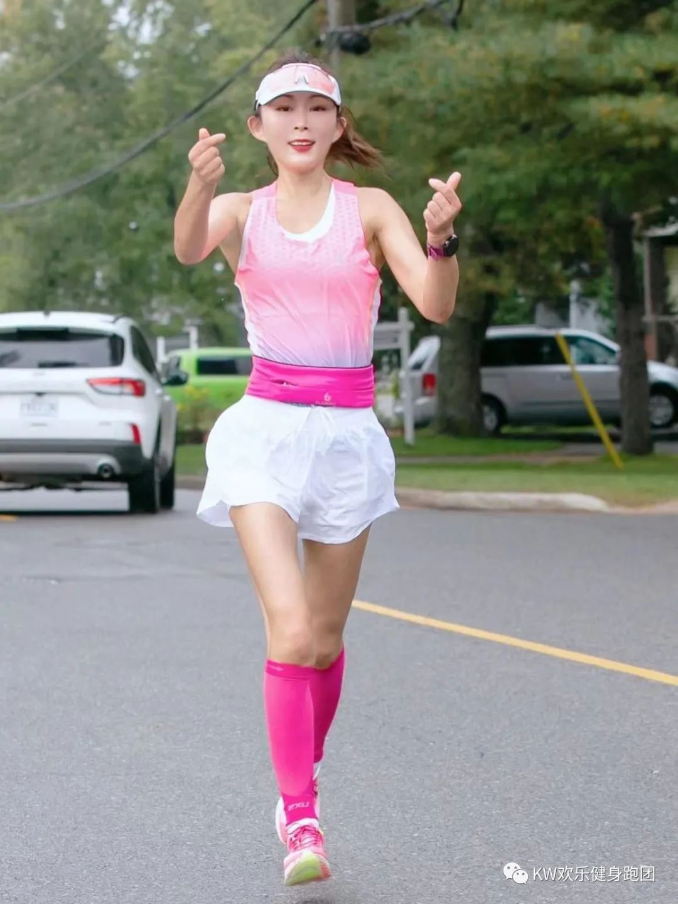
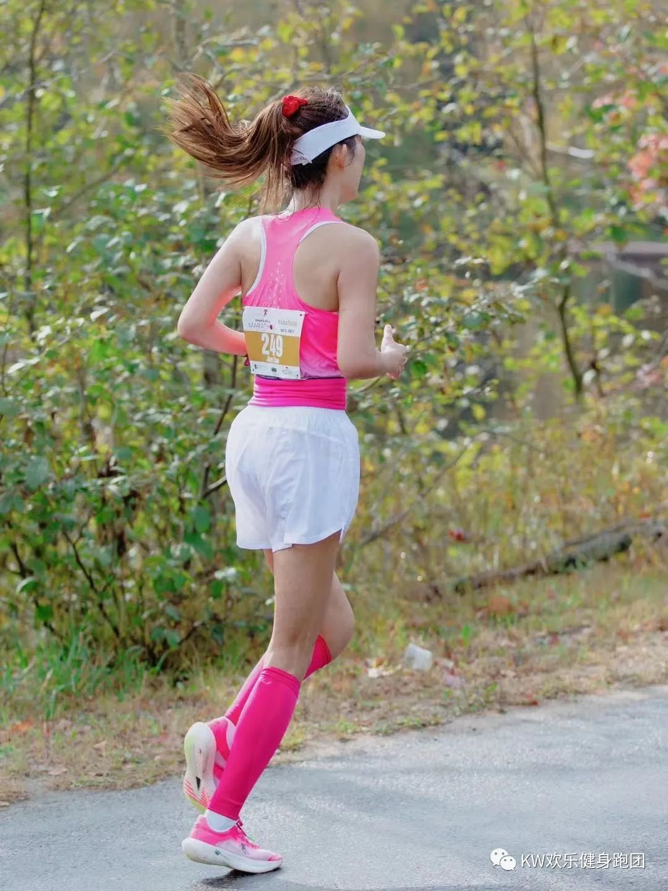
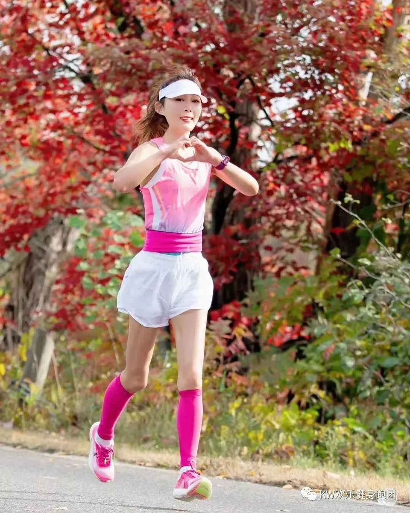
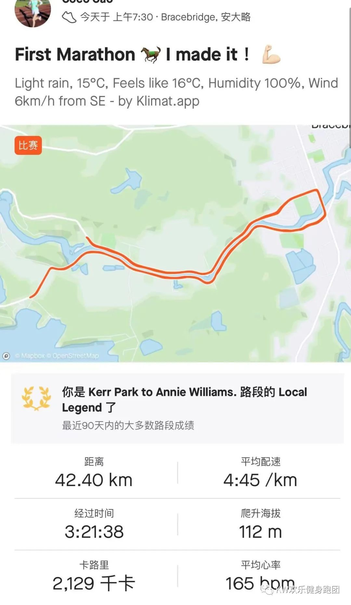
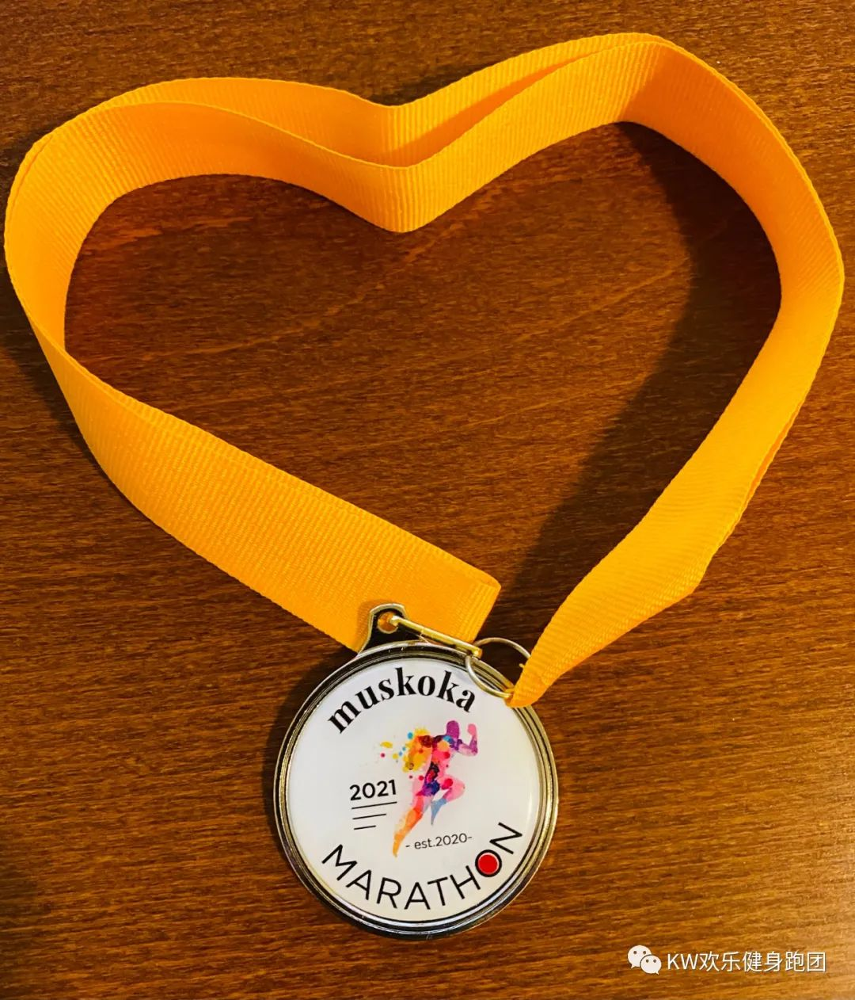
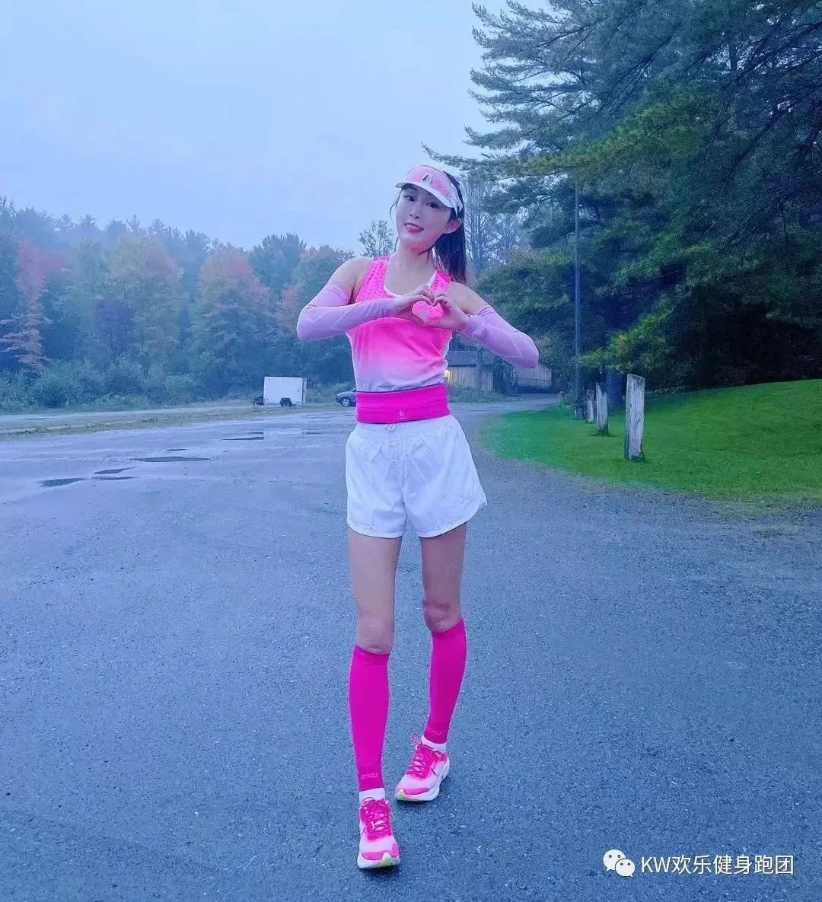

  
**在童话小镇跑一场童话马拉松**

**“这是不可能完成的任务”**

**“只要你相信就可能”**  
  
  
跑全马的初衷很简单，19年春天开始，机缘巧合一不小心跌入跑坑，在本村铁三帅哥追风的指点下跑了两个半马比赛。20年一年无马可跑，21年春天，国际上的赛事渐渐恢复，找了一圈，发现好玩的盛大的马拉松比赛都不带跑半马的玩，想去参加世界上的各种好玩的比赛，只能参加全马。  
  
  
全马42.195公里，跑一个半马比赛就累得快撅过去了，这后头可怎么跑完呀！对我来说这根本是不可能完成的任务。“只要你相信就可能” 忽然间《爱丽丝梦游仙境》里的一句台词闪现在我脑海里，要不要挑战一下自己？趁着疫情期间时间充裕，试试呗？不知哪儿来的勇气，几分钟之内掏卡交钱报名Muskoka Marathon，这事儿就定下来了。  
  
  
  
  
  
  
18周的训练，一次大课一次长距离都没有miss掉，为了不耽误正常生活，我尽量在早上八点前跑完。如果跑长距离，就只能早起。科比说 “你知道凌晨四点钟的洛杉矶是什么样子吗？” 我不知道，但是我知道我们滑铁卢小镇，四五点的天空，星月交辉，寥落的灯光，几乎见不到行人，偶尔有一两只调皮的小兔子和我比赛，跑着跑着能看见太阳一点一点的升起，慢慢地慢慢地铺满滑铁卢的大地。  
  
  
每个起早贪黑的日子，都是特别有梦想的日子。从春末跑到盛夏再跑到秋天，数不清跑了多少个30+公里，数不清在操场上绕了多少圈，数不清多少次衣服汗湿得像是从水里捞出来，10月3号，跑马的日子终于到了。  
  
  
**决定权在你自己手里**  
  
**因为当你走出来面对那些怪兽**  
  
**你就得战斗！**  
  
  
如果说跑步是生活方式的随意体现，那跑马则是饱含敬畏的极限挑战。42.2公里，几个小时的连续奔跑，如果没有充足的准备和强大的心理，是不可能完成的。备赛的几个月的过程就是不断怀疑，否定，寻找，肯定再推翻自己的过程，就好像爱丽丝梦游仙境里，在魔幻神奇的地下世界里，爱丽丝时刻努力保持清醒，不断探险，同时又不断追问“我是谁”，在探险的同时不断认识自我，不断成长，终于找到自我。  
  
  
比赛前一晚睡觉并没觉得激动，很奇怪的是也没有那种比赛的强烈感觉, 再加上鼻子也有些不通气，差不多12点多才入睡，感觉也没睡多久，闹钟就响了，打开门看了看并没有像天气预报那样下大雨，只是淅淅沥沥的小雨，于是吃饭喝水排空背个小包就出发了。  
  
  
疫情期间选手们都是分批出发，七点钟，精英选手们出发了，他们精神气十足迈着齐刷刷的步子, 清晨雨后的光洒下来刚好照在他们奔跑的身影上，在那些闪闪发光的人身上，奔跑呈现的赤子般的真诚与热爱，就好像一束光照进我的内心，瞬间把我照亮了。  
  
  
  
  
  
七点半轮到我了，听着倒计时五四三二一，我挥挥手，就随着一波人流，跑过出发点，按下佳明手表的start--准备了四个月的比赛，此刻真的开始了。钉子哥和我一起出发，我们都是首马，目标也差不多，不吹不黑，钉子哥作为跑步小伙伴，绝对是top级的。备赛的这几个月所有的间歇和长距离都是我们互相鼓励跑下来的。都互相见证了彼此的进步和成长。  
  
  
蜜月湖马（Muskoka Marathon）的最大魅力，就是风景美，静静的湖面倒映着红红的枫叶，河边很多非常梦幻的房子和小船，加上加拿大十月最美的枫叶，一切就像童话故事刚开始一般，充满着美丽与祥和。赛道是十公里长的路往返两次，来回都在一条道上，于是迎面可以与很多多伦多的跑友们互相加油打气，离得近的时候还相互击掌。虽然这些多伦多的跑友们从未曾谋面，但是在Strava 上已经默默关注很久了，他们的勤奋，自律和努力也时常影响着我，和他们击掌的那一刻真的感觉到他们传来的鼓励和力量。他们认真的对待这份爱好，也尽所能的把这份热爱传递影响其他人。  
  
  
跑步的乐趣或许是在美景里慢跑，和朋友交流，但马拉松的乐趣不是。如何在42.195公里的距离里尽最大可能的高速奔跑，是一门学问，也是科学。都说万事开头难，马拉松也是，我们往往会因为出发以及比赛的氛围，热血上头，而一场马拉松能不能跑出预期的成绩，往往真的是看克制的能力。克制自己从开始就保持清醒找到自己的节奏，克制自己在一开始大家拼命往前冲的时候还能严格地执行自己的计划配速。我和钉子哥前半程目标配速是一致的，于是我们一路跑一路互相报一下心率和速度。如果说经历了四个月的备赛，跑个完美的全马是万事俱备，只欠东风，但，这个东风却迟迟没来。比赛日当天气温忽然反常，凉爽了很久的天气忽然变得闷热潮湿，湿度达到了百分之百，早晨下过雨的地面很滑，有时候还需要避开积水，心率在这样的天气环境里一下就飙到很高，看这样子应该是一场硬仗，于是决定不想太多，稳住心态，严格执行配速计划。马拉松就是这样，是一场你只有出发才知道会遇见什么的旅程。战胜一路出现的怪兽的，是你自己强大的精神和稳定的心态。  
  
  
  
  
  
前五公里稍稍比目标配速慢几秒，钉子哥稍稍有些不淡定了，话开始多起来。我对他说，先别想太多，咱们先专注在跑步上，现在坡道比较多，一会平路和下坡我们争取抢回来一点时间。于是时而我们并排，时而交替领跑，按时补胶补水，路上见到91camp和滑铁卢四点出发赶过去的的志愿者们大声的加油，热心地递水，被他们的热情和包围鼓舞着，身上又更加有劲了。感谢这一路听到的加油和鼓励，因为这些鼓励，给了自己更多不停歇的动力。真心谢谢这些最美的志愿者们，最好的感谢，不是口头那几句话，而是传递。将来不跑马的日子里，我也要去做志愿者，服务参赛的跑者，把热情和热爱传递下去。  
  
  
半程过后，1小时39分左右，太阳也来凑热闹了，又湿又热又晒的感觉就像夏天，第二个半程明显感觉坡比前半程难跑，每次跑到坡的时候，我就在想，又来一个怪兽，我要消灭它去下一关，既然躲不过，那怕也没有用，牢记上坡要领，重心前移臀肌用力，迎头而上。也许，跑马拉松的乐趣之一就是为所爱，尽所能，克服赛道上一个又一个难关，克服自己身体的一个又一个极限，克服公里数上一个又一个数字。  
  
  
30公里后，钉子哥决定加速，我看了一下自己的心率评估了一下自己的体能，决定守住当前配速。看着他向前奔去，心里默默为他加油。没有同行的人了，周围也没有相同速度的人，就剩我自己，此时能做到的，就是尽可能地在38公里前守住配速。  
  
  
**实现“不可能”唯一的方法**  
  
**就是相信它是可能的**  
  
  
如果一切都很顺利，那真的就美好得像一个童话故事，然而，在马拉松的赛道上，你永远不知道，意外和计时器到底哪个先来。37公里处，我的小腿和脚开始有感觉要抽筋了，心下暗暗想，糟糕，千万不能抽筋啊，这个时候身体机械地向前奔跑，但是脑子却关注着自己的腿部肌肉，看了一下手表，如果提速估计刚刚好能跑进3小时20分钟，但如果提速，会不会导致抽筋前功尽弃？脑子里迅速权衡了一下，决定放弃加速，尽可能的控制住肌肉。38公里处断魂坡感觉自己快要上不去了，平时在滑铁卢比这个难跑得多的坡也跑过，怎么这个坡这个时候就这么难跑呢？一边艰难地跑着，一边想，以后再也不跑了，太虐了，太累了，太难了。最难的时候，Julie姐和Ruirui出现了，没有多的交流，默默地陪着我一步一步跑上了最难跑的这个大坡。剩下四公里，我算了算，如果顺利，二十分钟内应该就能跑完，心里默默地给自己鼓气，加油，三个小时都跑下来了，最后那二十分钟坚持啊！身边的美景，红叶似乎全都看不见了，眼睛就看着前面的三十米，身体机械的迈着步子，努力控制着小腿肌肉防止它抽筋，脑海里好像在放电影般回想起来过去的这个夏天一次次披星戴月一次次风雨无阻一次次顶着烈日的奔跑，也想起来整个备赛周期来自朋友们的爱和鼓励，尤其是最后几周比我还紧张的好朋友。回忆着这些，时间过去的也挺快，转眼就到了最后一个水站，看见了跑团御用摄影师YoYo, 和滑铁卢啦啦队长九儿，明白离终点不太远了，此时听见九儿问，要喝点水吗？可是我不敢停下来改变我的速度，很怕一慢下来腿会抽筋，就摆摆手，放弃喝水，继续向前。过了40公里，也许是离终点有盼头了，头脑和身体忽然清醒了很多，意识到每往前一步，就更接近终点，于是默默地提了一口气，收紧核心，什么也不想了，专注在每一步上，奋力向前。  
  
  
  
  
  
心存相信时，奇迹就会发生，最后一公里。。。最后500米。。。最后200米。。。远远地看见了终点线，精神一震，使劲全身的力气，大步冲向了FINISH的拱门。头脑一片空白，赛前设计好的好几个冲线动作早就忘得一干二净，掐下手表停止的那一刻，时间定格在3小时21分37秒。我的首马安全完赛并且BQ了。不可能终于被我变成了可能，竟然有点不敢相信，身边的Ruirui和钉子哥给了我一个大大的拥抱，抱住小伙伴的那刻说不清楚心里是什么感觉，好像有些喜悦但又已经没有多余的力气宣泄，来自小伙伴的拥抱让我觉得，啊，原来一切是真实的，椰子你做到了，你的梦实现了！  
  
  
  
  
  
  
  
  
  
**“我是否发疯了？”**  
  
**“恐怕是的，相当彻底”**  
  
**“告诉你一个秘密，最棒的人都这样”**  
  
**《爱丽丝梦游仙境》**  
  
  
马拉松，真是一项让人敬畏、让人谦卑的运动。不管你准备得如何充分，不管你赛前如何有信心，马拉松赛就是有这么多不可预测，它考验着一个人的意志，它呈现出一个人的心态。马拉松，快的是肉体，可是强的是精神，只要敢站在起跑线上，都是胸怀极大勇气的。对待马拉松也是需要敬畏的 。有人说，椰子，你做了我们想做的，却不敢做的事儿。可是我想说，梦想总是要有的，万一实现了呢？不论成败，追求的过程本身就很完美。整个备赛周期，每一个间歇跑长距离，我都是认认真真地，谦卑地去对待， 跑步的时候少一些复杂的思虑，多一些简单的行动，对这 42.195公里充满敬畏，从一开始的不懂训练，不懂控制速度，不懂心率对跑步的影响，慢慢摸索，不断学习，不断请教，每次跑得好或者不好，都和朋友及时复盘，汲取经验。再小的坚持，当乘以365的时候都会很惊人，我相信只有日复一日的坚持，才能拥有扭转乾坤的力量。马拉松也是严谨而科学的。备赛中后期，终于摸清楚了一些科学训练的门道，间歇训练从800米的短间歇向围绕乳酸阈值配速的长间歇倾斜，对间歇的休息时间也严格控制，长距离也中速有氧跑和马速相结合，而不是全程马速狂奔到底。这些科学的训练对我的提升很大，是马拉松后半程我还能坚持下来的基石。凡事讲究科学，马拉松这项运动，更是一门需要科学的运动。马拉松还是一项诚实的运动，不知道大家还记不记得童话故事里国王给了每个人一粒煮熟的种子，对他们说，谁的种子能开出花来，就给谁最大的奖励。日子到的时候，每个人都拿着鲜艳的花儿，但是只有一个孩子拿着一个空花盆，哭着说，我的种子种不出来花。结果可想而知，诚实的孩子得到了巨大的奖励。马拉松也一样，你练了多少，身体知道，你流了多少汗水付出多少努力和精力，马拉松他都知道，无论早晚，你的诚实一定能给你巨大的回报。  
  
  
  
  
  
  
**奋斗没有终点**  
  
**未来永不放弃**  
  
  
青春梦想常在，人人皆是少年。少年不负勇往，热爱正当时。每一个跑者都会用对跑步的热爱和理解来收获这42.2公里的经历。那些经历是可以对抗岁月的依赖，是无论未来会发生什么，跑马拥有的经历都能让自己笃定的说一句，“唯有热爱可抵岁月漫长。” 跑马的日子里收获的不仅仅是跑步本身，更多的是一路以来朋友的爱和鼓励，大恩不言谢，我会把你们对我的爱和鼓励都装在心里，一直奔跑下去。首马不是结束，而是新的开始，未来的千山万水，我们一起，永不放弃。  
  
  
  
  
  
**Coco**  
  
**2021年10月7日于滑铁卢**  
  
