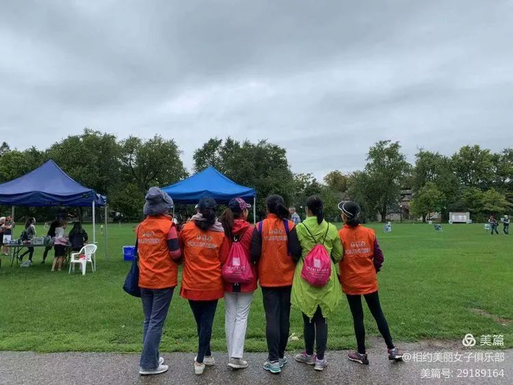

  
"异乡客"，是我不愿触及的几个字眼，但从出生至今，却如影相随。12岁以前生活在湖南蒋唐之乡，王姓是外姓人，在街上见到王姓长辈都得叫叔叔伯伯或姑姑。中学去邻县大姨和姨夫工作的省重点中学上学，一张嘴别人就知道这是个外乡人。到后来去北京上大学，H和F傻傻分不清的，一听就是外地人。现在在加国，黑头发黄皮肤，一眼就知是外国人。希望有朝一日能成为外星人。

  
但答应了的事儿，再难也要做呀。移民生活写点啥？多愁善感非我强项，那就写写在加十几年感受和学习到的爱吧。  
  
  
  
  
  
  
  
**路人**  
  
  
2009年10月，一个风雨交加的夜晚，飞机无法降落多伦多，转战渥太华出关，又登机，换另一拨机组人员带我们飞回多伦多。等到入住，已经是凌晨两点了。出师不利。  
  
  
第二天一早出门，满眼的26个字母，但却不知是干啥的。在街上碰到一个中国人，觉得很亲切，刚要张嘴问候，却见那人目无表情，赶紧傻笑了一下匆忙走过。  
  
  
那个时候还没有微信，关于多伦多北约克的认知，都是来自于一个叫家园网的地方。有不少热心人士，将自己登陆过程记录下来，分享给后来的人，有什么问题，给他们留言，他们也是有问必答。在体检后，我就经常上去学习，神游多伦多，收集学语言和找工作的资讯。一家人登陆初期的医疗保险，用的家园网赞助商，后来发现竟然是校友的先生。娃的第一个钢琴老师也是一个网友推荐的。跟几个网友还线下活动了几次，学会了做蛋糕，团购了蛋糕模具。  
  
  
在一个举目无亲的国度，这样一个网络平台，大家相互帮助，抱团取暖。一有什么问题就上去寻求帮助，也会经常回答陌生人的问题。后来有了微信群，也爱在群里回答别人的问题，希望能够帮到他人。  
  
  
  
  
  
  
**Brenda**  
  
  
Brenda是帮助我学习英语的志愿者，通过新移民机构Culture Link match的。她是来自于南美的早期移民，除了每周花两小时陪我练习英语口语，她每周还要带一个没有母亲的女孩玩半天，教女孩一些女孩子的事情。此外，她还在Sick Kids做志愿者，给一些患儿讲故事。  
  
  
  
  
  
  
我俩第一次见面安排在Young & Bloor, 逛街，喝咖啡，到Queens Park溜达，沿着University大街向南，最后到Sick Kids，给我介绍她给病童做什么。第一次走进加拿大儿童医院，很震惊，一点看不出是医院。  
  
  
  
  
  
  
 
**CEACT**  
  
  
CEACT是多伦多的一间教会。在Linc找工workshop认识的Bing Juan，带我们去她的查经小组度过了我们在加拿大的第一个圣诞节。2010年第一个主日，一早她和先生还有他们的宝贝女儿开车接我们去了教会。那一年，多伦多考车考官罢工几个月，我们去哪儿都靠公交或走，小组的兄弟姐妹轮番接送我们，几个月风雨无阻。  
  
  
  
  
  
小组的家庭结构相似，教育背景差不多，孩子们也几乎同龄，大人小孩经常在一块儿玩儿得不易乐乎。组长开放了他的家接待大家，每年都会张罗出去玩儿，beach，露营，滑雪......默默地奉献。组里成员之间特别融洽，真的成了兄弟姐妹。以至于现在我们回多伦多，都能随便去姐妹家借宿和吃喝。  
  
  
  
  
  
孩子们每周都盼着去主日学，义工妈妈们带着孩子们学习，听故事，做手工。每年夏天的VBS，整个教会都布置得满是童趣，一周结束，孩子们都不愿离开。吃得好，玩得好，灵性和身体都成长。这后面是大量大学生，中学生和妈妈义工的功劳。  
  
  
  
  
  
  
  
  
  
**小妞**  
  
  
小妞第一天去上学，回来哭着跟我说听不懂。我说爸爸过几天就回去，要不你跟爸爸回去上学，妈妈自己在这儿先找工作。然而，反差太大，每天几乎就是玩儿的生活，她压根就不想回国上学了。  
  
  
妞上初中的时候，我们搬到滑铁卢。赋闲在家的我，带上妞，一块儿申请了去Creekside Church照看小娃娃。小妞给孩子们讲故事，照看小不点用厕所，两年下来知道照顾人了。于是申请了YMCA游泳馆的义工，帮教练照看学游泳的小孩子们，做了两年，到11年级的时候，就去老人院做义工去了。几个八九十岁的老人打牌，她需要反复解释规则，做仲裁。  
  
  
  
两年下来，听了不少老人的故事，学习到他们的睿智，也体会了老人的艰难。这几年的义工经验，培养了她的责任心和爱心，学会了与各个年龄段的人交往。  
  
  
  
  
  
在学校，她也参加很多社团，还为癌症协会捐款，义卖自己做的饼干，自己做了母亲节卡片，挨家挨户去售卖筹款。每年也去演奏钢琴，为当地的交响乐团筹款。上了大学，虽然很忙，她也做义工，每年开学接待新生。  
  
  
  
  
小妞在成长过程中，在教会在学校都亲身体验到义工的爱心和奉献，她在传承这份爱心，老母亲很欣慰。  
  
   
  
**KW Women Club**  
  
  
初次接触女子俱乐部，是听说周五在我家边上小学有zumba，于是2016年9月open house的时候就注册了会员，开始学习瑜伽，zumba和民族舞。随着时间的推移，接触的深入，越发地喜欢上了女子俱乐部。  
  
  
  
  
  
  
  
这是一群爱美的女士，有爱心也愿意分享和传播中华文化。每年都会花很多时间排练旗袍秀和中国民族舞，到华人社区，老人院，阿富汗社区还有一些公司表演。  
  
  
  
  
  
WCCA女子俱乐部曾经多次组织编织拖鞋和毛线毯子，送给需要的妇女和儿童。  
  
。  
  
  
  
  
  
  
  
有机会也会参加一些当地活动，大家主动做义工。  
  
  
  
疫情以来，姐妹们也是捐钱捐PPE，帮助一线工作的医护姐妹们。还有不少姐妹坚持线上带大家跳舞，缓解居家隔离的烦恼和压力。  
  
  
  
  
女子俱乐部成立20年了，理事会的姐妹，一届接一届，年复一年日复一日地张罗着俱乐部方方面面的事情。特别是Ivy，一直在义务地教大家跳舞，十几年下来，这是一种什么样的情怀？做一天义工容易，但十几年的坚持，唯有热爱和爱心，感动。  
  
  
  
  
在她们的感召下，我也接过了接力棒，有幸带着这一届的理事为姐妹们服务。疫情无情，将我们分隔在各自家中，但姐妹们心还在一起，一旦有时机，就会小聚一下，分享美好欢乐的时光。  
  
  
  
  
  
  
  
  
  
移民加国12年，蓦然回首，无数温暖的瞬间，美好的回忆，感谢有缘和  
无缘见面的热心人，有你们的爱相伴，让我在加国的生活充满阳光，感恩。  
  
  
  
  
最后以我家床头挂的一位兄弟送的字画做结尾吧，继续学习爱感受爱，爱是永不止息  

  
**2021年11月22日**  
  
**加拿大 滑铁卢**  
  
