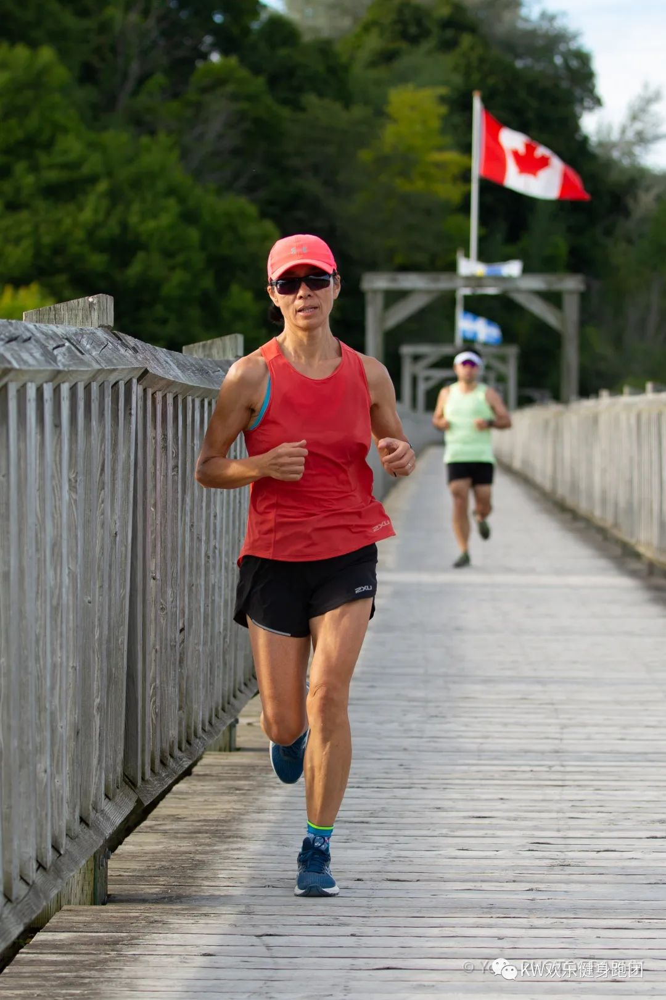

  
  
2022年5月1日对我来说是一个特别的日子，已经不再熟悉田径赛场的我二十多年后又一次站在起跑线上，而且这次是挑战人生中的第一个长距离比赛——半程马拉松。所有这一切的发生都离不开一个可爱而亲切的名字，KWHAPPYRUNNER。在认识KWHAPPYRUNNER之前，这是我连想都不敢想的事情.
  

记得大概在十年前，女儿要参加地区的运动会。为了教她起跑我去田径场给她做示范，因为长期没有活动，起身第一步就把小腿拉伤了，恢复了一个多月，从此伤感地意识到自己真的在变老，运动已经不属于我了，一直到2020年。  
  
  
  
  
  
2020年开始的疫情给大家的生活带来很大的负面变化，但是也激发周边的一些朋友来到了户外。我很清楚地记得2020年8月22日这一天，朋友拉我去给她刚参加的一个跑步活动加油（后来才知道是G2G120公里接力赛），我事忙推脱了。朋友回来秀视频给我看，霎那间我就被满满的正能量给深深地吸引了。从视频里我知道本地竟然还活跃着一支同龄人的跑团：KWHAPPYRUNNER，跑团里的 “COCO美女第一棒跑得漂亮 ”，团长响亮的名字叫“高清”。2020年10月下旬，我正式加入跑团，成为这个健康快乐大家庭的一名小学生。  
  
  
  
  
随后的一年过得很快，我1公里，3公里，5公里，10公里。。。。。。越跑越远，但是从来没有想到过要去比赛，只是为了享受跑步带来的快乐。2021年11月的最后一天，碰到跑团小伙伴们正在讨论多伦多马拉松比赛的相关信息。团长、COCO、九儿和高峰等小伙伴鼓励我也去，说得我心动了。随后钉子哥给了报名链接，我在摇摆不定中输入了一串比21.0975还长的一组数字，报了名。  
  
  
  
接下来，漫长的冬天开始了，天气转冷，距离比赛剩下150天，冬训是这150天的关键词。2021年12月25日圣诞节这一天，我跑了人生的第一个30K，也是我目前为止唯一的一次远距离，多亏在26K准备放弃的时候遇到了小伙伴YANYIN同学，他陪我跑完了30K；2021年12月31日和大家一起跨年跑，跑了21.22K，希望病毒和疫情停摆在2021年，让健康和快乐跑进2022年；2022年1月1日新年，钉子哥带领跑团的小伙伴们跑了“2022”及虎年的“虎”字。冬训的其余时间我都保持每天一个小时的跑步，周末外面路况好的情况下出去跑，中间也因为下雪路滑摔过2次，还好裤子没摔破（哈哈），腿也就没事，坚持跑回家。在这个漫长的严寒时节里进行训练，要提高自己身体的适应能力和增强体能储备，同时要充分地磨练自己的意志品质，自己时常提醒自己，如果我可以在冬天这么严苛的环境下跑步训练，那么进入舒适的春季就可以信心满满胸有成竹的参加这场比赛了。。。。。。想想都神采风扬（偷偷笑笑）。  
  
  
  
  
  
  
4月初，路面积雪已全部融化，可以路跑了。在团长高清的组织领导下，利用2个周末和小伙伴们进行了2次郊外长距离的拉练。期间，吃下了人生中第一支补给“能量胶”，还好吃，像“果冻”一样，团长又另给了我两支留着五月一号的比赛。最后一周，我严格按照美女师傅COCO和大神“追风”少年给的科学食谱进食，最后一天的晚餐6点多吃的饭，是5个小红薯、一大碗卤面、三个鸡蛋、又喝了2瓶佳得乐。4月30日下午，我们从滑铁卢出发去多伦多领号码薄。一路上先看到42K，再看到29K，虽然这两个数字和我的半程马拉松一点关系都没有，但是心里却已经开始忐忑不安了，我只跑过21K，还没有参加过任何比赛，跑崩了怎么办？想归想，马上自我安慰道：明天一门心思跑就是了。  
  
  
  
  
  
5月1日早晨，3：27分醒来看天气预报，还好没雨但有风。5点起床洗漱，喝水，又喝了一瓶佳得乐，但没有吃早饭，5点40分出门，出门时还是不自信的穿上了长衣长裤（但短衣裤都穿好，随时准备脱）。  
  
6点10分走在YONGE街上，小风吹的飕飕的，还挺大，但在步行去起点的20多分钟里，我看到许多全马的参赛者身着短裤从YONGE街的两边陆续走来，回头看看我前后左右的参赛者基本都是短打扮，我真的有些触动，我头一次见这种大场面。  
  
7点30分全马出发，7：45分我看见美女COCO和YANYIN在排队存包，在这一刻我跑进旁边的地铁站口脱去长衣、长裤、决定短打出发。  
  
  
  
  
8点20分，COCO、YANYIN、YUN我们几个一起站到出发的队伍里，又看见九儿、感触、郭大侠、冬哥、飞、小丫、GUIBAI、JIKAI大哥等（不好意思，有的小伙伴我不知道名字）。在等待的１０分钟里，COCO一直提醒我要注意的事项，给我吃下第一支能量胶，听见大家在欢呼５、４、３、２、１，“砰”的一声枪响了！出发，我没有退路，一路向前。身边，是４月１８日才跑完波士顿马拉松的美女COCO，两周内２个马拉松，我心生佩服。今天，COCO又带我出发，感恩、感谢、路上有你心里真踏实。她一路鼓励着我到了３公里，眼前是一个大上坡，果然和前辈霍烽说的一模一样。我们在这里按许诺扔掉衣服之后COCO说：“RURUI，你可以就先走了。”这个坡是有点难跑，不过早已有了思想准备。霍大侠之前说这个坡跟LOO村ERB上的坡有点像，让我去试，跑的时候不要着急提速，即使掉速也不怕，在后面的平路上都可以找补回来的，不要崩在这里。赛前一周，我和SAM表哥，高峰一起去ERB试了那个坡，很有帮助。在７公里的地方，我遇上了号码薄８９２４的小哥。他戴着耳机，我们没有交流，我试了试步频和节奏基本一致，决定跟上。从他的一些手势中，我可以感觉到我们俩是找到了一点点默契，互相带，一起跑。９到１０公里向东左转的地方，JIKAI大哥拍拍我肩膀加油（谢谢JIKAI大哥）。之后出现了一群从右向左的参赛者（蓝色号码薄），脑海中立马出现之前高峰和追风少年提到可能和全马跑者汇合的点之一，心里想，追上全马跑的后续部队了，在一点点小高兴的同时也有了目标，别着急，一个一个追。１３公里，我遵照九儿“医嘱”要吃COCO赛前给我放在短裤口袋里的第二支能量胶，我拉开拉链，拿能量胶时，“胶”掉地上了，急刹车，Ｕ－ＴＵＲＮ，低头，弯腰，伸手，捡起，转身，抬腿，继续前行，在行进中脱下手套扔掉，撕开口，喝下，这一系列的动作完成后，才感觉右腿后侧的股二头肌不舒服，抬腿时尤其疼，但还可以跑，不想那么多了，继续。１７公里，我回头看了几次我跟跑的小哥，他摆摆手，示意让我走。这时，是我第一次看表，已经跑了１７.４５公里（我眼睛不好，平时跑步不怎么看表）。我独自前行，右转上了一个小坡之后，路边人也多了，楼也多了，还有街车铁轨，我想这就是DOWNTOWN了。这里路面坑坑洼洼，我怕出现意外，跑得十分小心，眼神也从前方移到了脚下。随后遇见飞，就互相鼓励着一起跑。当看到19公里的显示牌时，前面有一个穿“多马”红背心的小哥，心想还剩2公里，2000多步，努力保持一致的PACE跟上。20公里，看见一对男女跑者，男的对着女的讲话，我猜一定是鼓励的话语，女跑者的双手五指已经打开，我脑海中就出现运动员冲刺的样子，快到21.0975公里了。摆臂、抬腿、提速、右转、上坡、看见写着FINISH的大拱门，冲刺，在由哥一声“RUIRUI”的呐喊声中我冲过了终点。感触给了我一个温暖的拥抱，我的首个半程马拉松比赛结束了。  
  
  
  
跑步是一项孤独的运动，只有发自内心的热爱以及心甘情愿的坚持。而身上的每一滴汗水、脚下的每一步、都会在你的身体里留下记忆。虽然过程是痛苦的，但结果是快乐的。自从有了你们，跑步也变得不再孤独：从2020年10底一起去跑C2P遇见你们 (看见高峰的80K, 我的天呐) 开始，我听闻了参赛许多大铁小铁追风少年的事迹，读了美女COCO、九儿、LINDA、主席WANGLI和Alice等的励志故事，欣赏了团长高清停下脚步对焦我们的照片、视频和发圈的文章，珍藏了帅哥摄影师由哥给我们拍的精美照片，等等。。。。。。太多的回忆。最后，感谢我身后那位始终如一支持我的后盾，感谢跑团里激情四射的小伙伴们，感谢为我们默默奉献的志愿者们和亲属们，路上有你们真好！  
  
（爱你们的RUIRUI）  
  
  
  
  
  
  
  
  
  
  
  
  
  
  
  
  
  
  
  
  
  
2022年9月9日发表于滑铁卢  
