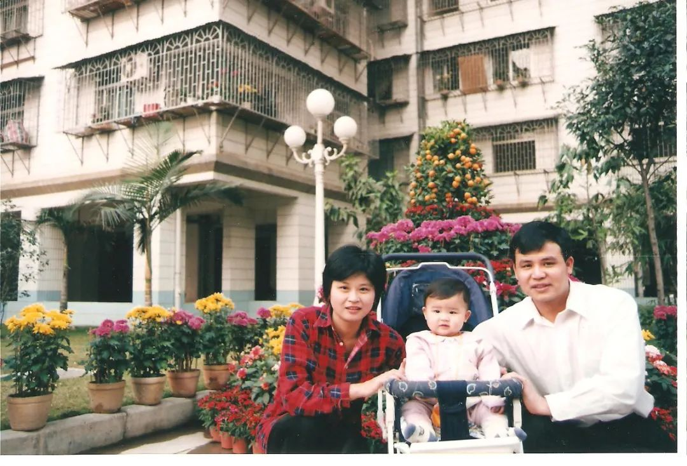
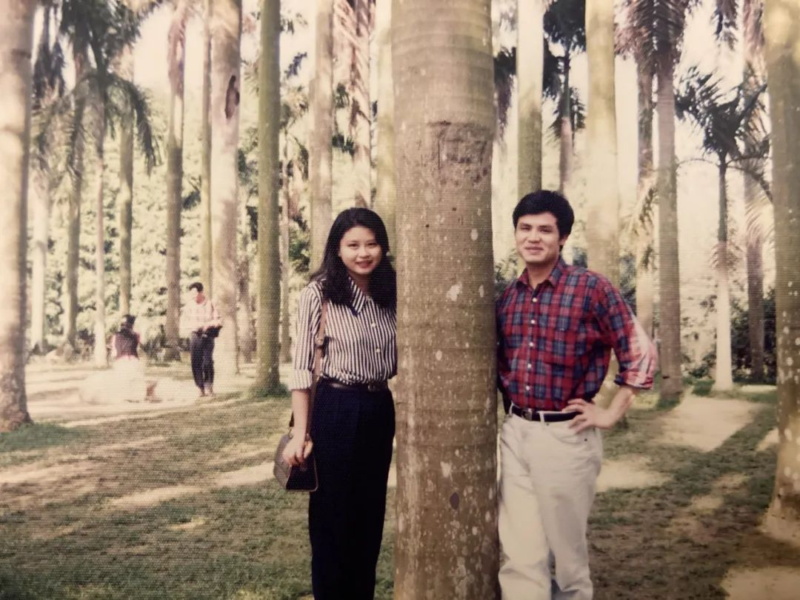
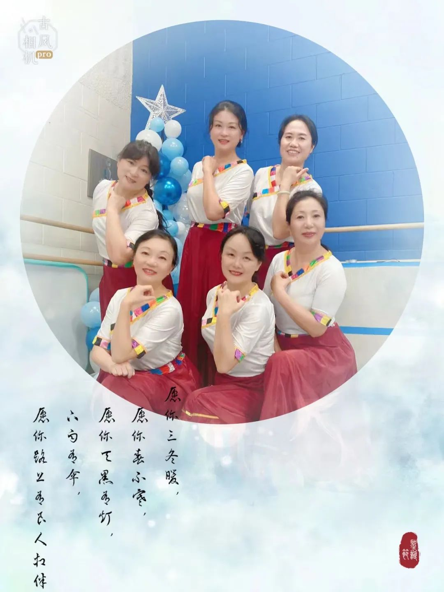

去国经年，经历许多，有激情澎湃的高光时刻，有黯淡伤神的伤痛场景。一直都想整理一下，借着这个机会，刚好可以捋捋思绪，回忆一下过往。弹指一挥间，二十多年就过去了，曾经的我，似水流年，虽平淡无奇，却都是我记忆深处值得珍藏的美好留念，时光一去不复返，蓦然回首，终是勇往直前的流金岁月。  

**从出国到离别**  
  
遥想当年，“曾梦想仗剑走天涯，看一看世界的繁华”，怀揣着为我们祖国的航天事业做贡献造大飞机的梦想，从大西北陕西咸阳来到我憧憬的首都北京，进入北京航空航天大学，之后又上了研究生，本科专业是检测技术与仪器，研究生专业是陀螺技术及惯导。  
  
  
  
研究生毕业后，继续我的看世界的梦想，从我喜欢的北京来到了一年四季温暖如春的花城广州——南方航空公司，打算在民航扎根踏踏实实好好干干，每次在机场停机坪上看到飞机起降，自豪感油然而生。  
前一阵子播放的电视剧“向风而行”，我从头认真看到尾，让我不禁回忆以前在南航工作的那些点点滴滴，何其熟悉，何其亲切，令人难忘，感慨时光不能倒流。  
只是因为一次偶然的机会，听了一次移民公司的报告，从此命运就开始改变了。  
  
  
  
2000年8月21日，这一天我们全家来到了加拿大。记得是晚上，多伦多灯光辉映，车水马龙，汽车行驶在高速路上，看着远方的万家灯火，感觉那么不真实，已经到了另一个国家吗？女儿才两岁多，我们也给她解释了，不知道她明白多少，只要跟爸爸妈妈在一起，一路上有吃有喝有玩，她就很高兴。初来乍到，幸亏有朋友的帮助，带我们熟悉环境，很快我们就找到了房子，暂时安顿了下来。
  
  
  
在北美，没车就等于没腿，寸步难行。记得带孩子去买菜，在商店里还行，有推车，她可以坐推车上，可出来到家这段路，就得一手抱着她，一手拎着菜，还是蛮辛苦的。  
  
  
  
女儿人小，但心思蛮细，她也知道我们是住在别人家，我们是共用厨房，做饭时候她也会观察，房东做完饭了，她就偷偷地告诉我们，意思是轮到我们了，可以做饭了。看到她这样，我心里有些不忍，不想孩子有委屈的感觉，还好，她不是那种胆小娇弱总觉着自己可怜的孩子，一直是积极豁达，乐观向上的孩子。  
  
  
  
很快，老公在这里帮我设好网络，买好电视，布置好临时居所，就准备带女儿先回去了。记得去机场送他们那天，女儿还什么都不知道，她一直都是笑嘻嘻的，他爸爸抱着她。送他们进到机场安检之后，我回到家，一路上都很难过，回家之后，听到老公和女儿的电话留言，老公说一句，女儿学一句，她虽然只有两岁多，但很会说话，留言无外乎是叮嘱我在这里要注意安全，好好休息，照顾好自己，不要着急，不要有压力之类的。女儿重复着她爸爸的话，吐字清晰，声情并茂，模仿得很认真，但她不知道，她这是跟我要暂时的分离，后来听我妈说，她回广州之后找不到妈妈，可了不得了，哭了个天翻地覆，谁都哄不好她。同样分离对我来说，也不好过，一听到这个录音，就难过想哭，这录音，我保留了很长时间，想他们的时候就听听，一听就哭，他们把我一个人丢到加拿大了。  
  
**重回大学**  
  
一个人也得活。先参加了新移民免费的LINC  
学习英语，又认识了新的朋友，冬天到了，雪花飞舞，常常遥望远方，遐想未来不确定的生活。  
  
  
  
加拿大比较看重经验，而且是加拿大的经验。我曾经在报纸上看有咖啡店招人，打电话约了周末去试工，这个咖啡店的位置在DOWNTOWN，人不断，挺忙的，老板自己也在干，我跟着干了半天，估计老板不满意，也是我刚到，很多东西都不知道，给我热了个JAMAICAN STYLE PATTY, 就打发我走了，也许是干累了，干饿了，这个老外式的馅饼我觉得分外的好吃，外皮很酥，里面的牛肉虽然不多，但特别香，终生难忘。 
  
  
  
加拿大也比较看重对等的资历，过犹不及，over qualify   
也不行。我把我国内准备的简历投了一些，有一家面试我，跟老板谈的也挺好，他招的职位也很简单，记记账，管管事，但看了我的简历之后，就说在他那里干，屈才了，要我去找更适合我的职位去做，天爷呀，我就是找个工作，能做不就行了吗?   
我自己愿意，不行吗？不行。  
  
加拿大也看重销售的经验。我还找过两个做SALES  
的工作，一个是卖电，一个是卖刀。当时也没有车，经过短期的培训之后，就可以跟着有经验的同事上岗了。一般开车拉到一个小区，大家分头行动，挨家挨户敲门，推销我们的产品。  
  
  
  
经过这许多种种，我觉得还是得先上学，之前投递的申请也都没消息，计划着是不是再重新考个托福，于是又报了个托福班。有一天，突然收到了GUELPH大学的OFFER，还有奖学金，真是喜从天降，正不知道何去何从的时候，老天给我指了条路，1月份就开始，于是乎，托福也不用继续了，跟房东也说了，还损失了两个月的租金，准备从多伦多杀到GUELPH了，觉得好远啊。

这期间，我也一直到处发简历找工作。终于，有一个跟我之前工作匹配度颇高的工作机会向我招手，BOMBARDIER庞巴迪加拿大最大的飞机制造厂，给我工作机会，这个公司在蒙特利尔，我已经到GUELPH上大学了，但我还是十分高兴。 
  
  
  
2001年1月，来到了安省南部中心的城市贵湖（GUELPH），在多伦多的西边100多公里，是加拿大评比最适合居住的城市之一。我的专业方向是工程系统与计算（ENGINEERING SYSTEM AND COMPUTING），为了尽快完成学业把孩子接过来，我四个学期就做完了所有的课程答辩毕业了。这期间老公也过来了，还找到了工作，在BRANTFORD，有些远，一周回来一次，后来我们买了车，他每天开车。生活上我们也很节俭，除了付房租吃饭，没有大的开销，基本上这样一直到2002年5月份我GUELH研究生毕业。  
  
**职场博弈**  
  
刚登陆时2000年8月，计算机工作很好找，很多就报个班，突击学一下，就找到很好的计算机编程方面的专业工作。我当时也凑热闹，去学过几天JAVA之类，后来拿到大学的OFFER,认为先上学就是最好的出路。没想到，毕业这一年，市场就业不景气，工作不好找，找工作的同时，也不能闲着，就通过中介找到一个数据输入的工作，在RBC银行，工作环境不错，也不是很累，只是干一天下来，也没有时间找别的专业工作了。干了几个月之后，因为老公的工作在BRANTFORD，于是决定辞掉这个工作，先搬到BRANTFORD离老公单位近一些，后来女儿和我妈也来了，全家终于团聚了。
  
  
  
BRANTFORD  
是在安省西南的一个城市，当地土著人多一些，城市不大，但设施齐全，人也很淳朴，友善，见面都打招呼，还有个赌场，很多人从美国开车过来玩。就业机会就更少了。没有找到专业工作，我就应聘MALL  
里的一个珠宝首饰店的工作，卖金银首饰，倒是被接收了，很快就上班了。记得那时候是圣诞节前夕，买首饰的人还很多，有给爱人买钻戒的，也有给家里人买圣诞小礼物的，手链，表带，手表，耳坠，项链等，MALL  
里人多，还比较忙碌，一站就是好几个小时。不同的行业，也挺有意思，女人天生喜欢珠宝，每天穿戴漂漂亮亮的，往这儿一站，看着这些金光闪闪，也挺开心的，所以就一直干着，一直到找到正式工作。  
  
  
  
当时找工作不知道具体找什么，工程，软件，质量控制和保证，测试，什么的都找。后来发现市场PLC  
的工作机会挺多，就周末开车到多伦多学PLC PROGRAMMING  
，据说GEORGE BROWN COLLEGE  
这个专业不错，就报了个班，每个周末都跑去上课，想着以后也许朝这个方面发展。  
  
  
  
不知道从什么时候开始，潜意识里就觉着自己想做的职业是地产经纪，记得一位大学同学说，她朋友的妈妈就是地产经纪，没有周末，没有假期，没有生活，但我仍然喜欢。搬到BRANTFORD之后，日子也是一天天地过，感觉这也是一个不错的选择，我是行动派，想到哪儿，就马上行动了，登记注册，资料很快就寄到了，因为没有时间去上课，所以就自学，准备好了就去考试。

上天眷顾我，给了我一个在滑铁卢工作的面试机会，我的职位是软件质量保证工程师（SOFTWARE QUALITY ASSURANCE ENGINEER）,都挺顺利。回去后不久，我就收到了公司的OFFER, 让我2003年1月3日就去上班，当时的喜悦心情无法描述，把那个OFFER读了好几遍，公司也是大公司，福利待遇也都好，专业也算对口，于是这个圣诞和新年我们都快快乐乐的，感觉有希望有奔头，未来会越来越好。
  
  
  
在加拿大的第一份工作是全球航空航天领域里出名的大公司-雷神公司。之前也很想去波音公司，洛克希德.马丁也是一家很大的美国航空航天制造厂商，加拿大的庞巴迪公司位于魁省，也是生产直线飞机，公务喷气飞机的大公司。我当时对这些公司都很感兴趣。

雷神公司是一间美国的大型国防承包商，雷神加拿大公司滑铁卢分公司，主要是为民用和军用生产固态空中交通管制雷达。我的工作就是在这里做软件质量保证（QA）工程师，所有的软件产品在发出去之前，都要经过软件QA的验证和确认，才能出厂。刚入职，要熟悉公司，熟悉业务，熟悉各部门之间的关系等等，不敢懈怠，一丝不苟地认真工作。周末和下班的业余时间，我还自己学习，考取了美国质量协会ASQ（AMERICAN SOCIETY OF QUALITY）的软件质量保证工程师的证书CSQE（CERTIFIED SOFTWARE QUALITY ENGINEER）。 
  
  
  
工作落实后，很快我们就在滑铁卢买了房子，全家就从BRANTFORD搬到了滑铁卢，上学，就业，买房之后，觉得时机成熟了，2005年4月就生了老二，是个男孩，凑成了一个好字，全家都很高兴。记得当时怀孕是在8月份，开始不明显，冬天又不怎么出门，四月底就生了。记得出院手忙脚乱地带着小BABY回家，到家时，家里的郁金花正开，顿时感觉到春的气息，每天有太阳时给BABY晒太阳，女儿才7岁，也总想着抱抱小弟弟，怕她抱不住，她还是很兴奋地要抱。一个月后，老公推着小孩出去，邻居都很诧异，没见怀孕，就出来了个小BABY，现在回忆起来，点点滴滴还是蛮温馨的。
  
  
  
雷神公司福利待遇都很好，每年夏天BBQ, 圣诞节员工和家庭都搞大型PARTY，圣诞节员工午餐高层领导还专门给我们盛饭，服务我们，做得很是亲民。在我生完老二3个月后，我回去上班，没几个月，我也被裁掉了。虽然知道一直在裁人，真轮到自己还是挺突然。记得那天我进公司后，跟平时一样，去接水，在咖啡厅，就被叫到人事部，人事经理很认真地跟我谈话，跟平时见面打招呼谈笑风生判若两人。我都懵了，之后部门经理就陪着我，或者说是押着我，到我的座位，让我简单收拾一下就送我出了公司。诺大一个停车场，我内心五味杂陈，当时招我进公司，我是欣喜的；如今裁掉我，被赶出去，我的内心非常的伤痛。就像失恋的恋人，以前曾经那么好，处处都是你，一分手，可以那么无情，早知现在，何必当初。但人不能因噎废食，该走的，该经历的还是要一路前行，哪怕前面等着你的是狂风是暴雨，还是要走在勇往直前的路上。自我平复了一会，就开车回家了。妈妈见我回来的早，问我怎么这么早，一下子，我的泪水忍不住了，掉了几颗，妈妈一直是很坚强的，说了几句安慰的话，倒也不像我那么天要塌下来的感觉。我看着才几个月的老二，他的大小刚好占我们家三人沙发的三分之一，我每次把他放在一格，觉得特别平衡。今天也一样，他也不乱动，他也动不了，很乖地呆着，我坐在旁边，把他抱到怀里，看着他无邪的眼睛，可爱的小脸，我忍不住又哭了，拍着他心想，放心，无论如何，妈妈一定会把你养大的。现在想想，以前在国内一直很顺，出国后，经历的太少了，在北美，一般每人平均被裁员7次，我这儿又算什么呀！我后来在JOB SHOP碰到的其它被裁员的人，有一个加拿大的女士，说在公司都干了十几年了，没想到被裁掉，也是哭得个梨花带雨……
  
  
  
在加拿大，第一份工作比较难找，有了第一份工作的经验，就容易很多。很快，我就收到了当地一个做飞行计划和机载配重的软件公司的面试，并顺利地被接收，从被裁员到接受第二份工作，也就两周时间间隔，这让我信心大增，觉得裁员也不是那么可怕的事情，旧的不去，新的不来，而且新工作工资还比以前高了。  
  
  
  
有一天，突然收到我之前公司（RAYTHEON）  经理的电话，问我愿不愿意回去，公司新拿到美国的项目，我说想一想。从内心来说，公司当初把我裁掉，内心已被打击，但我也知道在北美这边没活时被裁掉，有活时再叫你回去，也是正常的事情，而且工资又涨了，所以就不跟自己的自尊心较劲了，提了个不错的条件，2008年3月，转了一圈，又回到第一个给我工作机会的雷神公司上班了。故地重游，新同事，老同事，熟悉的工作环境，很快就上手了。这期间，老板支持我去美国参加了ASQ的CSQE培训，我自己还利用业余时间考了安省的专业工程师P.ENG的证书。工作上需要的软的硬的经验理论都有了，再裁掉也不怕了。  
  
  
  
博弈职场需利器，一路拼搏一路考。当初从北航研究生毕业的时候，长舒一口气，心想这辈子再也不用考试了。可没想到，工作也要考试，民航英语，民航基础执照，工程师证书，飞机737，757，777和空客A320等各种机型执照，还有出国前的专业培训都要考试。后来申请移民，又考雅思，又考托福。来到了加拿大上大学，又要考试。在这边毕业了，为找工作，又学PLC又考教育基金，保险和地产，多方备考。终于找到了专业工作，又有ASQ的CSQE, 和安省的P.ENG考试，期间还在滑铁卢大学修过跟SOFTWARE REQUIREMENTS相关的课程。长期以来，考试竟然成为我生活的一部分，学习过程让我觉得充实，考试全身心专注的投入让我愉悦，准备考试的过程使我成长，让我充满自信地走在勇往直前的路上，都是我的宝贵的人生财富。
  
**与命抗争**  
  
一段时间身体状况一般，经常头晕，肩背疼，难受，每天昏沉沉的，都是打起精神去上班。我打电话给我的家庭医生，很快她就给我约了检查，当地看专科，后来还约到HAMILTON  
医院看专科，做活检，一通忙活之后，医生郑重其事地跟我说，我的肾里有个瘤子，是恶性，要做手术，鉴于瘤子的位置在中间，只能整个肾都摘除。  
  
  
  
  
  
我听到完后，感觉那么的不真实，那么的不可置信，怎么会落在我的头上呢？加拿大医院资源宝贵，尤其是住院做手术，每天差不多$3000花费，当然我们有OHIP，不用交钱，感谢政府，虽然平时交税挺多，但福利也确实好。
  
  
  
手术后身体恢复得还行，每天早上出去走走，其它时间就卧床休息。但我精神上着实花了很长时间才慢慢地恢复过来，最初总是情绪低落，容易伤感，容易偏激，有时又特别敏感，别人不经意的一句话一个行为，我都会感到是一个伤害，经常忧伤，好像别人欠我似的。我都怀疑我得了抑郁症。后来身体恢复的差不多，又回去上班，又参加女子俱乐部的活动，又锻炼，再加上其它一些事情，一忙，就没有时间顾影自怜了，慢慢地，我忘掉这些，忘掉了病痛，甚至也不忌讳谈这个事情了，恢复了正常，又一如既往地向前。  
  
  
  
我是2015年4月13日做的手术，恢复半年左右，就又回去上班了。公司之前的几个大项目已经接近尾声了，活也越来越少，每天人心惶惶，一开全厂大会，就知道又是裁人了。大BOSS即使每次都鼓舞士气，大家都不乐观，知道都要走，只是早点晚点的问题。这年10月份，同样的场景又重复了，依旧是经理带到HR，跟我谈话，这回公司领导还比较中肯，说了公司的难处，我们做员工的也无话可说，理解公司处境，裁就裁吧，经过以前种种，这回已经坦然面对了，只是同样的地方跌倒过两次，再次又被押着走出了公司，感觉还是很伤心，只是不像上次那么绝望了。

  
  
  
因为有了第一次被裁员的经历，防患于未然，多方准备，之前考的小孩教育基金，保险和地产的执照，  
这次就正式启用了。另外也考虑到自雇比较适合我的身体状况，时间上灵活，还可以锻炼身体，于是就做了全职的地产经纪，一直到现在。帮人安家置业，乐在其中。  
  
  
  
运动能增加免疫细胞数量，于是2016年下半年恢复得差不多之后，就开始参加活动了。独乐乐不如众乐乐，于是参加滑铁卢华人联合会女子俱乐部这个大集体，一起跳舞，做瑜伽，参加社区各种表演，另外还参加了羽毛球俱乐部，一周打一次羽毛球。在家里自己也会慢跑做操之类的。2019年底COVID疫情开始，也就只能在家里跳跳健美操，视频集体活动，出门散步都戴口罩，分外小心。
  
  
  
2022年8月，意外加入KWHAPPYRUN跑团，有了组织，G2G之后，就开始跟着群里的跑友们一起跑步，练习2个多月之后，10月竟然参加了多伦多的半马（21.1公里）比赛，并且在短短时间内取得不错的成绩。锻炼让我身体变得强健，耐力也大大地提高了，以前各种头痛背痛之类的统统不见了。身体好了，精神也好，心情也好，以前的敏感忧郁一扫而光，也不怎么对家人发脾气了。长跑我不知道能坚持多久，但有那么多的榜样鼓励着我，我会努力坚持，一直走在积极锻炼健康前行的大道上。 
  
  
  
在滑铁卢二十多年弹指一挥间，大事没干什么，但也一直忙忙碌碌，工作，家庭，孩子，老人，社区，各种琐事，所幸工作顺利，家庭和睦幸福，孩子们也都健康成长。老大女儿顺利地在医学院博士毕业，目前是心脏外科手术的住院医生。老二男孩在WCI，即将高中毕业，目前已经拿到了滑铁卢大学CS及多伦多大学的CS, ES的offers，我们的任务基本完成得差不多了。自己虽没有多大的成就，但也是认认真真地做好每一件事情，走好每一个脚步，珍惜每一个属于自己的机会，真诚对待每一个因为机缘认识的朋友，尽可能地帮助他人，赞助社区，回馈社会。
  
  
  
  
  
回想起来，认识了很多人，经历了很多事，每个人都有故事，每件事都有因缘，海外的华人们各个优秀，孩子们也都很努力，滑村牛蛙遍地，都很棒。篇幅有限，不能一一道来，以后退休有空，有机会再同大家一起，细细品，慢慢言。现在看过往，就像在看画卷，愿每个人都有一幅美好的画卷，记录美好过往……  
  
**2023年4月20日****滑铁卢**  
  
