有一个神奇的心理体验叫：心流，估计每个人或多或少都会感应过.

感谢滑村好友高清团长，在他的感召下，疫情期间参加了滑铁卢欢乐健身跑团。几年来，几乎每个周日都会参加跑团俱乐部的主场跑步活动，深深地被跑团大神和小伙伴们的精神所鼓舞，逐渐培养出了跑步的兴趣。  
  
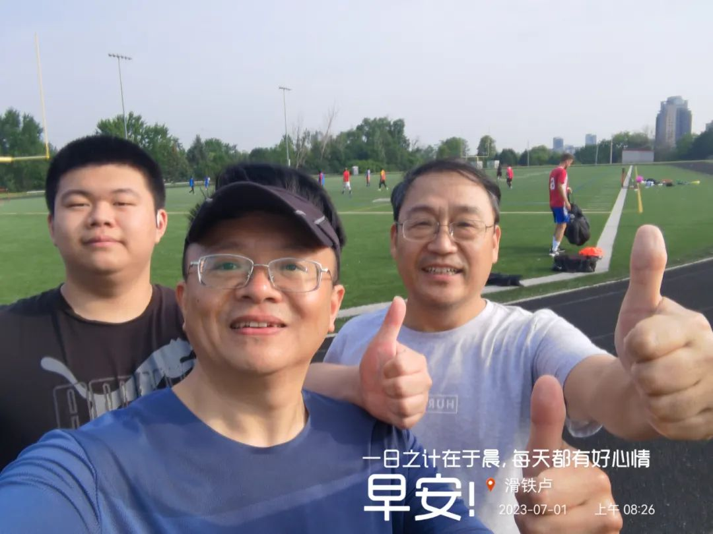  
  
兴趣有了，但是跑得很菜很佛系，谈不上配速更谈不上距离。直到有一天，跑团新成员谭德斌先生携妻带子入住金钥匙留学之家后，情况开始有了转变。6月11日早晨，我们第一次一起参加周日主场跑步，他一直陪着我跑，我们一边跑步，一边聊天。他告诉我，对于新手，一定要学会慢跑，能慢跑也是一种本事。他因材施教，对症下药，针对我的情况，深入浅出地介绍了长跑训练的基本常识和路径。不知不觉之中，我们就轻松地跑完了5公里。从那天开始，我对长跑有了信心，我真诚地感谢老谈，拜他为“谈教练”。

那一天，天上飘着毛毛雨，洒落在我们微汗的身体上，十分酸爽。这正是：凌波微步五公里，腾云驾雾多巴胺。跑团小伙伴席爽在我的朋友圈里跟帖戏和：同频共振内啡肽，美女俊男荷尔蒙。
  
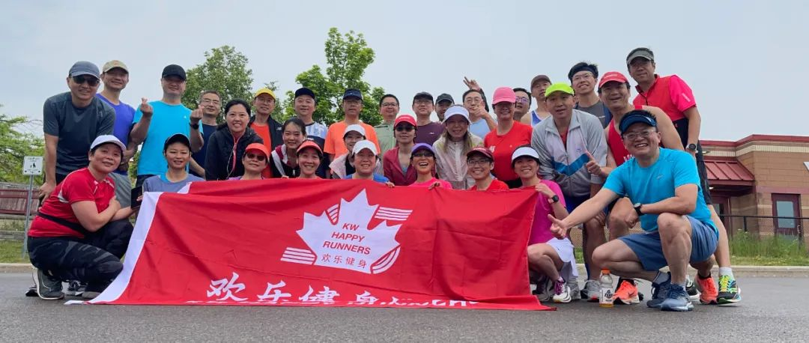  
  
过去我一个人跑步的时候，只能间歇跑个三五圈，如今几周下来，我已经可以跑出N多个5公里，这个距离在之前对于我独自一个人来说，几乎是不可能完成的任务，如今可以轻松搞定，一跑就是5公里。看来很多事情的发生，是需要机缘的，谢谢谈教练。

趁热打铁，乘胜追击，我把谈教练建的早晨跑步打卡群改为“金钥匙跑团”群，推己及人，邀请更多的家长和同学们参加跑步活动。我们金钥匙的陪读家长们经常相约到附近的圣大卫中学操场跑步，大家相互鼓励，相约而跑，我相信，有谈教练的带领，会有越来越多的家长和同学爱上长跑运动。
  
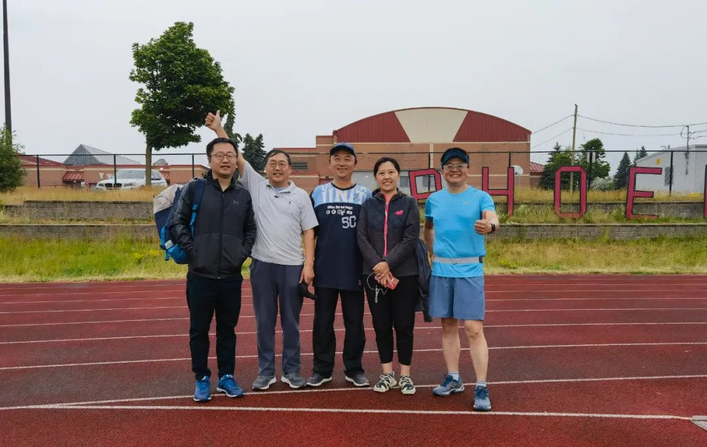  
  
前几天跑步归来的路上，谈教练给我们第一次讲到：心流理论。他说，当有一天长跑成为习惯的时候，跑步过程中会产生明显的特殊的“心流体验”，那个时候，你的身心会十分喜悦，精神会高度放松也会高度集中，跑步过程中能够体验出深度冥想的兴奋感、充实感和价值感，自己会与自己进行深度的灵魂对话，也会产生许许多多的灵感……这就是为什么马拉松运动会在全球广泛发展的深层心理原因。  
  
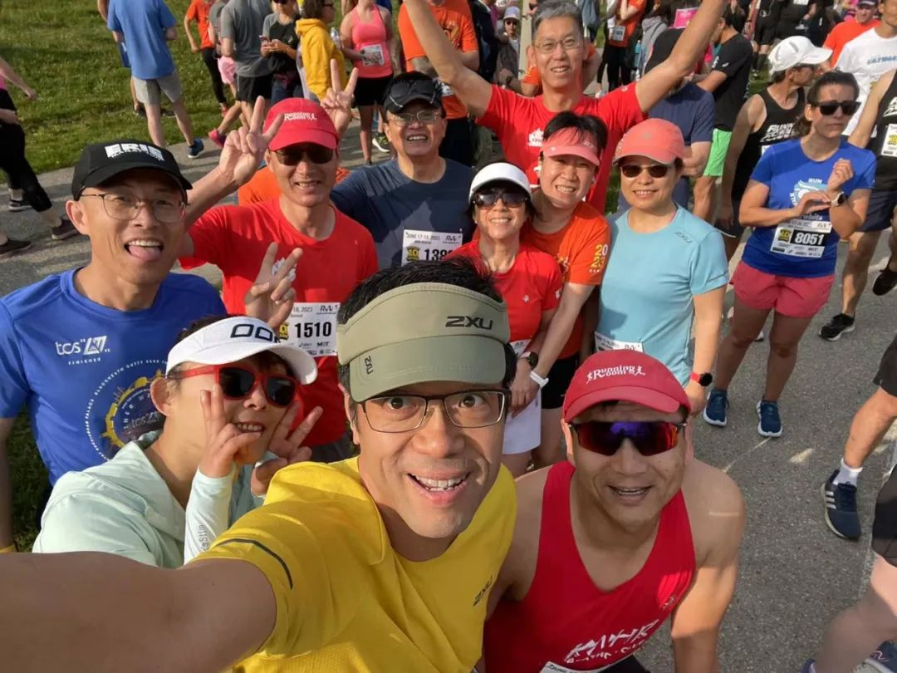  
  
在我过去自己短跑的过程中，偶尔也会出现灵感迸发的状态。那时候思维敏捷，思想丰富，只是转瞬即逝。随着长跑距离的递增，心流体验也越来越明显，时间也越来越长。我期待着有一天可以轻松突破10公里。  
  
活在长跑的心流里，与天地共呼吸，和自然同命运，天人合一，这个运动心流来得酸爽舒坦，巴适得很……  
  
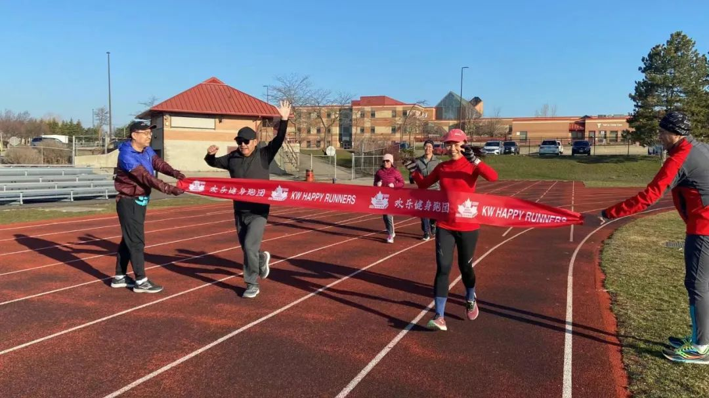  
  
其实，世界上有无数种心流体验，有一种兴趣就会产生一种心流。每个人都活在自己喜欢的“心流”里。假如，你喜欢唱歌，你就会常常活在音乐的心流里。  
  
“因为一群人，爱上一座城”——喜欢滑铁卢，不是空穴来风，而是有一个个真凭实证。不经意之间，偶然的机会，我和卫平加入了滑铁卢歌声飞扬声乐团，从此踏入了音乐的殿堂，时常感受到那种神秘的“音乐心流”。  
  
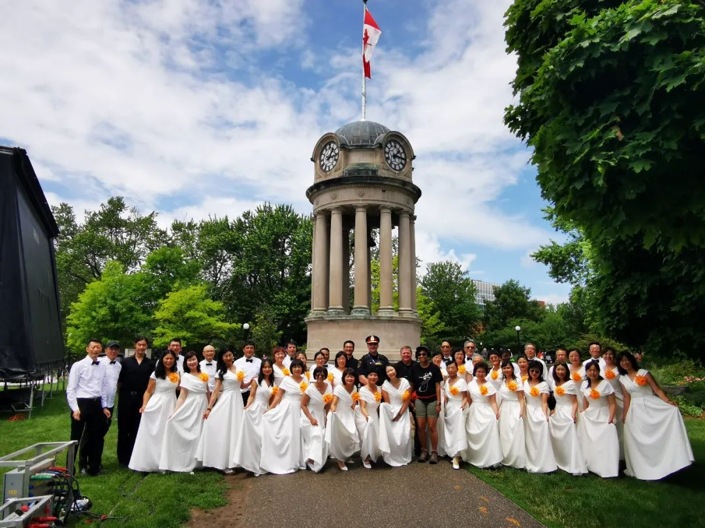  
  
艺术的世界博大精深，广阔深邃。进入艺术世界，有许多入口，其中合唱团是一个看似门槛比较低的入口。一旦登堂入室，必定别有洞天。  
  
记得是2023年中国农历的除夕之夜，我们应邀参加了滑铁卢华人联合会董事会主席潘刚先生在自己公司举办的跨年大聚会。那天晚上估计有60多位滑村朋友，分享百家饭，共度新春节。大家济济一堂，相聚甚欢。晚宴之后，开始卡拉OK，一直唱到大年初一的到来。这期间，我作为一个业余爱好者，无知无畏，胡乱地开心地唱了几首。在场的小婷和黎励等朋友盛情邀约我和卫平参加刚刚成立的歌声飞扬声乐团。于是我们就第一次参加了合唱团，这里也特别感谢潘刚先生搭建的平台。 
  
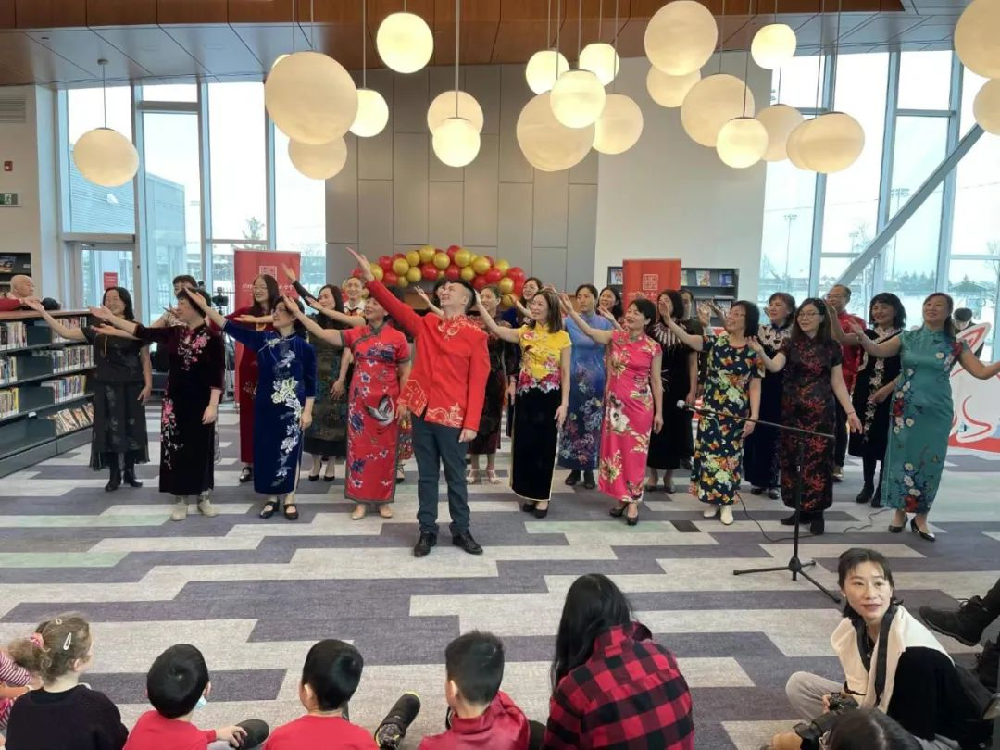  
  
歌声飞扬声乐团是一支正在成长的队伍，春节期间声乐团排练的《茉莉花》节目，以快闪的形式，参加了春节团拜会的演出，令人惊艳。  
  
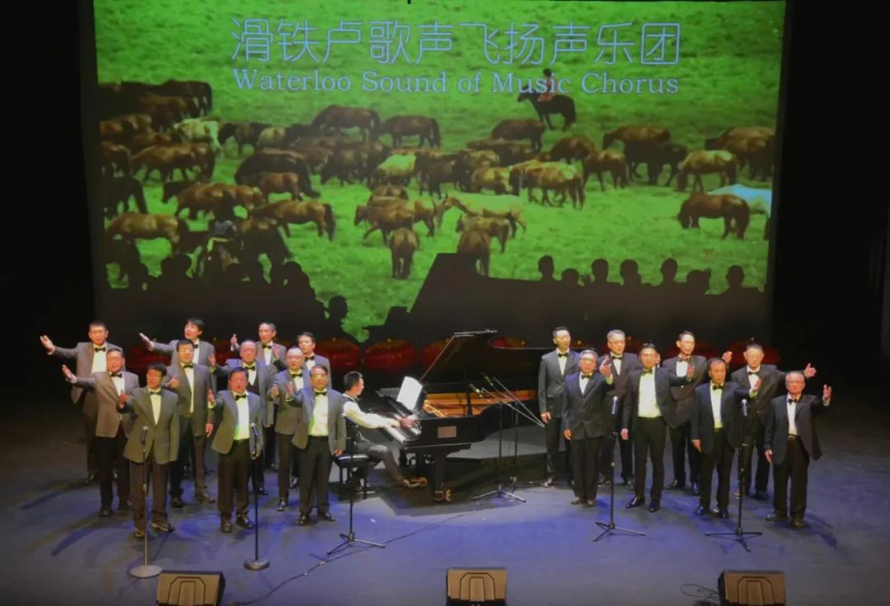  
  
男声排练合唱的《天边》，女声排练的《山楂树》，每个曲子都是多声部，都十分好听，参加了滑铁卢华人春晚的演出。  
  
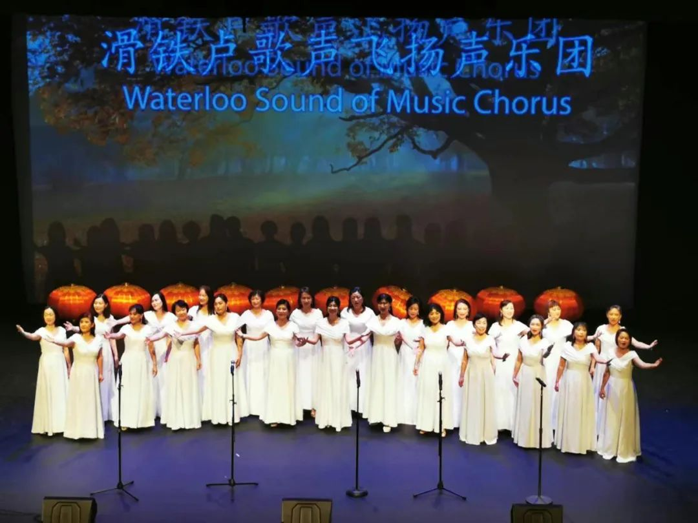  
  
  
每一首经典的歌曲都是作曲家们精心打造的作品，经过改编成合唱曲目，再经过反复排练多次创作，才会给观众呈现出声乐视听节目。  
  
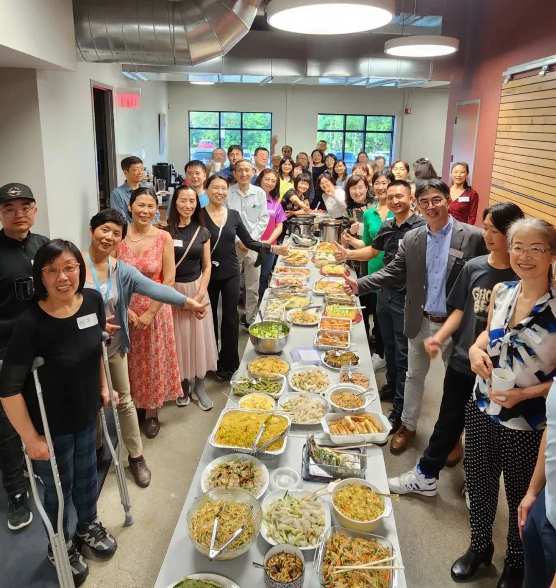  
  
每周一的晚上，大家如约而来，风雪无阻。音乐老师是谭守金先生，年轻的大帅哥，来自四川大山的深处，野性幽默，热情奔放。暑假期间谭老师回国探亲，我们很幸运地请到了美女沈老师执教，美女沈老师轻盈灵动，如沐春风。第一次听他们的声乐课，感觉都是好极了，因为他们都很专业，浑身流动着美丽的音符，艺术永保青春，生命之树常青。  
  
艺术永保青春的秘密大概就在音乐的心流里。声乐团排练每一首歌都是中国经典曲目，比如谭老师指导的《父亲的草原母亲的河》，原本我以为这首歌对于我们来说难度太大了，开始没有信心。没想到谭老师一句一句耐心地教唱，经过三个月的时间，我们大家终于可以完整地演唱四声部的无伴奏合唱《父亲的草原母亲的河》。在刚刚过去的滑铁卢地区多元文化节上，我们声乐团进行了现场表演，收到了广泛好评。  
  
  
所有的艺术都在生活里，也在形而上，甚至在灵魂之间，能够给我们一个反观生活和生命的视角，从而审视和发现生命之美。审美水平提高了，幸福感和自由度也会随之提高，这是艺术的永恒魅力。艺术虽然无法战胜战争、瘟疫和饥饿，但是可以安抚人心，弘扬善意。和声之美源自同样爱好音乐的人们的同频共振，大家齐心协力形成一个磁场，这个磁场愉悦身心、滋养身心，润泽身心。在这中间，还有一个惊人的秘密，那就是我们唱歌的过程中，充分体验到了音乐的心流。  
  
  
  
语言到不了的地方，文字可以；灵魂到不了的地方，音乐可以。贝多芬：音乐是比一切智慧和哲学更高的启示。活在音乐的心流里，脑洞大开，豁然开朗，神交天地人，沐浴日月星 ，甘之如饴。  
  
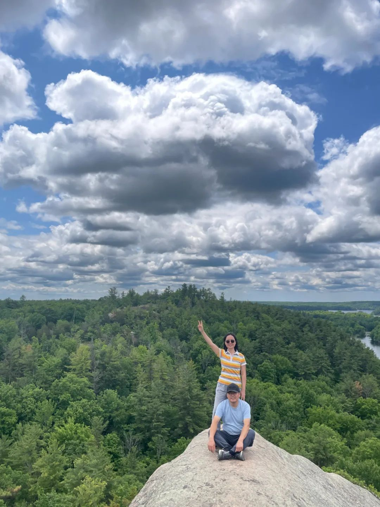  
  
每个人都会沉浸在自己喜欢的心流里。比如书法、舞蹈、旅游、写作、朗诵、钓鱼、高尔夫、羽毛球……人类每一种良性的行为熟练到一定程度后，都会引发相应的良性心流体验，这些精彩纷呈价值连城的精华巅峰体验，能量很大，给人带来和平、丰盈、富足和幸福感，足以带给人类丰盛光明的觉悟人生。  
  
  
**2023年7月1日****滑铁卢******  
  

  
