从我还只有7岁的时候，跑步就成了我生活中的一部分。

那时候，我还没有意识到脚步的每一次落地，都在为我编织一段段有趣的故事。随着岁月的流逝，我慢慢地发现，跑步不仅是一种锻炼方式，更是一扇通往奇妙世界的门，让我结识了许多有趣的事和有趣的人。  
  
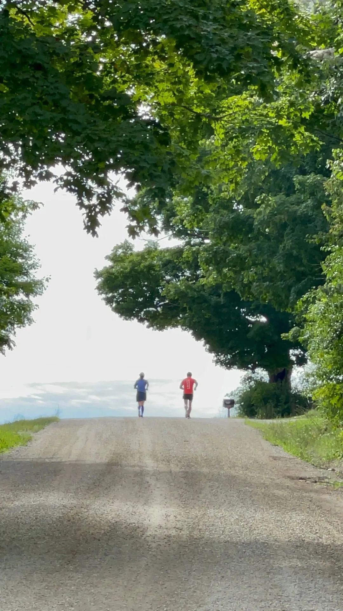  
# 2023 G2G 比赛感想  
  
回顾刚刚过去的周末，我参加了G2G比赛，它成为我与跑步那段特别的故事中的一个章节。这已经是我第三次参与这个Guelph to Goderich的接力赛，每一次都充满了期待，但也伴随着一些紧张的情绪。然而，酷热的天气和多出的4公里，让我心生一丝害怕。  
  
当我准时抵达起点，看到友人们在那里为我加油，一股亲切和兴奋的情感涌上心头。虽然跑步是一项个人的修行，然而当朋友们也参与其中时，这平凡的运动变成了一场与友人们一同追逐的群体旅程。  
  
我跑的第11棒是沿着起伏不定的山丘奔跑。起初，我感觉这次跑步似乎并没有想象中那么简单。不到半分钟，我就落到了倒数第一名，很快也没有其他选手在我前面。幸好，峰神骑着自行车一直陪伴在我身旁，帮我渡过前面的4公里。从第一个坡开始，感触出现在远处。他说他将陪我跑到终点。然而，第一个坡让我几乎透不过气。每一次上坡，朋友们都在鼓励我，为我递水，仿佛是在为一颗失去气的皮球重新充气，让我重新拥有力量。  
  
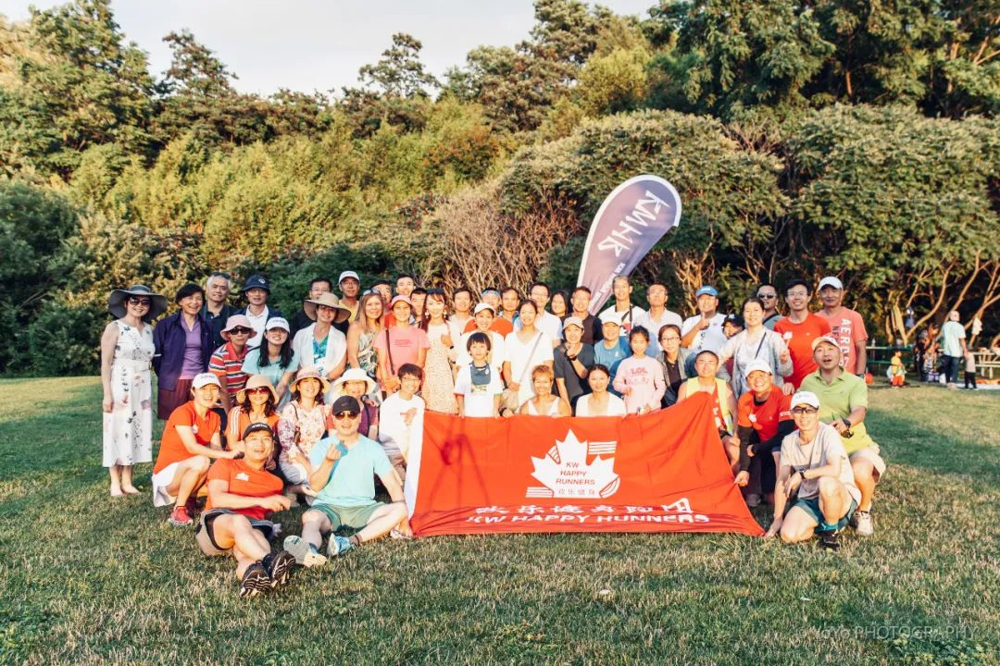  
  
在朋友们的鼓励下，我继续前行，就像一个不停弹跳的皮球一样，攀爬着艰难的山坡。当我艰难地攀爬过第四个陡坡后，我以为前方将是一段平坦的路程，然而抬头却是一段漫长的陡坡。那时，我渴望有人能拖着我前进，心情变得沮丧，开始怀疑自己为何要参加这场比赛。在怀疑与跑步的较量中，我继续前行。时间不知不觉地流逝，下坡出现了，虽然陡峭，但我享受着风中飞翔的感觉，就像是坐在过山车上一样的刺激。虽然我明白下坡时容易受伤，但却无法抵挡速度的诱惑。  
  
在之后的下坡中，我感受到了这次跑步赋予我的馈赠。沿途，我领略了山谷中独特的风景，经过了无数次的攀爬和下坡。渐渐地，地势平稳，最后的3公里让我感觉愈发轻松，然而速度却始终难以提升。在挣扎与自我激励的交织中，我终于跨过了终点线。这段旅程是一场关于坚持、友情和自我突破的历程，我在其中找到了力量，也让自己更加了解了跑步所带来的意义。  
  
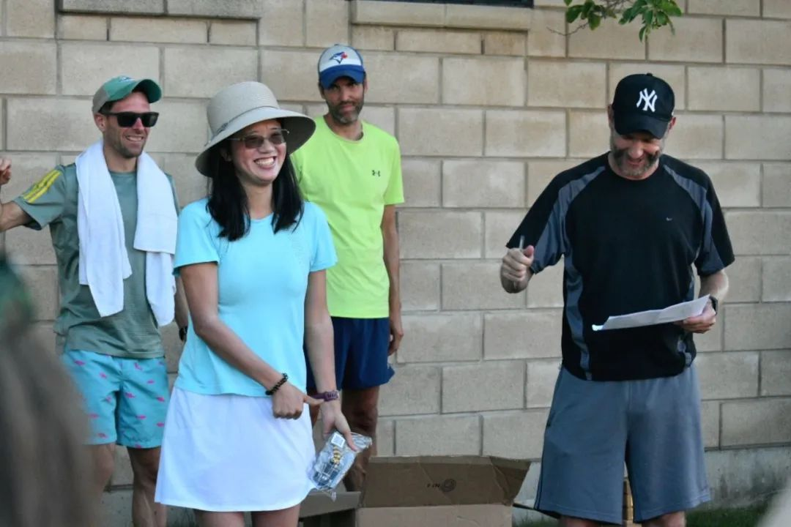  
# 跑步与我的英雄情节  
  
童年时光总是充满了无限的幻想和梦想，我也曾怀揣着英雄的情结，希望能在跑步中体验电视中大侠的飞翔。小时候，我特别钟爱将自己装扮成英雄角色，渴望在奔跑的瞬间感受飞翔的快感。有一次，我真的披上了自己亲手制作的披风，带着小伙伴们在一条坡道上来回跑，仿佛只要速度够快，我就能飞离地面。然而，尽管我付出了满满的努力，却并没有真的飞起来。尽管如此，那份对于未知的探索和想象的激情，至今仍在我内心深处萦绕。  
  
有一天，我找到了一个陡坡，以最快的速度冲下去，试图感受武侠大片里面的各种空中飞舞。然而，第一次的飞跃并非以我所期望的英雄结局结束，而是以一次意外的腿部扭伤收场。那一刻，疼痛刺激着我，却也让我深刻认识到了跑步所蕴含的力量。  
  
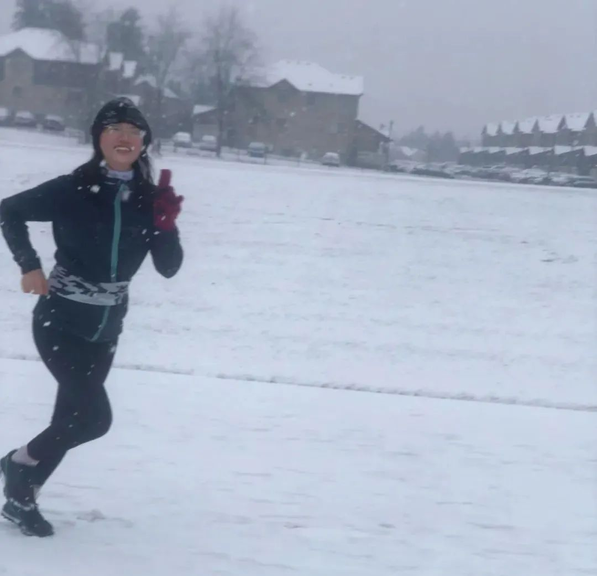  
  
虽然当时的探险并没有如愿以偿，但我从那一次事件中，更深刻地领悟到了跑步的魅力。跑步不仅是一种快速前进的方式，更是一种释放潜能和探索极限的方式。那段时间，我成了班级里因为受伤而休学数周的第一个孩子，或许这是我英雄情结的一个独特的延伸。  
  
我的童年英雄情节，在跑步中找到了一种特殊的寄托。尽管那个时候，我没有真的飞翔起来，但跑步带给我追逐梦想的满足感和真实力量的感受，让我从中收获了珍贵的成长与启示。  
  
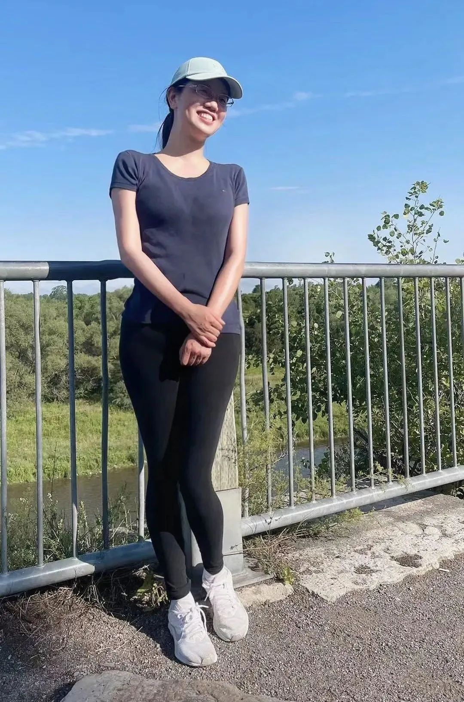  
# 跑步与自律  
  
进入初中后，老师们开始鼓励我们每天早起进行跑步锻炼。起初，我对此持怀疑态度，认为几乎没有人能够坚持早起晨跑。然而，当我注意到班上前几名同学都每天清晨6点起床跑步时，我的态度开始发生改变。为了不落后于他们，我决定制定一个每天早上半小时跑步的计划。每天，我早早地从床上起来，前往学校操场开始我的跑步之旅。逐渐地，我意识到，早上5点多起床并不像我想象的那么困难。反而，我在早上获得了更多的时间用于学习。  
  
在这个过程中，我逐渐培养了自己的自律和自理能力。每天早起坚持跑步，需要极大的毅力和恒心。我学会了按时起床，养成了良好的作息习惯，更加注重时间的合理利用。跑步不仅增强了我的体质，也塑造了我坚韧的意志。这段经历教会了我如何克服困难，如何在面对挑战时坚持不懈。  
  
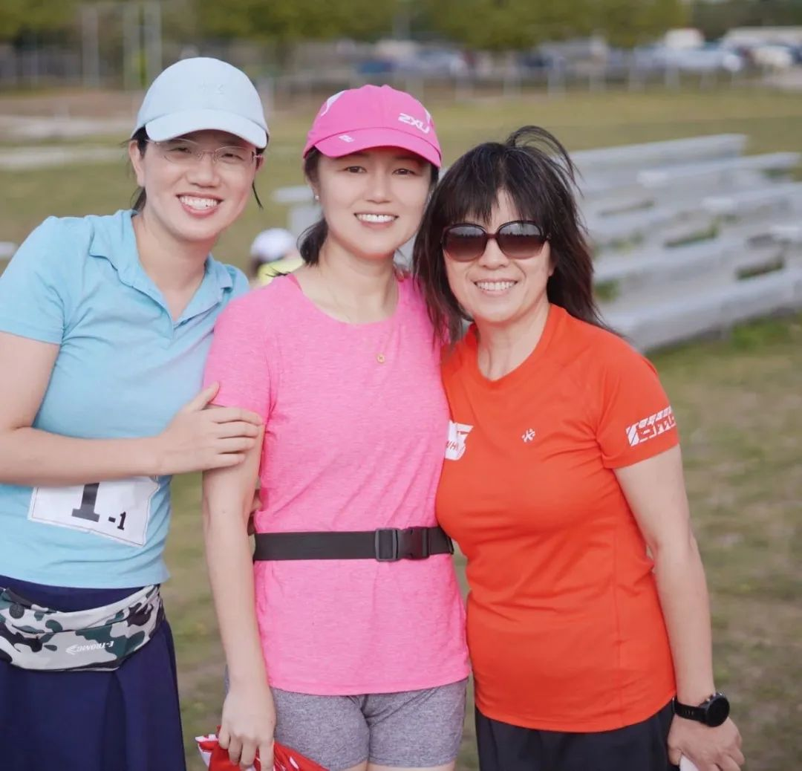  
  
通过跑步锻炼，我不仅提高了体能，还提升了自己的学习效率。我逐渐体验到早起的清新和宁静，将这段宝贵的时间用于学习，让我在课堂上更加专注。而当初二第一学期的成绩揭晓时，我意外地获得了年级第一的好成绩。  
  
跑步，不仅是一种锻炼身体的方式，更是塑造品格的工具。在日复一日的坚持中，我学会了管理时间、调整作息，更重要的是，它已经不仅仅是一种锻炼方式，更是一种生活态度。  
  
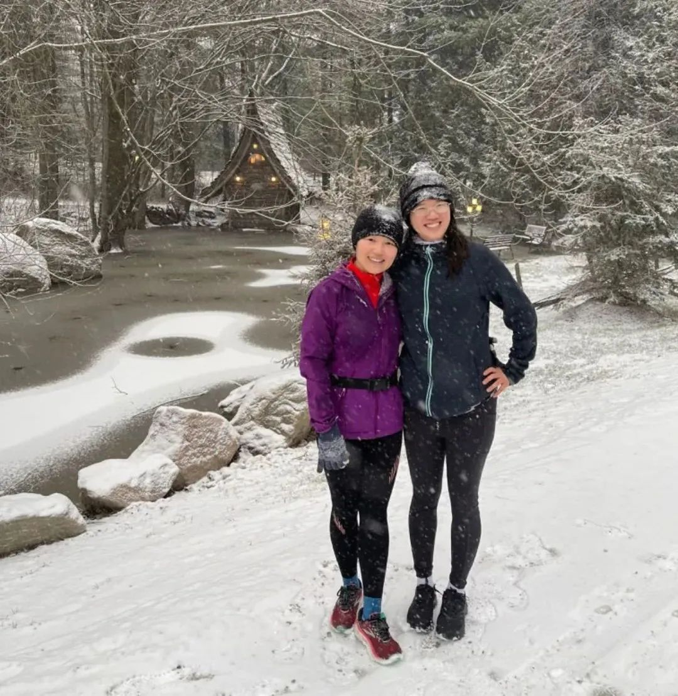  
# 跑步与功夫大师  
  
回想起高中时的一次运动会，我参加了3000米的跑步比赛。然而，刚刚起跑不久，我就意外地被撞到，导致擦伤和受伤。在疼痛和困惑中，我的同学和一位朋友提出带我去见他们的师父，一个懂得疗伤和功夫的大师。这个突如其来的建议让我充满了期待。  
  
于是，我和他们一起乘坐公交车，在一个偏远的大山中寻找着那位师父的家。经过一个小时的路程，我们终于到达了目的地。在这个神秘的环境中，我真的见到了那位精通疗伤和功夫的师父。他给我上药，细心地照料着我受伤的部位。我还有幸目睹了他们练习功夫的场景，那种氛围让我仿佛置身于武侠小说中。尽管现在看来这些经历似乎像是一场奇幻的冒险，但事实上，这确实是我在十五岁左右所经历的真实片段。  
  
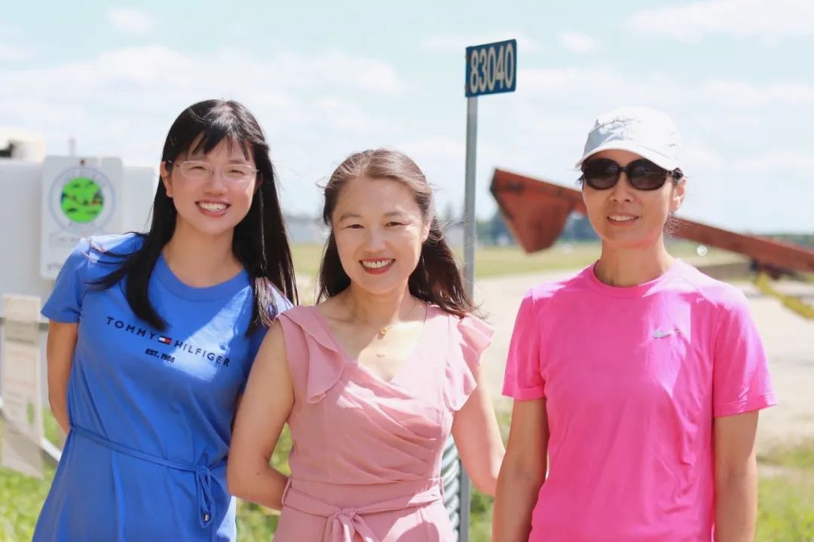  
  
随着岁月的流逝，这两位朋友渐渐地失去了联系，直到最近我再次与其中一位联系上，才得以回忆起当初他们带我去拜访师父的往事。而更令人惊讶的是，他成为了一名杰出的艺术家。这一重逢勾起了我与跑步这段经历的记忆，为它增添了一抹神秘的色彩。  
  
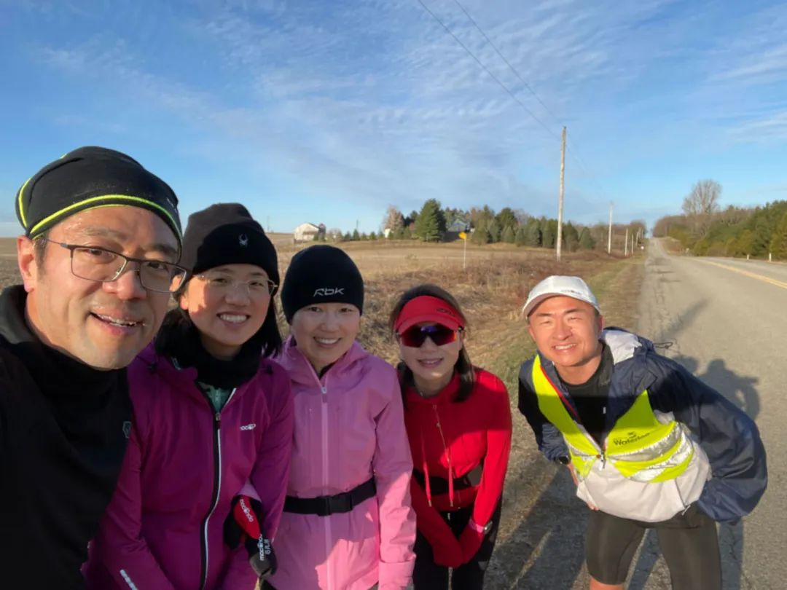  
  
这段经历让我意识到，跑步不仅是一种锻炼身体的活动，还能连接我们与一些特殊时刻和人物之间的纽带。那次受伤的经历虽然痛苦，但却引导我与一位懂得疗伤和功夫的大师相遇，为我的伤痛带来了治愈和力量。这种意外的连接使得我与跑步之间多了一份神秘的联系，让我更加深刻地认识到，每一个步伐都可能成为一段特殊的经历，串联出我们生命中最独特的故事。  
  
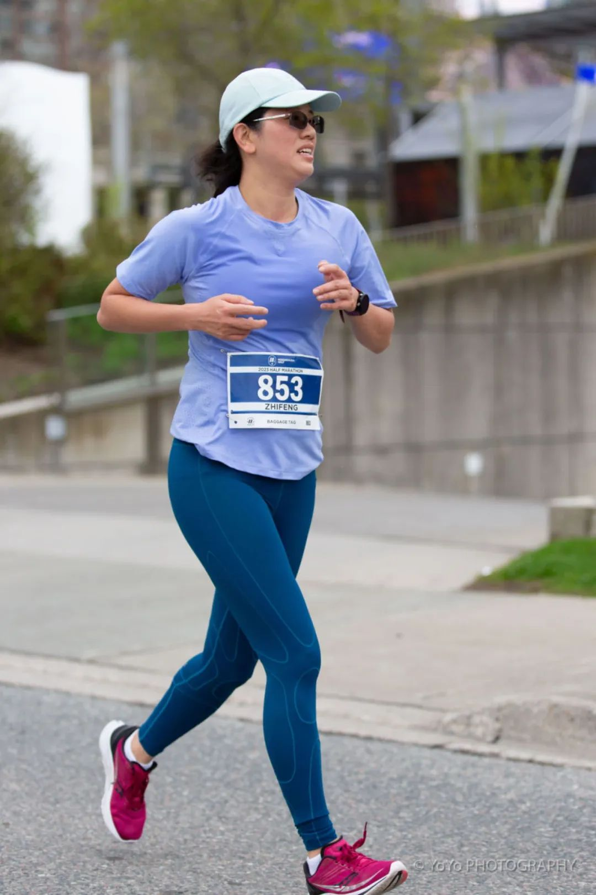  
  
# 跑步与减肥  
  
研究生毕业后，由于疏于管理自己的体重，我发现体重逐渐超出了自己的掌控范围。因此，我决定通过跑步来实现减肥的目标。然而，这次的减肥过程中，我发现慢跑竟然给我带来了无比的愉悦。每天中午，我会在同事们的午休时间，前往健身房进行一个小时的跑步锻炼。而晚上下班后，我会与两位同事一起跑步回家，共计两个小时的运动。  
  
在健身房慢跑的过程中，我开始意识到身材的好转所带来的自豪感。每次镜子中看到自己逐渐改善的身材，都会让我感到满足和愉悦。而下班后与同事一同跑步回家，我们会分享各种故事，仿佛生活变得轻松无忧。大约半年的坚持，我的体重重新回到了大学时期的水平。  
  
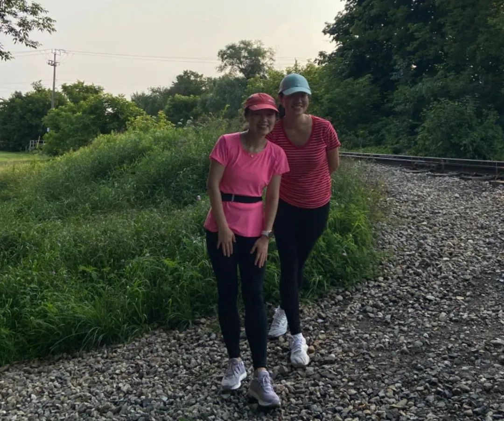  
  
从那以后，跑步就成为了我生活中不可或缺的一部分。它好像是一个陪伴我的朋友，也是联系我与其他朋友之间的纽带。每次自己独自跑步的时候，我总能回想起那些曾经与我一同跑步的人和事。跑步不仅让我减去了多余的体重，更为重要的是，它将我与过去的回忆、与他人的友情紧密相连。  
  
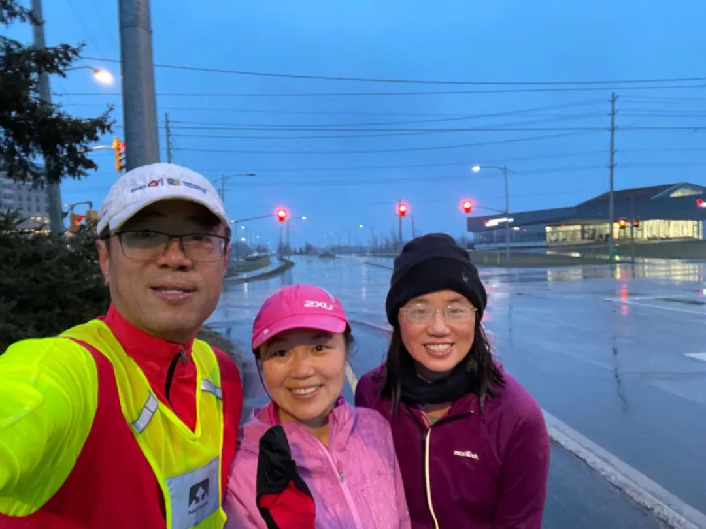  
  
跑步成为了我生活中的一种习惯，一种自我关怀的方式。通过跑步，我不仅保持了健康的身体，还收获了无数美好的回忆和珍贵的友情。无论是在清晨的宁静时光，还是在傍晚的余晖下，每一步都似乎在诉说着我的成长和坚持，成为了我生活中不可分割的一部分。  
  
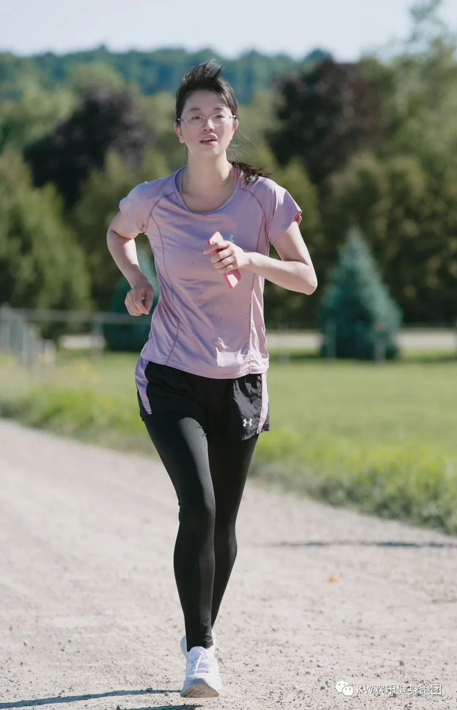  
  
# 跑步与心境  
  
在工作和学习的生活中，我时常感受到压力和困惑，而跑步成为了我宣泄情感的有效出口。当我感到沮丧或迷茫时，跑步成为了我心境的抚慰者。在跑步中，我找到了宣泄情感、释放压力的出口。无论是面对无法被理解的情感，还是难以解决的问题，跑步都成为了我的情感发泄和思考整理的方式。  
  
在跑步的过程中，我可以忘记自己的烦恼，全身心地投入到奔跑的心流体验中。每一步的节奏，每一次的呼吸，仿佛都在帮助我抛开困扰。有时，跑步甚至能够唤醒我内心深处的灵感，让我在逐渐平静的状态中找到解决问题的思路。  
  
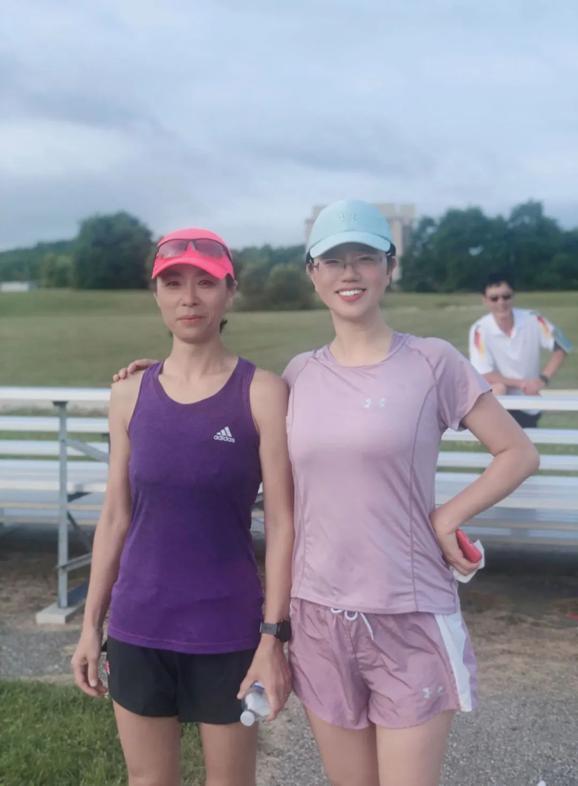  
  
还记得有一次，面对一个让我夜不能寐的JAVA项目，我感到绝望和困惑。第二天一早，我一个人来到操场，开始了持续两个小时的跑步。那一刻，我几乎将自己的焦虑全部释放在奔跑中。下午醒来后，我突然感觉问题的解决之道如同显现在脑海中一般。这次经历让我深刻理解，跑步不仅仅是简单的锻炼，它还具有引发思考、澄清思绪的神奇力量。  
  
跑步使我能够平复心情，思绪得以回归清明。在那些跑步的瞬间，我好像与自己的内心展开了对话，让自己逐渐释放困扰，找到答案。它不仅是一种锻炼方式，更是一种治愈心灵的方式，让我重新获得内心的平衡和力量。  
  
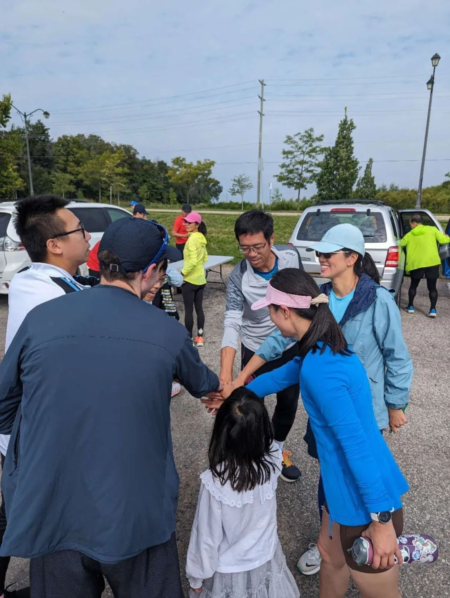  
# 跑步与人生  
  
跑步在我人生中不仅仅是一种锻炼方式，更是一种对人生的领悟和反思。通过跑步，我结识了许多可爱的朋友，这让我感受到人生如同一场漫长的长跑比赛。在这个过程中，有上坡也有下坡，有轻松愉快的时刻，也有挣扎与坚持的时刻。正如人生的起伏不断，跑步也是一次次的追求和挑战。  
  
跑步教会了我坚持不懈的重要性。就像长跑比赛中，当我们面对艰难的坡道和劳累的身体时，我们不能轻易放弃，因为人生中的困难也需要我们咬牙坚持，不断向前。每一步都是一种坚持的体现，每一次的呼吸都是一种挑战的成功。跑步中的努力和毅力，让我明白了努力奋斗的重要性，这种品质不仅仅适用于长跑，也适用于人生的各个领域。  
  
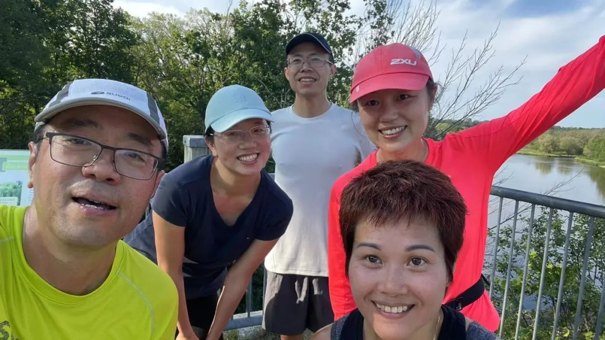  
  
同时，跑步也给我带来了内心的宁静。在奔跑的时候，我可以将烦恼和杂念抛诸脑后，沉浸在安静的世界中。这种宁静不仅是一种放松，更是我不断前进的动力。在宁静中，我能够聆听内心的声音，思考人生的方向，找到前进的动力。  
  
与我一同奔跑的朋友们也成为了我人生中宝贵的财富。我们一起分享着跑步的喜悦和挑战，相互鼓励和支持。这些朋友成为了我人生道路上的伙伴，一同走过了许多路程，留下了美好的回忆。  
  
跑步已经我人生中不可或缺的一部分，它教会了我坚持、努力和宁静。跑步的每一步，都在我人生的长跑中累积着智慧和力量，让我更加坚定地前进。  
  
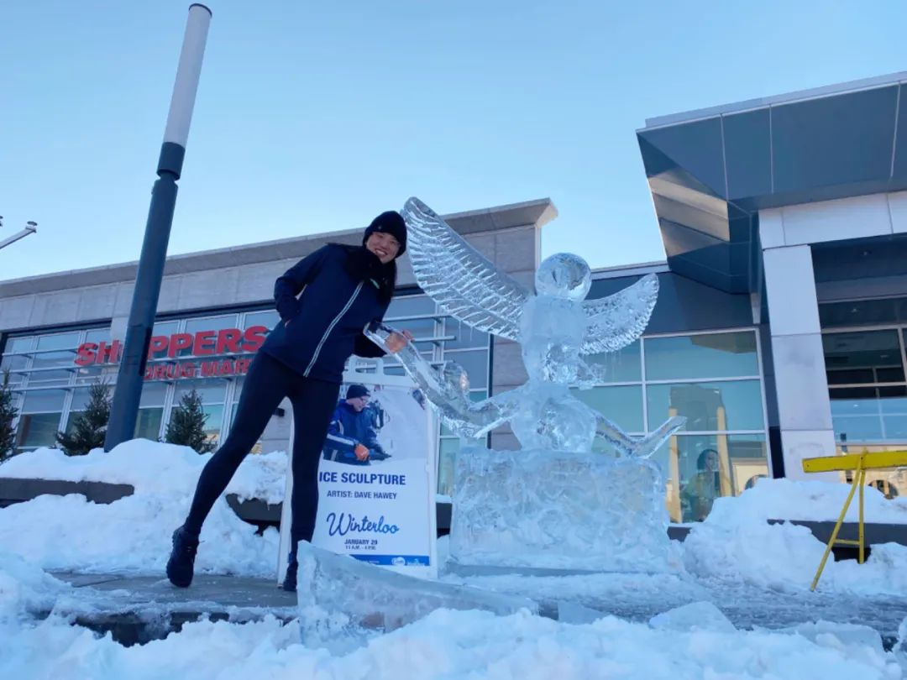  
  
让我们继续奔跑着，朝着自己心中的光。  
  
  
**2023年9月****20日****滑铁卢**  
  
****  
  
  
  
  
  
  
  
  
  
  
  
  
  
  
  
  
  
  
