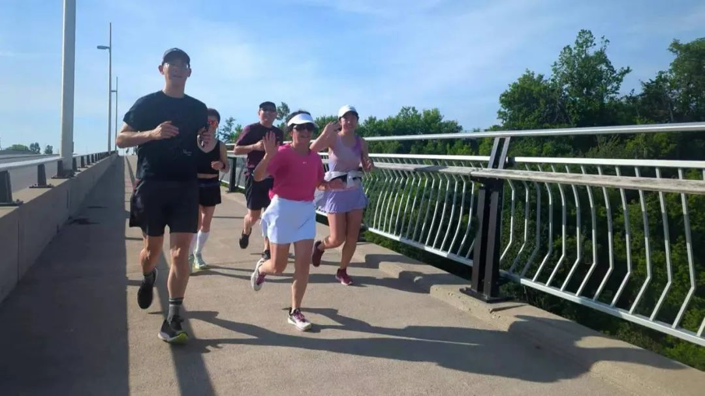

  
光阴似箭，岁月如梭。一转眼，移民加拿大已经20多年了。

和许多同时期来到加拿大的移民一样，我和先生也经历了移民它乡时的茫然和探索，尝试和努力，失败和成功，一步步经历了从无到有的过程，直到如今有了一个温暖的四口之家，一份喜欢且得心应手的专业工作，一种简单但健康快乐的生活方式，和一群热爱生活的好朋友，它乡也早已在不知不觉之中成了故乡。

如今两个孩子已经长大，离开家门开始了大学生活。空巢后的我，也有了更多的时间，可以把散落在记忆里的珍珠重新拾起，串成一幅岁月的项链，珍藏于心，也分享给大家。 
  
  
  
**“我喜欢你的中国围巾”**  
  
加拿大，一切都是全新的，而我在加拿大结识的第一位当地朋友，则源自一条普通的中国围巾。

那是一个冬天的上午，去公共卫生局的路上，遇见了一位推着婴儿车的女士。眼光对视后，她主动和我打招呼：“ 早上好，今天天气不错”。 几句话下来，得知我是新移民，也感觉到了我还有英语障碍，对加拿大公共卫生机构还不甚了解，因此到了卫生局后，她主动帮我和前台沟通，顺利完成了在卫生局的各项检查。出门的时候她说，“我是Lisa，咱们留个电话吧，有时间来我家一起看冰球比赛” 。

当时我以为这就是一个普通的客套话，但没想到一个星期后，Lisa打来电话约我们周末去她家一起看冰球直播。我们如约前往，看了人生第一次冰球比赛直播，爆米花、啤酒、欢笑声，夹杂着磕磕巴巴的英语，多年以后回忆起来，依然美好。 
  
  
  
之后Lisa带我参加了她们妈妈群每周一次的下午茶活动，并把我介绍给了她的朋友们。一天，她的一个朋友联系我，“文斌，我们家有一些女儿用过的小宝宝的东西，女儿长大不需要了，不知道你需要吗？介不介意这些东西是用过的？” 在得到肯定答复后，又非常贴心地说：“我们家有车，你不介意的话，我可以把这些东西给你送到家里。” 于是一个周末的下午，我们在租住的公寓楼里，收到了好几件8成新的婴幼儿用品，其他朋友来家玩的时候都很吃惊，初来乍到的我们，居然拥有了这么多几乎崭新的“高级”婴幼儿用品，儿童推车、高椅、摇椅、Playyard，简直应有尽有，听我讲了来源，更是纷纷称赞。  
  
  
  
有一次我问Lisa，素昧平生，为什么对我这么好？Lisa笑了笑说：**“因为我喜欢你的中国围巾”**。

这就是Lisa，还有许许多多和Lisa一样的加拿大人，他们骨子里的那份善良，让他们帮助他人的时候，不需要一个具体的理由。之后的岁月里，我也学着力所能及地去帮助身边有需要的朋友们，并时时提醒自己，提供帮助时也给予对方足够的尊重。
  
**Fan-Qie-Jiang**  
  
登陆加国后的第一顿早餐，是在移民旅馆附近的麦当劳。

看着写满英文的菜单，几乎一个单词也不认识，只好指着图片，“这个”、“这个” 地点了早餐。点完主餐后，想着像在王府井麦当劳时一样，加一点番茄酱，于是脱口而出：“Fan-Qie-Jiang” ，收银员站在原地一脸茫然的看着我，我很奇怪，她没听懂吗？于是又重复了一遍……过了好一阵，我忽然意识到我现在在加拿大，收银员根本不知道我在说什么……

就这样，我们开始了在加拿大语言不通的生活，别人说什么我们听不懂，我们说的别人也听不懂，我们能做的，就是抓住每一个机会学习英语。
  
  
  
  
一次申请家庭电话线，本可以去唐人街找一家有中文服务的商店，几句话就能说清楚把事情办了。但为了锻炼英语，我们最终选择了一家只有英文服务的商店。来加拿大前，先生曾短暂公务出国，有一点英语口语交流的机会，听力不好但敢说。我读研时有一些听力训练，能听懂但张不开嘴。于是先生向店员描述我们的需求，我听懂了翻译给先生，先生再用英语继续沟通……几番下来，店员也看明白了，我们一个会说一个会听，于是先生说的时候他仔细听，然后转过身来对着我解释，我用中文翻译给先生听后，先生和店员继续交流……最终我们成功地申请到了第一条家庭电话线路，还免除了因没有信用记录而需要缴纳的200加币的保证金。签合同的时候，店员鼓励我们：**“你们是一个好的团队”**。

就这样磨练了大概半年的时间，我们的听说水平都有了很大提高，出门办事不再需要一起行动了。这期间我们也一直参加社区的英语学习，那时孩子还很小，没有人帮忙，我们就推着婴儿车带着孩子一起去学习，风雨无阻。上课时，孩子在婴儿车里或玩或睡，课间休息时，我们就抱抱孩子…….这样一直坚持到了学期结束，结业那天所有的六位老师都来了，只有我们这两个学生，还有一个抱在怀里的婴儿。主讲老师说这个结业典礼是她教新移民英语这些年里最特别的一个。

如今基本实现了刚移民时的“梦想”：一边炒着西红柿鸡蛋，一边听着广播里的新闻，已经不再觉得那么难受。回想起来，庆幸当初茫然不知道该做什么的时候，我们抓住了一切机会学英语，这也让我们在加拿大逐渐通过语言关，慢慢扎下根来。
  
**“等你考完试有时间再陪我吧”**  
  
每个新移民大概都会面临找工作和职业发展这些问题。新移民人生地不熟，又没有职场的各种联系，找工作的困难自然比本地人大了许多。好在加拿大提供了各种各样的成人职业培训，帮助成人学习和提高职业技能，这也给新移民提供了更多选择的机会，可以尝试自己更感兴趣的职业，是继续国内原先的专业，还是重新选择职业方向，这是一个问题。
  
  
  
刚来加拿大的那几年，我有幸进入安省学前中心工作了五年，为有0至6岁孩子的家庭提供儿童学前教育服务。当时两个孩子还小，学前中心学习到的和锻炼到的，常常可以学以致用在自己孩子身上，也常常把在家里两个孩子身上运用得好的方法运用到中心的活动中。和公共卫生局护士一起举办的各种活动，得到了学前中心和家长们的肯定，那几年我对中心的工作兴趣很高。几年后休完产假重新考虑职业定位时，我不能肯定自己家孩子都长大后，是否还有如今的热情。反复考虑后，最终还是决定调整方向，选择财务专业。

离开北京登陆加拿大前，我刚刚拿到了首都经贸大学财务专业的硕士学位，但没有任何财务工作经验。放下一份已经稳定的工作转向财务，意味着一切又将重新开始。带着两个年幼的孩子，一边工作一边考试的日子并不轻松，所以我没有在思想上给自己太大的压力，准备考到哪儿算哪儿，20门课有时间有精力的时候，就学一门考一门，过了就继续报考下一门，不过就不准备接着考了，退一步海阔天空，做自己力所能及的工作就好。幸运的是每一次考试我都一次通过了，这样前前后后用了八年的时间，最终拿到了**加拿大注册会计师的资格证书。**  
  
  
  
这一路走来，有家人的支持和鼓励，也有公司上司的大力扶持，其中的两件事情让我印象深刻。

开始准备第四级的专业课程考试时，我在滑铁卢一家运输公司工作。当时的顶头上司是公司的财务主管，知道我正在准备注册会计师的考试后，特别支持。每月一个小时的一对一会议，基本上花几分钟快快的讨论完工作后，就开始讨论我学习中遇到的问题，以及实际工作中遇到类似问题时可能的一些解决方案，这样的学习方式让我对各门课程的理解越来越清晰，学习起来也事半功倍。每次考试前，上司都会把我的一些工作或分担或延迟，好让我有一到两天的学习时间，复习重要的知识点。当所有学科基本完成、需要提供实际工作案例书面报告作为评估时，上司知道我擅长干活但不擅长书面总结，于是在我初稿的基础上，一字一句地帮我修改、润色了整个申请资料，让陈述更加准确清晰，最终一次通过，顺利拿到了注册会计师的资格证书。 上司是我在职业发展路上的贵人之一， 特别感谢他们在职业发展道路上给予的帮助和支持。
  
  
  
注册会计师还剩最后四门课的时候，黑莓公司大裁员，先生换工作去了外地，公司离家有4个小时的飞行距离，而且需要时不时全球出差，一个月在家的时间寥寥无几。我经常一个人上班带孩子，同时还要学习和考试，精神和身体上的疲劳不断累积，心生退意，不想继续考试了。知道上进的先生肯定是不赞成的，我就想在孩子们那儿找个不考的理由，于是和他们商量，“爸爸现在经常不在家，妈妈工作考试也挺累的，也没时间陪你们了。要不然妈妈不考了，可以有更多的时间陪你们”。大儿子听后说：“妈妈，我还能做什么让你把这个证书考完”，小儿子则说：“妈妈，你马上就能考完了，我自己可以的，**等你考完试有时间了再陪我吧**。”

总不能给孩子们做一个半途而废的榜样吧，于是咬咬牙，继续完成剩余的课程，并且由于Excel在财务工作中的广泛应用，我还一并考取了微软Excel的专家证书，让日常工作更加游刃有余。如今我在本地最大的医院做高级财务分析师，在处理和解决各种复杂财务问题中，也真切地感受到了那些年学习带来的益处。虽然有些遗憾那些年少了一些陪伴孩子们的时间，但孩子们亲眼目睹了妈妈工作、学习、考试的经历，也让他们学会了认真对待自己的学业和生活，算是有失亦有得吧。 
  
  
  
**家庭运动 —— 羽毛球**  
  
我们小时候，当过兵的老爸总带着我们打打乒乓球羽毛球什么的，让运动成为我们日常生活里不可或缺的一部分。自己有了孩子以后，也尽可能地和孩子们一起运动。在孩子们成长的过程中，他们尝试过很多体育项目，羽毛球是他们最喜爱的一项运动并且保留至今，这项运动也逐渐变成了我们家的家庭运动项目。
  
  
  
兄弟俩曾经一起通过选拔，代表安省西部地区参加过两届安省青少年运动会羽毛球项目，非常喜欢那种团队合作的氛围。时间来到了第三届运动会，以前的教练和领队同时辞职了，西部地区面临着没有教练没有领队也没有队伍的尴尬状况。为了圆小儿子一个打满三届的梦，我自我挑战了一把，毛遂自荐担任了2022年安省西部地区青少年羽毛球队的领队。找教练、组队、服装、备战，然后带着6名男孩6名女孩奔赴Peterwawa参加全省比赛，成了我特别难得的一段经历。至今记得球员们战胜对手进入上半区比赛的欢呼雀跃，也记得他们微弱比分失利无缘铜牌的沮丧，更欣慰有机会在他们难过沮丧的时候，鼓励并陪伴他们，在接受失利的同时，也不忘提醒他们那些曾经打出来的一场场精彩的比赛和瞬间。
  
  
  
不光是孩子们继续着羽毛球运动，当孩子们长大先生和我有了更多自由时间后，我们也开始定期打羽毛球了。今年和几个经常聚在一起打羽毛球的大学同学聊天，说起了每年一次的多伦多羽毛球高校杯，我们也可以组个队去以球会友啊！讨论并确定了参加比赛的基本原则后，我们就马不停蹄地着手准备工作，又邀请了其它两个院校一起组建了羽你同行联队，参加了今年十月感恩节长周末在多伦多举办的2023年羽毛球高校杯比赛。虽然我们小组赛遗憾没有出线，但一天比赛下来，校友/球友们玩得兴高采烈。更重要的是，虽然比赛只有一天，但准备比赛的这几个月，我们联队十几个朋友总是每隔一个月左右，就会在某一个俱乐部相聚，然后酣畅淋漓地打球，痛痛快快地聚会，天南海北地聊天，充分享受打球带来的乐趣。 
  
  
  
如今羽毛球已成了我们家的家庭运动项目了。大儿子在滑铁卢大学被选为学生羽毛球俱乐部的 Director，平时自己打球也经常组织一些羽毛球相关活动。小儿子则入选了麦克马斯特大学羽毛球校队，经常和队友们一起训练比赛。先生和我坚持每周两次以上羽毛球，有时间就练练球。家庭里的每一个成员都和自己的一群球友玩得不亦乐乎，甚至有时间四个人还可以聚在一起，来一场家庭羽毛球比赛，混双对男双，精彩不断。
  
**跑出最快乐的我**  
  
做为一个地道的南方人，对加拿大长达半年的冬天多少还是有一些畏惧的。机缘巧合，2022年7月的长周末，老朋友拉我们进了本地KW 欢乐跑团，和一群热爱运动、热爱跑步的朋友一起享受跑步带来的乐趣，从此不再畏惧冬天。
  
  
  
高中的时候最怕跑步，差一点因为跑步不达标不能参加高考。没想到知天命后开始喜欢上了跑步，在操场、在路上，在trail上，在海边……自己跑，和小伙伴们一起跑，跟着跑团的大部队一起跑，每一次跑步都很快乐。
  
  
  
跑团的人都喜欢跑步。平时在各自小区自己跑，每到礼拜天小伙伴们都喜欢到主场一起跑，很是热闹，夏天跑完步有西瓜，冬天跑完步有热咖啡。有时候小伙伴们也在公园里画个弓、画个大象、画个大雁什么的，跑步跑出了画家、艺术家的感觉。 
  
  
  
  
跑团的朋友们都特别认真，参加各种比赛，挑战自我，不断提高。在小伙伴们的支持和鼓励下，我们也参加了几个小比赛，趣味跑，2022年十月份的湖滨5公里跑，十一月份的圣诞老人跑，2023年6月份的父亲节10公里跑，7 月份的Terry Fox 跑，G2G，每一次跑步都有不同的收获。
  
  
  
  
喜欢跑步，是喜欢跑步时可以完全放松、心无旁骛、自由自在地随心跑；是喜欢三五好友聊着天、唠着嗑、一路欢声笑语地开心跑；是喜欢因跑步结识的朋友各有特色，每个人都是一本书，读你千遍也不厌倦；是喜欢跑团里各种各样的活动，把跑步变成了日常生活的一部分……
  
  
  
  
  
**花草最抚凡人心**  
  
  
小时候家里一直养着花花草草，长大以后也一直喜欢花花草草。养花种草的过程，也是认识世界、认识自己的过程。 
  
  
  
君子兰高雅稳重，艳丽团簇的花朵寓意着幸福美满、富贵吉祥；蝴蝶兰清新纯洁，花朵细致柔美，如蝴蝶翩翩起舞，传递着爱和幸福的花语；蟹爪兰花色艳丽，意味着鸿运当头、运转乾坤……这些花里，哪个最好，哪个最美？其实各花自有各花好，每一种花都有着自己的美，都各有特色，无法类比。人和花也一样，不须攀比，各自活出自己最灿烂的模样，就是最好。

 
  
  
  
同为天竺葵，颜色各有不同，花型亦不尽相同；同为蟹爪兰，光颜色就有好几十种。世界的丰富性就在这里，面对同一件事情，不同的人可能有不同的解读和不同的处理方式。不必太在意别人的看法和处理方式，依从自己的本心，尽可能求同存异就好。  
  
  
  
阳光多、水多、肥多，植物就一定长得好吗？茉莉花、铜钱草肯定长得好，但发财树、富贵竹就不一样了。它们更喜欢阴凉和有散射光的地方，要等土干了后再浇水。玉树则需要多晒太阳，春天刚挪到室外的时候叶子会发黄，会蔫儿。别紧张，这是玉树从室内到室外的过渡时期，一个星期以后，玉树就可以尽情享受阳光、尽情生长了。如果过渡期间把玉树挪到了背阴、阳光少的地方，短时间内玉树叶子不会变黄，但是长久来说，就会生长缓慢…… 所以和花一样，我们每个人也需要找到合适自己的位置；在养育孩子时也是一样，要找到最适合自己家孩子的方式，提供适合的养育，避免过度保护。

继续在养花种草的日子里，认识自己、认识世界……
……  
  
  
  
  
生活从来没有写好的剧本，困难、挫折、变化、挑战时不时出现。直面困难和挑战是我们一直在修习的一门功课。回顾移民的20多年里，幸运的我身边总有亲人和朋友的相伴相助。谨以此文献给我所有亲爱的亲人和朋友们，有了你们的陪伴、帮助、支持和鼓励，才有了今天安居枫叶国的我，感恩一路有你！ 
  
**2023年12月30日**  
  
