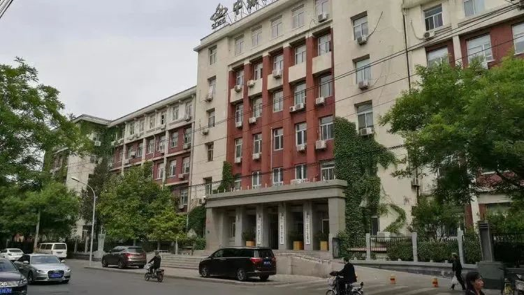
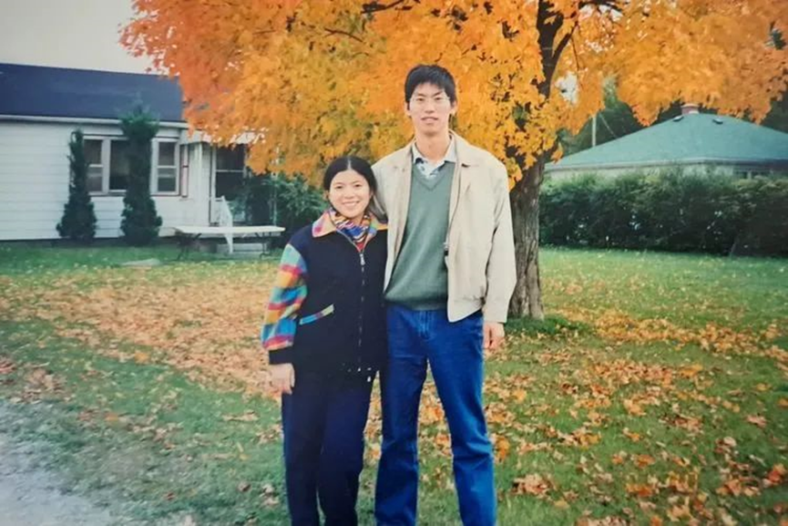
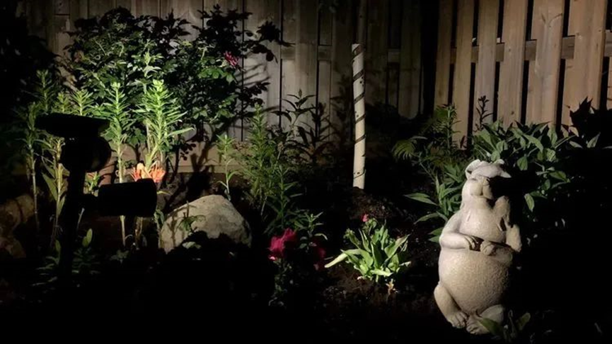
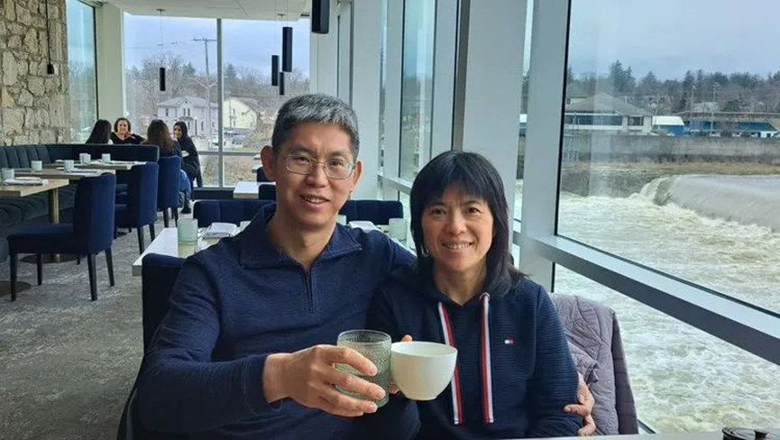
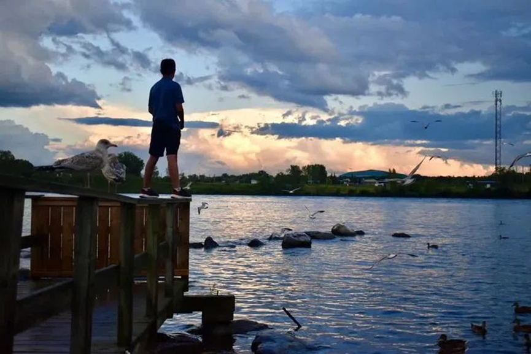
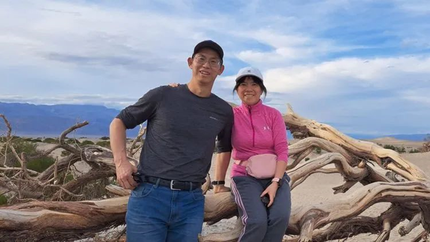
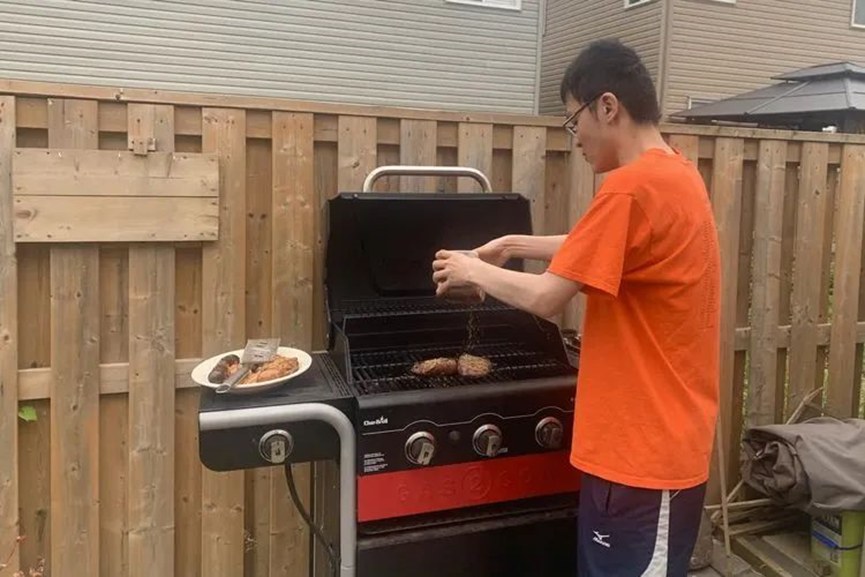
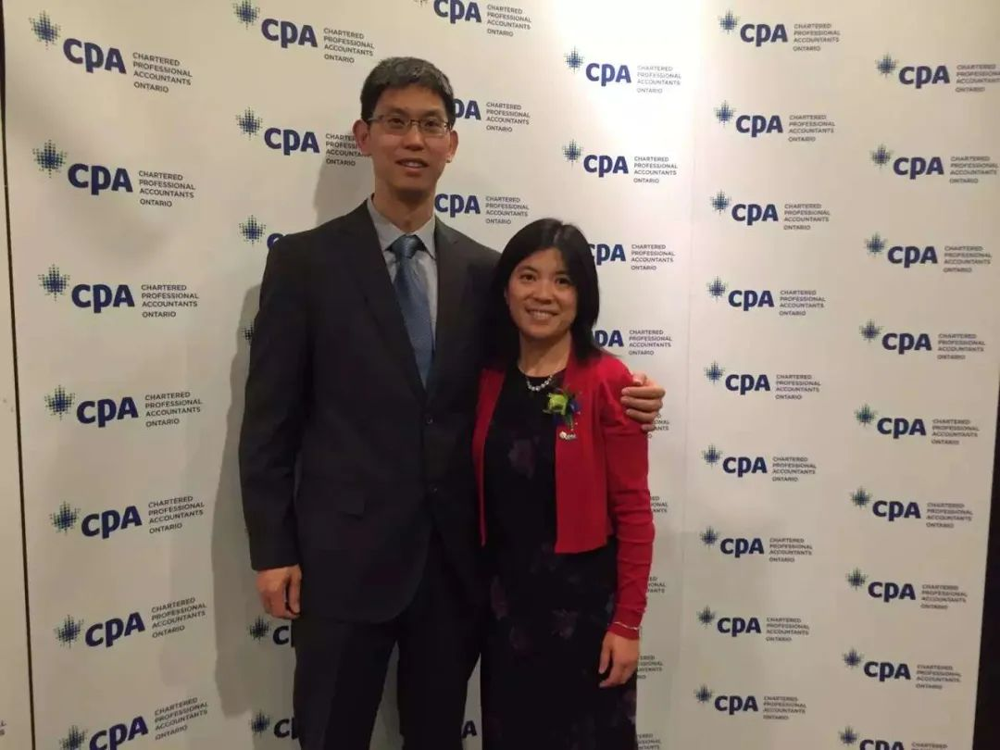

  
****  
   
自觉是一个没有故事的人，既没干出些可以自我陶醉的大事来，也没混得穷困潦倒，在千千万万的移民中，是普通的不能再普通的那个。郭老师约稿时，感到无落笔点睛之处，因此不敢满口答应，只说试试看，这样一晃就是大半年过去了。  
  
  
  
几天前偶尔翻出以前写的一篇文章《寂寞追光》忽然想到，我与夫人之移民二十余年，不正是如此吗？告别熟悉喧嚣充满活力的昼，而选择了旷野中寂寞清冷却又平和恬静的夜，抱着憧憬而来却没遇到极光，可最后天上的千万星光，却又让我们感到了真实和永恒。于是想了想，那就写写那些年，我这个普通人的那点普通事吧，虽然不绚丽也不出彩，但每一件小事，却也如浩瀚银河中的一颗星，微小羸弱，但真实存在。  
  
我是一个好动的人，移民加拿大这个决定，多少有年轻时不安分的成分在里面。大学毕业后进入设计院，机缘巧合只用了短短几年，就将变电站、高压输电、生产系统集控、工业场地动照网、大型设备运行控制、工程项目管理等等，这些通常需要几十年积累才能获得的机会，统统干了一遍。想着今后要重复同样的甚至更简单的东西，就没了最初的热情，开始有了跳槽的想法。这时看到身边有人办理了加拿大移民，没多想就递交了申请。  
  
  
  
至于移民的动机，与其说是为了梦想这种似是而非的理由，我倒是觉得“世界这么大，我想去看看”，更贴合我年轻时好动的性格：明知要受点罪，但就是有这样一种冲动，可以让我放下熟悉舒适的东西，去选择陌生寂寞又寒冷的远方。说到这里，我不得不感谢我的妻子，当我提出移民时，喜欢平静生活的她只是淡淡的说，我没想过要出国，但如果你认定了，那我们就一起走好了。

2001年8月，我们登陆多伦多。初来加拿大，面临着和其他新移民一样的困难和挑战，大家大同小异，所以我也没有更多可分享的东西，只是我天生乐观派，没工作英语也说不好的日子里，也没觉得天会塌下来了。但接下来的事情，就让我，或者说是我们，多少有些手足无措了。
  
  
  
  
“医生说我怀孕了。” 从士巴丹拿和登打士夹角处那个医生办公室出来后，夫人对等候在外面的我说，接着眼泪就下来了。

这就是我们在加拿大的开始，落地刚一个多星期，突如其来的消息，打乱了原先一切计划。

“嗯...那...我出去打工，你在家调养好身体。” 经过十来秒短暂的大脑短路后，我说。

于是我开始寻找打工的机会。好在运气不错，经一位朋友介绍，去了一家小作坊做松下电池返修。发挥手速快的优势，我一临时工，愣是把一份计件工作，干出了技术员的收入。可惜好景不长，几个星期后 911 那天，老板召集我们说：“告诉大家一个好消息，明天大家可以在家好好休息了，我们的活干完了。再告诉大家一个坏消息，世贸大厦半个小时前被袭击了，估计下一步经济不乐观。”

对刚落地一个月才几天的我来讲，纽约太遥远，我更多的只是关注眼前的苟且，眼见连眼前的苟且都要消失不见的时候，实在无法苟同这是件多好的事情。相信说到这里，对 911 之后那次经济危机有印象的朋友们，还有那些为了申请一个装配工的岗位，冬天凌晨四点钟就去电子厂门口排队碰运气的高学历们，你们一定懂得我在说什么。
  
  
  
  
90 年代末 2000 年初的技术移民，基本上都是两手空空来到加拿大，没钱没时间让你去计划、等待和选择，生存下来，就是最迫切的问题。于是我从维修工到搬运工，从餐馆工到工厂工，所有能保证第二天有面包在桌子上的 Surviving Jobs，那时都是来者不拒。篮球运动员科比曾说：”你见过凌晨四点钟的洛杉矶吗？” 是的，我没见过凌晨四点钟的洛杉矶，但我见过凌晨一两点钟多伦多的雪花，知道夜里公交车多长时间才来一趟。当科比在训练场上一次次重复着同样的投篮动作时，我们这些打工人，也在一遍遍地重复着那些机械的动作，每天抬起累计几十吨的重物，上午餐馆站上三四个小时后，下午晚上工厂里再站上八九个小时。 
  
  
  
但我不想抱怨打工时的艰辛，那时很多新移民都是如此，抱怨也不是我的嗜好，何况打工还让我有地方住有饭吃。我也不轻看体力劳动，自己干过也曾与工友们共呼吸过，所以心里认为所有劳动都值得尊重。而且我也不后悔那段打工的日子，甚至还必须感谢它拓展了我的下限，能以这样的方式生存下来，我知道，未来已经没有什么可怕的了。更是在那段寂静的没有色彩的岁月里，懂得了什么才是人生中更重要的东西，也永远感谢那个深夜归来，为我留下一盏灯的人，也永远感谢拖着带病的身体，为我们打点国内事宜的父母。  
  
  
  
  
后来的事情就简单了许多。一年后我们不光生存了下来，账上的存款还多了，还成了我们后来买房首付的一部分。有了经济上的短暂自由，我辞去了打工工作，花更多的时间学习英语。又通过短期成人coop项目，被一家科技公司留了下来，做了一名可靠性实验室的实验员。可以毫不夸张的讲，当时及之后十年里，每一个在加拿大有银行卡信用卡的人，你们都曾经使用过我和我的同事，共同测试和 Qualified 的读卡机。
  
  
  
  
多年后当我有了更丰富的人生履历回头看，坦率的说，类似实验员这种机会如果出现在早些年，我是接不住的，在国营环境里养成的一些坏毛病，是我之于我的最大敌人。是那些年打工的经历，洗去了我原先身上的浮躁，让我可以更加务实，从一个普通的职位上起步，一步一步完成职业转向，最终成为一名质量工程师，并先后任职多家科技公司。如果说生活是最好的老师，那么打工的那些年，就是我一生中最重要的学习和转变的阶段。  
  
  
  
  
实验室的工作开展了刚两个星期，项目经理满口法兰西口音还没听懂，头儿就让我独自参加项目会议，还打趣的说，英语不会不要紧，做质量工作的，会说 “No” 就可以了。两年后新产品上市后，法国总部决定把北美研发中心给关了，大家过俩月后就都要没工作了，可我们的新房合同才刚签了一个多月，还不上贷款就要破产。后又经历了08年全球经济危机，和2013年黑莓公司史诗级的崩盘，当无可奈何的失业来临的时候，实话实说，因为曾经有过一段挣扎的日子，知道如今的情况还远没那么糟糕，基本上也就做到了处乱不惊。
  
  
其实这些所谓故事的故事，无非是世纪之初来到加拿大的那一波技术移民们，很多人都有的经历，放在大千世界之中，我这点事也算不上什么。远的不说，妻子就是一个很好的例子，那些年，如果我打工还可以用小时数来衡量，那带着刚出生孩子的她，基本上就一直处于24小时待命的状态。她的第一份工作，是一边推着婴儿车，一边在公园、商场、社区做 Outreach，向路人介绍即将成立的早教中心。由于全身心做好了这份没人监督的临时性工作，几个月后有雇人机会时，新中心首先想到了她。后来更是被几个中心争抢，最后联合起来，为她创造了一份全职工作岗位。若干年后，她又完成了职业转向成为了加拿大注册会计师，中间所有的过程，和打工也没什么两样，白天一份全职工作，晚上和周末还要学习和考试，再加上照顾两个孩子，繁忙的日子，她一坚持就是 8 年的时光。
  
  
  
如今回头看，我们每一个来到异国它乡的人，或多或少都曾怀揣着一份对外面世界的憧憬，如同憧憬五彩绚丽的极光一般，可以不加思索的选择一种奔向。当刚刚来到加拿大人生地不熟，现实的云雾锁住了我们的天空让生活寂静下来的时候，我们也曾有过怀疑，来加拿大是不是值得。而当我们这些移民们，不再关注极光是否会出现，开始从身边最普通的工作做起后，有一天我们仰望夜空，发现曾经做过的，那些平凡而普通的一件件小事，已化作漫天的星斗，每一颗都不亮眼，但汇聚在一起，灿烂的银河又是如此的真实和生动。也才在多年后忽然意识到，最终真正让自己欣慰的，是当初没有停留在一片叹息之中，而选择了“士兵突击”，放弃临渊羡鱼之后，才有了退而结网的专注。 
  
  
  
如今同样的故事依然发生在身边。我知道有这样一个年轻人，高中时独自来到加拿大，坦率地说，那时的他各方面技能，与同龄人相比存在着不小的差距。唯一保留的火种，是内心深处那份对自我提升的渴望。留学这些年，他不断寻求自我突破，即使有些时候碰得头破血流，花了很多功夫仍然不得要领，也从未停止过步伐。几年之后，他成长为具有一定独立能力的年轻人，管理着自己的时间、学业、任务，独自办理护照、学签、大学申请、专业选择、课程选择等所有留学相关事宜，并于去年进入麦克马斯特大学，攻读数学专业。而这些变化，都开始于他愿意从最普通的洗碗这件事上做起，告别十指不沾阳春水投入到更多实践中后，也就相应锻炼出了更多的能力。我知道他会看到我的这篇文章，也希望借这篇文章告诉他：“你有令人信服的理由，去为你这些年的每一个普通的进步而感到自豪，它们都是你劳动和努力换来的，有一天回头看，你也会看到你的星辰。”
  
  
  
  
至于最初为之奔赴而来的极光是否会出现，那又有什么关系呢？出现了固然很好，不来又何妨？已拥有满天繁星，何须劳神极光来否。  
  
  
**2024年2月9日 滑铁卢**  
  

