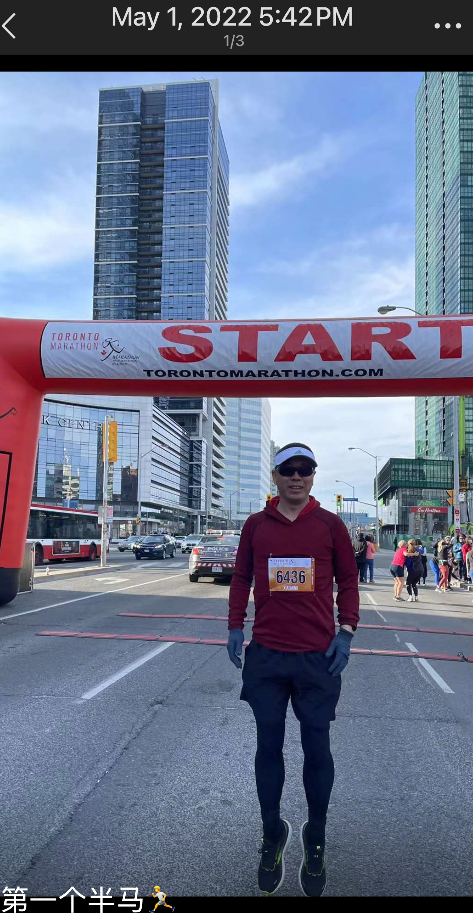
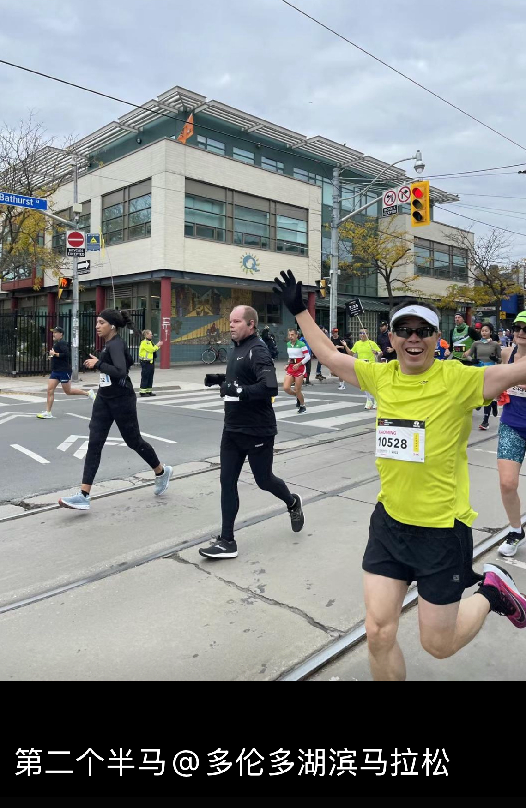
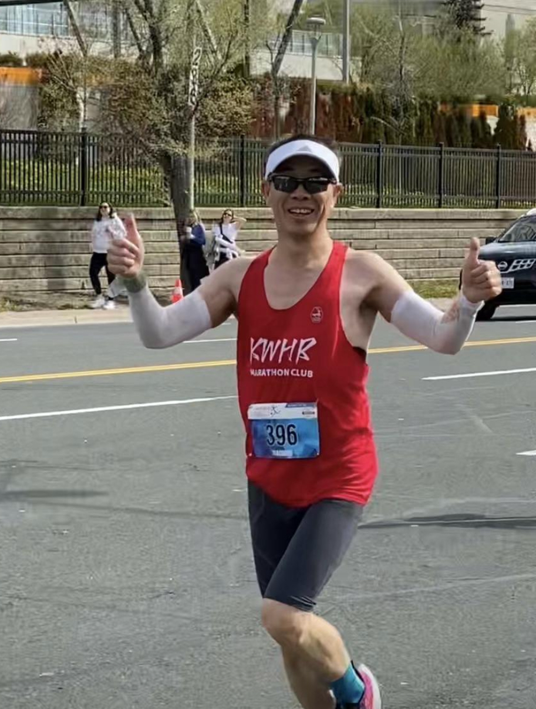
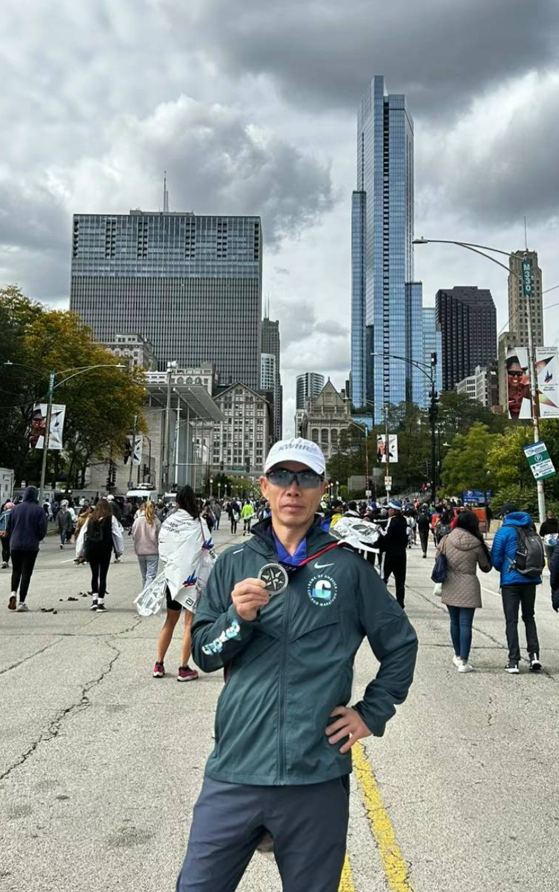
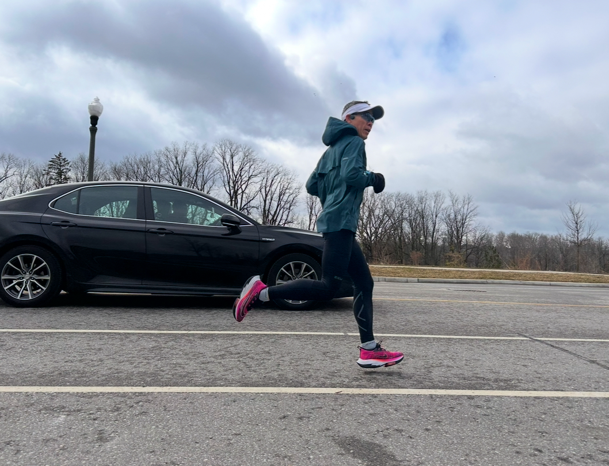
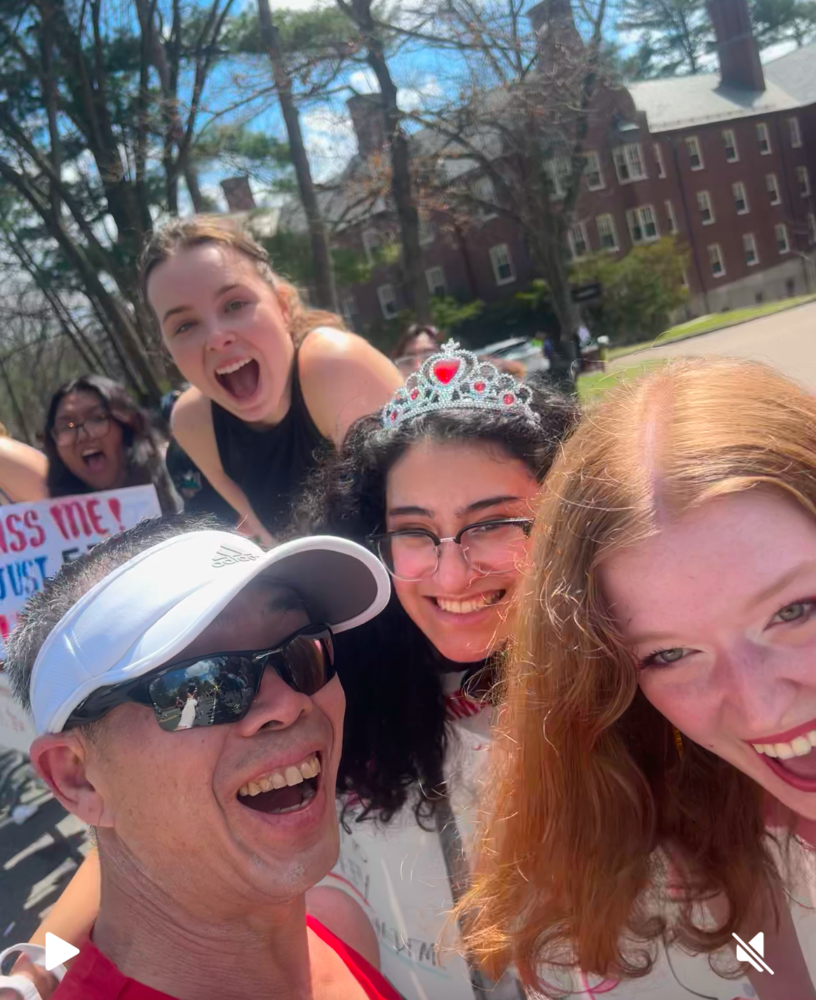
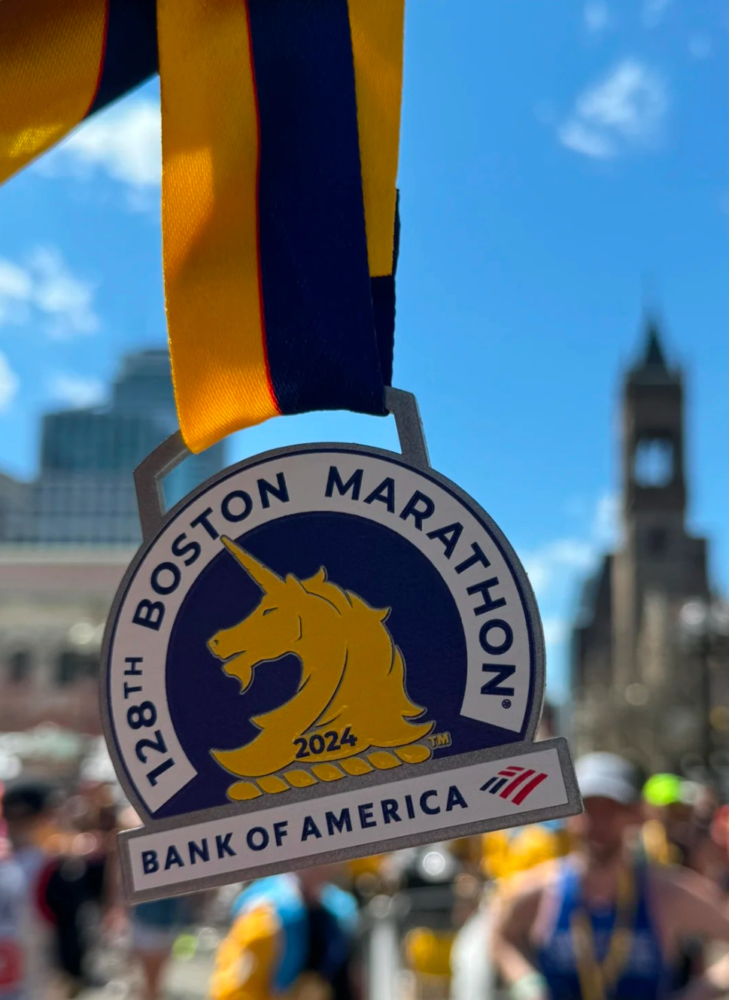
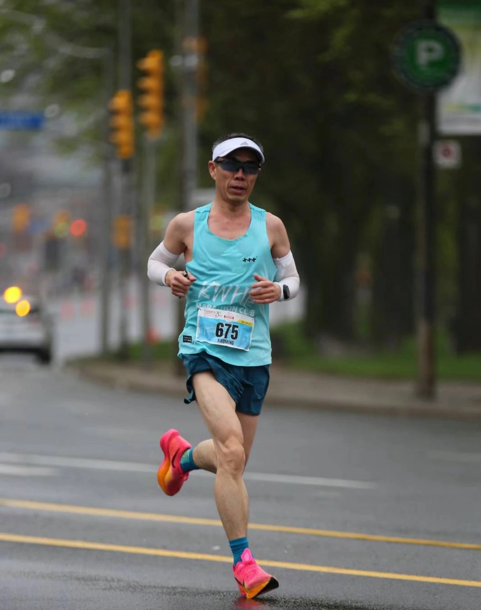
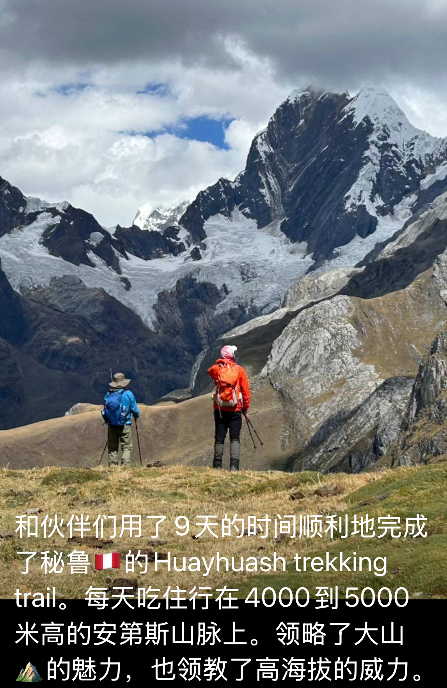

这是没有任何锻炼的我  

⼈到中年 ⼤腹便便 想想还是得活动活动 于是开始骑⻋｡

话说骑了⼏年⻋ 想换个玩⼉法｡
2021 11⽉正式开跑  公⾥ 8 公⾥的晃悠｡ 2022 年元旦 迎新年 新的开始 新脚新鞋新袜⼦  操场跑道绕⼏圈 领导说要不你就跑个 20.22 公⾥吧 得令｡ 当时还没有运动⼿表 (⽤⼿机 Strava,记录的) 不懂配速和⼼率 完成了个 2022 跑完腰疼了半个⽉ 现在想来核⼼太烂｡ 5⽉报了个多伦多半⻢ 1:55:08 欢乐完赛｡

夏天来临， 月跑量100多公里三天打鱼 两天晒网模式跑进秋天， 10月中背包7天走了Killarney, 回来跑了湖滨半马1:41:41（当时感觉还挺美，是我肤浅了😂）

赛后聚餐， 跑团大神校长和Coco撺掇我试试全马🐎，对啊 never try never know， why not  。 开整！同时看到6大马之一芝加哥马拉松🏃开始报名抽签，要不抽一个吧，万一呢能抽中呢，虽说没有跑过全马，但是它也没要求有全马成绩啊， who knows， 抽！！！这就是无知无畏啊。  
2022年 ，11月正式站到隧道口，开启自己的追光之旅。听说跑步要先健脑，欲善其事，先利其器。 书，来一本AM， 跑步知识先学起来。 跟计划， 科学训练🏋️。 跟大神跑友学怎么吃 怎么练 怎么算（心率 配速啥的） 。  大神们说没有公里数跑不下全🐎，11月跑量直接拉升到月300公里。冬天的加拿大宁古塔那不是白叫的， 北风烟雪地，跑🏃；零下一，二十度，跑🏃‍♀️；路滑 穿上冰爪，跑🏃‍♀️。 吃饱了撑地跑🏃； 不吃饭空腹跑🏃。 体重也开始卡卡掉。一路跑到气温回暖，春暖花开那你还得等。2023年5月， 时隔首半马一年， 再次站在起跑线上，但是这次是全麻，Full Marathon 。 开跑🏃后， 祖师爷稳如老狗的配速带到30公里， 然后团长接过棒子带到终点。感谢兄弟👬们， 有事儿真上啊。🫶， 3:22:30完赛。

 首马🐎竟然BQ🤩意思是作为新马仁儿， 我竟然可以去跑马仁儿的麦加朝圣地Boston了， 虽然占了年龄优势，但是这个鼓励和回报还是有点大啊😍。 多巴胺满格之余，心里暗戳戳地想，或许还可以更快，或许前面的光更加明亮，好玩儿的事不能等， 追光的脚步不能停，继续干。  
话说去年全无跑马经厉下竟然抽中了芝马， 又被这只“黑👋”推了一下， 芝马🐎走起。第一次参加6大，第一次进expro, 第一次看到这么多发光的人，就是， 第一次看到这么多的瘦子， 精神抖擞、自带腱子肉（脑补的）的瘦子。   
心情激荡了又激荡。 从满载的都是跑马人的地铁上；到开枪前，马仁儿们从四面八方汇集到起点，（震撼啊）奔向心中的海陆丰 ； 到赛道边一浪高过一浪的欢呼🎉加油声； 到千百人过桥时令人震撼的同频共振、步调一致的脚步声 ； 到25麦快力竭时， 听到老大比我还力竭😛的 加油声👏； 到终点时满眼的痛并快乐着的马仁儿们，心情再次激荡，我悟了， 经历风雨不一定有彩虹🌈，但是没雨那是肯定没有的了。 芝马🐎PB 3:10:27完赛，大PB 了。 为了心中的那个灯塔 那分光， 接着跑 ， 接着干， 接着往前站一站， 继续干。 

时间飞到2024，就今年，整个大的，要去朝圣了，波士顿， 波士顿。 冬训是肯吃苦了，开春儿也不知道是猫还是虎。 继续学，继续练。 没有教练自己琢磨，没有队友自己带自己。 长的短的（距离）一通操作懵如虎，乱漂亮😻。 

同时也加强了核心和臀腿训练。 一切按步就班。 临近朝圣之日，然个后， 正日子前一周， “吸引力法则”反义词来了，“心想事成”倒装句了。“千万别受伤，千万别受伤”， 妈咪妈咪哄。 咔了个喳，脚🦶脖子崴了😩。 肿的老高。 腿脚也练了，心肺也提了， 门票🎫也买了， 期待值也拉满了， 咋整？ 还追吗？这话问的， 光就在眼前， 焉有不追之理。 瘸也得瘸下来。接着又是一通操作懵如虎， 热敷 ，按摩，帖膏药… 额滴个乖乖， 🦶🦶水灵灵地消肿了。 走吧， 戴好小帽，抖擞小肩膀， 波士顿我来嗑你啦🫵

波士顿啊 ， 对马仁儿最公平的舞台，you 行you up，不行you out。 碳也冲足了， 表情包也练好了。跟现认识的一位配速差不多的上海老哥也说好了，一起跑，互相带。 然后老哥一出发就没影儿了（上海老哥还记得出发前我们的约定吗？😂）     兴奋揍是兴奋， 都不用吃药💊的那种兴奋。 配速也不管了 ，心率也不看了， 这是麦加的路， 我是朝圣的人儿，爱谁谁了。 然后顺理成章地在尖叫隧道前没劲儿了😂。 但是咱不能辜负了隧道两边比太阳还火热的美女们的欢呼“厚爱”。腰挺直， 臂摆起， 髋送出（也不知道送没送出去）， 跑路边，击个掌✋， 和美女们比个ye 和个影， 波马的精髓咱必须掌握😅。 

几罐鸡血一直坚持到伤心破， 天太热了， 估量一下形式， 马， 不是一天跑完的， 放吧。 （主要是pb没戏了）， 一路享受赛道一路互动，3:19完赛。 并在伤心💔坡前不意外地捡到上海老哥。 波马更年期似的天气， 去年下雨☔️低温。今年暴晒 干燥。  你虐马仁儿千万遍， 马仁儿爱你如初恋。 接着跑  ，接着干， 争取往前再站一站。 继续干。  

波马回来体能恢复的较慢， peak期已过，但是冬训的苦还历历在目， 兴奋的内啡肽还在，网上又划拉一个5月多马名额。 3周后， 小帽再次一戴，小肩膀再次抖擞。事隔2023首马3:22一年， 2024 5月， 多马3:08:02，再次小小pb. 

虽然又是往前拱了那么一点点， 但是这次看到的了彩色的光- =还能进步。 不必介意他人的光芒万丈， 只要能向着自己的方向。 就是跑  就是干  就是要往前站一站， 继续干。 
2年多的跑步训练，慢慢摸索出来自己的身体状况， 调整了适合自己的训练计划。并且身兼数职，教练 营养师 按摩师…。 开始再一次的加量， 5月多马后， 月跑量基本保持了400左右。 并且加强了核心和交叉训练🏋️。 目标🎯直指10月的湖滨马。 但是但可是，可但是，7月的3周秘鲁行， 因为高反严重， 回来后身体所有指标直达最低点。 

离湖滨马还有2个月，这马怕是又不好牵了。 但是状态的起起伏伏不是马仁儿们都得经历的吗？伤痛 ，低谷，PW 都是马仁儿们独有的勋章🎖️。  只要还在路上，u任何的际遇和风景都是最棒的。 收敛心神，该吃吃， 该练练，该休休。 湖滨马已经是第五个马了， 知道该怎么跑了， 尽管节奏还不是控制的很好， 但是有进步，后程基本没掉速，但是也没劈个叉。 （还得练）。  3:04:33完赛（感谢飞哥最后10公里带飞）。 再次PB .     

虽然还是又往前拱了一拱， 但每一次的PB 都是送给自己的月桂王冠👑。2024，开了个刺儿头，结了个好尾， 感谢众跑友们一路的助攻和鼓励。 
普通人 ，小人物 ； 没天份， 靠积累； 有梦想， 就去追。 山水一程， 人生一世。 跑马路上，每一步都充满力量， 每一滴汗水都闪耀光芒。 
马仁儿们， （上价值了🤣）我们跑🏃的是信仰，是生命里的光。 是鲜活一回的勇气和胆量。（当然干点别的 也一样闪耀光芒  🤗）  
拒绝❌廉颇印象， 被人耻笑吃顿饭去3次厕所🚽😎他要是跑马，最多去一次😂。 
接着跑，接着干， 接着往前站一站。  小老头👴 2025。 继续战。！ ！ ！

完美的2024收官了（ 下次复盘3年后🤪）
祝胖圈的朋友们新年快乐，继续 完美2025 🏃🏽‍♂️‍➡️🏋️‍♀️🎖️🚴‍♂️🍺
